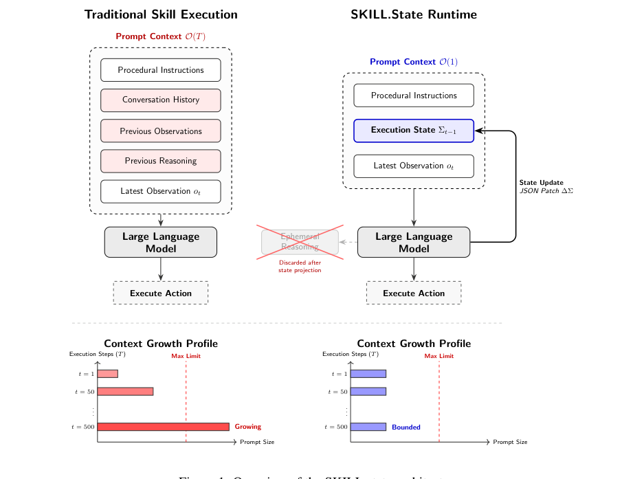

# SKILL.state: Scalable Long-Horizon Agent Skills

> **Source** : arXiv:2608.26263v1 [cs.AI], 26 août 2026 — <https://arxiv.org/abs/2608.26263> (PDF fourni par le responsable, copie sous `pdf/arxiv-2608.26263.pdf`)
> **Auteurs** : Sanket Badhe¹, Priyanka Tiwari², Jonghyun Chung¹ — ¹Google LLC, ²Purdue University
> **Récupéré le** : 2026-08-30 — **Statut** : Preprint, 16 pages
> Export Markdown fidèle du texte intégral du PDF. Figure extraite sous `images/arxiv-2608.26263/`.
> **Pertinence pour ce dépôt** : architecture d'exécution à état structuré mutable et empreinte de prompt bornée O(1) — candidat direct pour la gestion de contexte du harnais AVO sur un modèle à fenêtre de contexte limitée ; taxonomie d'erreurs des modèles open-weight (motive la validation JSON stricte avec rollback-retry) ; benchmarks publics candidats (InterCode CTF, Sierra τ-Bench).

---

## Abstract

Large Language Models (LLMs) increasingly act as autonomous agents executing complex, long-running procedural skills. Existing agent runtimes maintain execution by continually appending observations, actions, and intermediate reasoning traces to an ever-growing conversation history, causing latency degradation and context-poisoning failures over long horizons. We present SKILL.state, a runtime architecture that replaces append-only conversational history with an explicit, mutable execution state. At each execution step, the model receives only the immutable skill specification, the current structured execution state, and the latest observation. Intermediate reasoning is discarded immediately after producing a validated state update, preventing prompt growth with execution history. Across diverse datasets, models, and execution environments, SKILL.state improves task accuracy while substantially reducing cumulative token consumption. Our results demonstrate that explicit execution state is an effective and architecture-agnostic abstraction for scalable long-horizon agent skills.

## 1. Introduction

Large Language Models (LLMs) have rapidly evolved from passive language interfaces into autonomous systems capable of iterative reasoning, tool use, and interaction with external environments (Yao et al., 2022; Schick et al., 2023; Qin et al., 2024; Wu et al., 2023). Recent work further demonstrates that these capabilities can be encapsulated as reusable procedural skills, enabling agents to perform software engineering, workflow automation, web interaction, and scientific discovery through modular compositions of specialized behaviors (Badhe et al., 2026). As agents increasingly execute long-running procedures, execution itself becomes a systems problem rather than purely a reasoning problem.

Modern agent runtimes almost universally adopt a conversational execution model. At every execution step, the language model receives the original skill specification together with an ever-growing transcript of previous reasoning, actions, observations, and tool outputs (Yao et al., 2022; Mialon et al., 2023). Although memory systems alleviate context growth through summarization or retrieval (Packer et al., 2023; Wang et al., 2023; Zhong et al., 2023), they preserve the same execution semantics: future decisions are conditioned on textual reconstructions of past execution rather than an explicit representation of the current execution state.

This design introduces fundamental limitations for long-horizon procedural skills. Prompt size grows with execution length, increasing token consumption and inference cost (Liu et al., 2024; Xiao et al., 2024a). Historical observations and obsolete reasoning remain embedded in the context long after they cease to be relevant, requiring the model to continually distinguish current facts from historical artifacts. Consequently, execution correctness increasingly depends on reconstructing state from accumulated textual history.

In this paper, we introduce SKILL.state, a runtime architecture that reformulates procedural skill execution as explicit state transitions rather than conversational history accumulation. Figure 1 provides an overview of the proposed runtime. At execution step $t$, the language model receives only three inputs:

$$A_t = (P, \Sigma_t, O_t), \tag{1}$$

where $P$ denotes the immutable procedural specification, $\Sigma_t$ is the structured execution state, and $O_t$ is the latest environment observation. After producing a validated state update, the intermediate reasoning trace is discarded while only the updated execution state is retained. Consequently, execution depends strictly on the current world state instead of replaying historical trajectories.

To evaluate this hypothesis, we evaluate SKILL.state across both synthetic and real-world benchmarks: SkillExecBench, a controlled benchmark designed for long-horizon procedural skill execution under scaling, noise, and state recovery; InterCode CTF (Yang et al., 2023), featuring interactive Linux terminal exploitation; and Sierra τ-Bench (Yao et al., 2024), evaluating multi-turn customer-service workflows over complex database APIs.

Experimental results demonstrate that explicit execution state substantially improves the scalability of long-horizon procedural skills by maintaining bounded prompt sizes while cutting token consumption and outperforming history-based and compression-based baselines across multiple model families.

Our contributions are summarized as follows:

- We propose SKILL.state, a runtime architecture that executes procedural skills through explicit structured execution state where intermediate reasoning is discarded after each step, proving a strictly bounded O(1) prompt footprint and O(T) cumulative token complexity.
- We present SkillExecBench, alongside evaluations on public benchmarks (InterCode CTF and Sierra τ-Bench), for evaluating long-horizon procedural skill execution in sequential, stateful environments.
- Across multiple execution horizons and runtime baselines, we demonstrate that state-centric execution maintains competitive task performance while substantially reducing prompt growth and cumulative token consumption across both proprietary and open-weight models.

## 2. Related Work

This section positions SKILL.state against prior work on procedural skills, memory architectures for long-horizon agents, dialogue state tracking, and long-context reasoning; in each case the contrast is that prior work manages conversational history where we remove it.

**2.1 Procedural Skills for LLM Agents.** Existing research on reusable procedural skills primarily addresses skill discovery, representation, composition, and security threat modeling (Badhe et al., 2026; Badhe and Tiwari, 2026). Our work instead focuses on the largely unexplored mechanics of skill execution once a skill has been selected.

**2.2 Memory Architectures for Long-Horizon Agents.** Long-horizon agent architectures typically preserve conversational semantics through episodic retrieval (Park et al., 2023) or persistent storage (Chhikara et al., 2025; Zhong et al., 2024). These methods leave execution state implicitly distributed across accumulated logs. SKILL.state instead isolates execution into an explicit, mutable runtime state, eliminating the need to repeatedly reconstruct world models from textual history. Frameworks like LangGraph use auxiliary structured state to orchestrate workflows across agent nodes. However, these systems still rely on conversational transcripts as the primary reasoning substrate. SKILL.state replaces this substrate by discarding intermediate reasoning traces immediately after producing validated state transitions.

**2.3 Dialogue State Tracking.** Dialogue State Tracking (DST) maintains user slot values across conversational turns in task-oriented dialogue (Williams et al., 2013; Henderson et al., 2014; Rastogi et al., 2020; Wu et al., 2019; Heck et al., 2020; Hosseini-Asl et al., 2020). While both DST and SKILL.state maintain structured representations, they differ fundamentally in execution mechanics: DST tracks auxiliary state alongside full conversational transcripts in quasi-static dialogues, whereas SKILL.state treats the structured state as a sufficient statistic, discarding conversational history to execute autonomous skills in dynamic environments with bounded prompt footprints.

**2.4 Context Management and Long-Context Reasoning.** Language models exhibit degraded retrieval over long contexts (Liu et al., 2024; Zhang et al., 2024), motivating streaming attention (Xiao et al., 2024b) and prompt compression techniques (Jiang et al., 2023; Li et al., 2023). Rather than attempting to process or compress extended conversational histories, SKILL.state prevents history accumulation entirely by maintaining the canonical execution state required for the next computation.

## 3. SKILL.state

Current LLM agent runtimes execute procedural skills by repeatedly appending reasoning traces, actions, observations, and tool outputs to a growing conversational history. Consequently, the execution state is represented implicitly within natural language and must be reconstructed by the language model at every interaction. As execution horizons increase, both prompt size and the volume of obsolete information grow monotonically, making execution increasingly dependent on interpreting historical text rather than maintaining the current world state.

SKILL.state reformulates procedural skill execution as an explicit state transition process. Instead of representing execution as an append-only conversation, every execution step is defined by:

$$A_t = (P, \Sigma_t, O_t), \tag{2}$$

where $P$ is the immutable procedural specification, $\Sigma_t$ is the structured execution state at step $t$, and $O_t$ is the latest observation received from the environment. The language model never receives previous observations, previous actions, or previous reasoning traces.

Figure 1 illustrates the execution cycle. At each step, the runtime constructs a prompt from $(P, \Sigma_t, O_t)$, invokes the language model, deterministically validates the proposed state transition, updates the execution state, executes the selected action, and repeats the process using the updated state.



> **Figure 1: Overview of the SKILL.state architecture.** À gauche, l'exécution conversationnelle traditionnelle : prompt O(T) (instructions + historique de conversation + observations passées + raisonnements passés + dernière observation), taille de contexte croissante. À droite, le runtime SKILL.state : prompt O(1) (instructions procédurales + état d'exécution Σₜ₋₁ + dernière observation oₜ), le raisonnement éphémère est jeté après projection dans l'état (State Update, JSON Patch ΔΣ), taille de contexte bornée quel que soit t.

### 3.1 Execution State and Schema Authoring

Unlike conversational runtimes, SKILL.state treats execution state as a first-class runtime abstraction. The state contains only information required for future execution and is represented using a structured schema defined for the domain. Schemas are authored once per domain rather than per task; for example, across all 100 diverse challenge instances in the InterCode CTF benchmark, the agent reuses a single static 5-field schema (`discovered_flags`, `tested_hypotheses`, `active_files`, `working_dir`, `cmd_summary`).

### 3.2 Reasoning and State Transitions

Reasoning is used strictly as an intermediate computation for producing state transitions and selecting the next action. Given the current execution context $(P, \Sigma_t, O_t)$, the language model generates:

$$(R_t, \Delta\Sigma_t, a_t), \tag{3}$$

where $R_t$ denotes the multi-step Chain-of-Thought reasoning trace, $\Delta\Sigma_t$ is a structured state update (a JSON dictionary of key mutations and deletions), and $a_t$ is the action to execute.

Crucially, within-step multi-step reasoning is fully intact during generation to support complex deductive planning. However, once the state transition has been validated and applied, the reasoning trace $R_t$ is discarded permanently and never appears in subsequent prompts. The execution state is updated according to:

$$\Sigma_{t+1} = \Sigma_t \oplus \Delta\Sigma_t, \tag{4}$$

where $\oplus$ denotes the runtime's dictionary merge operator with null-deletion semantics. This model projects transient reasoning into persistent structured state, allowing only information required for future execution to survive across interactions.

**Algorithm 1 — SKILL.state Runtime**

```text
Require: Procedural specification P, initial state Σ0
1: for t = 0, . . . , T do
2:   Receive latest observation Ot
3:   Construct prompt (P, Σt, Ot)
4:   Generate (Rt, ΔΣt, at) using the LLM
5:   Validate ΔΣt
6:   Σt+1 ← Σt ⊕ ΔΣt
7:   Execute at
8: end for
```

### 3.3 Complexity Analysis

Let $T$ denote the execution horizon. For conversational runtimes, prompt length grows with the accumulated interaction history, $|C_t| = O(t)$, leading to cumulative token complexity:

$$\sum_{t=1}^{T} |C_t| = O(T^2). \tag{5}$$

In contrast, SKILL.state maintains only the procedural specification, structured execution state, and latest observation:

$$|P_t| = O(|P| + |\Sigma| + |O|), \tag{6}$$

which is asymptotically bounded and independent of the number of previously executed turns $t$. Consequently, cumulative prompt complexity grows strictly linearly with the execution horizon:

$$\sum_{t=1}^{T} |P_t| = O(T). \tag{7}$$

The resulting runtime shifts execution from reconstructing history toward maintaining an explicit, validated representation of the current execution state.

## 4. Evaluation Benchmarks

### 4.1 SkillExecBench (Controlled Diagnostic Testbed)

SkillExecBench isolates execution mechanics from open-ended heuristic search by providing sequential procedural tasks with deterministic ground-truth world transitions:

- **Environment 1 (Warehouse Management):** A discrete physical inventory domain tracking 500 independent shelves. Actions include Store, Ship, Move, and Wait. This environment tests the model's ability to maintain independent, non-overlapping state variables over extended horizons where early observations leave the context window.
- **Environment 2 (Software Repository):** A deeply nested, relational graph of Git branches, commits, Pull Requests, and CI test statuses. Actions include CherryPick, Merge, RunTests, CreateRelease, and Rollback. Features dense dependencies where a single action (e.g., merging a PR) fundamentally alters the state of the target branch and dependent PRs, testing complex structural reasoning over an entangled graph.

### 4.2 Public Interactive Benchmarks

To evaluate SKILL.state on real-world, non-deterministic tasks with complex search, generation, and tool use, we evaluate on two public benchmarks:

- **InterCode CTF** (Yang et al., 2023): A suite of 100 Linux bash Capture-The-Flag challenges spanning reverse engineering, forensics, cryptography, and binary exploitation. Agents execute bash commands in Docker containers and iteratively test hypotheses to discover hidden flags.
- **Sierra τ-Bench** (Yao et al., 2024): A benchmark for tool-agent-user interaction in enterprise customer service (Retail and Airline domains). Agents interact with simulated users, query relational SQLite databases via tool calls, and execute transactional actions (e.g., flight rebooking, refunds) under business policy constraints.

### 4.3 Evaluation Metrics

We evaluate runtimes across three dimensions:

- **Task Accuracy / Success Rate:** In SkillExecBench, accuracy is measured continuously as the ratio of valid, correct actions matching the ground-truth deterministic simulation (Score = Successful Actions / Total Actionable Events). In InterCode CTF, success is binary pass@1 (exact match on the binary-verified flag). In τ-Bench, success is scored by the official programmatic evaluator, which verifies that the final database state satisfies user intent without policy violations.
- **Average Prompt Size:** The mean token footprint per LLM invocation.
- **Total Token Cost:** The cumulative token burn across the entire execution horizon.

## 5. Experiments and Results

### 5.1 Experimental Setup

We evaluate SKILL.state against two families of baselines (see Appendix A for exact prompt templates):

*Primary Runtime Paradigms:*

1. **Prompt (ReAct-style):** Appends every observation, intermediate reasoning trace, and action to a continually growing transcript (Yao et al., 2022).
2. **Memory (Summarization-style):** Maintains a rolling 3-step conversational window alongside a periodically updated natural language summary of past interactions (Packer et al., 2023).
3. **Stateful (LangGraph-style):** Injects a structured state block into the context window alongside the full rolling conversational transcript.

*Budget-Matched and Compression Controls:*

1. **Truncated (Sliding Window):** Retains only the most recent interaction turns that fit within a fixed token budget.
2. **Summary-capped:** Strictly enforces a hard token ceiling on the natural language summary.
3. **ReAct + LLMLingua** (Jiang et al., 2023): Uses budget-aware small-model perplexity compression to prune tokens from the full history down to the target budget.

*Underlying Models:* Evaluations are conducted across proprietary and open-weight models: Gemini-3-Flash, Gemma-4-31B-it, and Qwen-3-8B-it. Decoding is controlled at temperature 0.0 and top-p 1.0 across all runs to ensure deterministic reproducibility.

*Statistical Significance:* All synthetic experiments are evaluated across 5 distinct procedural generator seeds. Results are reported as mean ± sample standard deviation. Differences between SKILL.state and baselines at extended horizons (T ≥ 50) are statistically significant (paired t-test, p < 0.01).

### 5.2 Experiment 1: Long-Horizon Execution Scaling

We evaluate runtime accuracy and context expansion across execution horizons scaling from T = 10 to T = 200 steps.

**Results:** As shown in Table 1, SKILL.state matches or exceeds baseline accuracy across all horizons while maintaining a flat prompt size (~1,736–1,905 tokens). In contrast, history-appending baselines suffer quadratic token accumulation O(T²). At T = 100, the Stateful baseline consumes 1,062,387 tokens, whereas SKILL.state consumes only 65,408 tokens (a 16.2× token reduction). At T = 200, SKILL.state maintains 0.94 accuracy consuming 122k tokens, while the Memory baseline inflates to 6.1M tokens. Additional scaling results for the Software Repository and open-weight models are detailed in Appendix D.

**Table 1: Warehouse Management Long-Horizon Scaling using Gemini-3-Flash.** Baseline runtimes suffer O(T²) context accumulation, whereas SKILL.state maintains a bounded O(1) prompt footprint (Mean ± SD across 5 seeds).

| Horizon (T) | Runtime | Score (Accuracy) | Avg Prompt Size (Tokens) | Total Tokens Consumed |
|---|---|---|---|---|
| 10 | Prompt (ReAct) | 0.90 ±0.02 | 3,249 ±94 | 9,438 ±371 |
| 10 | Memory (Summary) | 1.00 ±0.00 | 3,300 ±123 | 9,972 ±204 |
| 10 | Stateful (LangGraph) | 1.00 ±0.00 | 3,430 ±42 | 10,337 ±299 |
| 10 | **SKILL.state** | **1.00 ±0.00** | **1,775 ±74** | **5,870 ±131** |
| 25 | Prompt (ReAct) | 0.92 ±0.02 | 6,052 ±192 | 42,689 ±2,238 |
| 25 | Memory (Summary) | 0.99 ±0.00 | 6,357 ±203 | 43,067 ±1,948 |
| 25 | Stateful (LangGraph) | 1.00 ±0.00 | 5,858 ±301 | 41,238 ±3,196 |
| 25 | **SKILL.state** | **1.00 ±0.00** | **1,736 ±49** | **14,714 ±564** |
| 50 | Prompt (ReAct) | 0.88 ±0.04 | 11,931 ±346 | 171,658 ±6,978 |
| 50 | Memory (Summary) | 0.93 ±0.03 | 7,582 ±283 | 131,455 ±6,841 |
| 50 | Stateful (LangGraph) | 0.94 ±0.00 | 11,594 ±438 | 170,992 ±7,918 |
| 50 | **SKILL.state** | **0.96 ±0.01** | **1,773 ±53** | **30,151 ±1,231** |
| 100 | Prompt (ReAct) | 0.84 ±0.07 | 36,362 ±1,304 | 1,245,413 ±53,241 |
| 100 | Memory (Summary) | 0.87 ±0.05 | 29,607 ±978 | 1,082,154 ±83,212 |
| 100 | Stateful (LangGraph) | 0.91 ±0.02 | 31,354 ±831 | 1,062,387 ±53,839 |
| 100 | **SKILL.state** | **0.94 ±0.01** | **1,905 ±93** | **65,408 ±5,431** |
| 200 | Prompt (ReAct) | 0.74 ±0.14 | 48,007 ±2,092 | 2,608,755 ±102,415 |
| 200 | Memory (Summary) | 0.84 ±0.09 | 84,364 ±3,446 | 6,175,509 ±294,089 |
| 200 | Stateful (LangGraph) | 0.88 ±0.03 | 72,305 ±3,096 | 5,041,164 ±346,925 |
| 200 | **SKILL.state** | **0.94 ±0.02** | **1,811 ±184** | **122,384 ±4,522** |

### 5.3 Experiment 2: Context Corruption (Noise Robustness)

Real-world execution environments emit dense background telemetry. We fix the horizon at T = 50 and inject distractor events (system telemetry, irrelevant git branch activities, and rule overrides) at rates of 5, 20, and 50 events per turn (see Appendix C for calibration details).

**Table 2: Warehouse Noise Robustness (T = 50, Gemini-3-Flash).**

| Noise Level | Prompt | Memory | Stateful | SKILL.state |
|---|---|---|---|---|
| 5 Events (Low) | 0.68 | 1.00 | 1.00 | 1.00 |
| 20 Events (Medium) | 0.61 | 1.00 | 0.98 | 0.97 |
| 50 Events (High) | 0.53 | 0.96 | 0.98 | 0.98 |

**Results:** As shown in Table 2, the standard Prompt runtime degrades sharply from 0.68 at low noise down to 0.53 at high noise. In contrast, SKILL.state maintains robust task completion (≥0.97) across all noise levels because distractors are filtered out during state patch generation and never enter subsequent prompts.

### 5.4 Experiment 3: State Recovery

We test runtime resilience to silent external environment drift where the true world state is modified outside the agent's action loop (e.g., an external actor moves an inventory item).

**Table 3: Warehouse State Recovery (Gemini-3-Flash).**

| Scenario | Runtime | Success | Recovery Steps |
|---|---|---|---|
| A: Secret Audit | Prompt / Memory / Stateful | Yes | 5–8 |
| A: Secret Audit | **SKILL.state** | Yes | **0** |
| B: Secret Barcode | Prompt / Memory / Stateful | Yes | 6–8 |
| B: Secret Barcode | **SKILL.state** | Yes | **0** |
| C: Secret Move | Prompt / Memory / Stateful | Yes | 5–8 |
| C: Secret Move | **SKILL.state** | Yes | **0** |
| D: Canceled Order | All Runtimes | No | N/A |

**Results:** As shown in Table 3, history-based baselines hallucinate for 5 to 8 consecutive turns because obsolete facts in their prompt history overpower contradictory new observations. In sharp contrast, SKILL.state requires zero recovery steps: because its decisions depend on the current structured state, the state is updated immediately upon receiving the corrective alert.

### 5.5 Experiment 4: Public Interactive Benchmarks

To test generalizability on open-ended tasks with complex search, generation, and tool use, we evaluate SKILL.state on InterCode CTF and Sierra τ-Bench.

**Table 4: Evaluation on Public Interactive Benchmarks using Gemini-3-Flash.** SKILL.state achieves the highest task success rates while significantly reducing prompt sizes and cumulative token consumption.

| Runtime | CTF Pass@1 | CTF Prompt | CTF Tokens | τ-Retail Pass | τ-Retail Prompt | τ-Retail Tokens | τ-Airline Pass | τ-Airline Prompt | τ-Airline Tokens |
|---|---|---|---|---|---|---|---|---|---|
| Prompt (ReAct) | 43.2% | 1,909 | 977k | 48.2% | 2,819 | 4.48M | 21.8% | 5,100 | 4.85M |
| Memory (Summary) | 46.4% | 1,797 | 1.03M | 29.9% | 2,737 | 4.24M | 23.6% | 4,700 | 4.65M |
| Stateful (LangGraph) | 41.8% | 1,946 | 1.13M | 51.7% | 3,065 | 3.92M | 28.1% | 5,400 | 5.28M |
| **SKILL.state** | **54.2%** | **813** | **387k** | **58.3%** | 3,325 | **3.47M** | **32.4%** | **2,800** | **2.88M** |

**Results:** SKILL.state achieves the highest task completion rates across all three benchmarks while substantially cutting cumulative token consumption. In InterCode CTF, maintaining explicit hypotheses and discovered flags in $\Sigma_t$ prevents the model from repeating failed commands, increasing pass@1 to 54.2% (+7.8 points over the strongest baseline and +12.4 points over Stateful) while cutting total tokens by 60.4% vs. ReAct and 65.9% vs. Stateful. In τ-Bench Retail, SKILL.state leads with 58.3% pass rate at the lowest total token cost. In τ-Bench Airline, where complex database responses cause baseline prompts to peak above 11,000 tokens/step, SKILL.state maintains a flat footprint of ~2,800 tokens/step and achieves a 32.4% pass rate, saving 40.5% tokens vs. ReAct and 45.4% vs. Stateful.

### 5.6 Experiment 5: Budget-Matched Controls and Statistical Compression

To determine whether SKILL.state's performance gains stem merely from shorter prompts or from structured state representation, we evaluate budget-matched baselines on Warehouse (T = 100, Gemini-3-Flash) pinned to the token budget of SKILL.state (~1,800 tokens).

**Table 5: Budget-Matched Controls on Warehouse (T = 100, Gemini-3-Flash, Budget ~1,800 tokens).**

| Runtime / Configuration | Score | Avg Prompt | Total Tokens |
|---|---|---|---|
| Full ReAct (Unbounded) | 0.84 | 36,362 | 1,245,413 |
| Truncated (Sliding Window) | 0.18 | 1,800 | 62,100 |
| Summary-capped | 0.52 | 1,840 | 63,400 |
| ReAct + LLMLingua | 0.22 | 1,810 | 62,350 |
| **SKILL.state (Structured)** | **0.94** | 1,905 | 65,408 |

**Results:** All budget-matched compression baselines suffer catastrophic failure. Sliding-window truncation drops to 0.18 because critical early inventory allocations are evicted. LLMLingua drops to 0.22 because statistical entropy filtering removes seemingly redundant slot identifiers that are semantically vital. In contrast, SKILL.state achieves 0.94 score, demonstrating that structured state maintenance preserves exact relational dependencies that statistical compressors destroy.

### 5.7 Error Taxonomy for Open-Weight Models

On open-weight models (Gemma-4-31B at T = 100, score 0.42), we analyze failure logs and categorize errors into three distinct modes:

1. **Premature State Overwrite / Deletion (68%):** The model accidentally omits existing keys during state update rather than merging in-place.
2. **Schema Comprehension / Type Coercion (20%):** Inconsistencies between expected nested lists and dictionaries.
3. **JSON Syntax / Formatting Slips (12%):** Malformed JSON delimiters or trailing commas.

This error distribution shows that small-model degradation stems from structured output adherence rather than reasoning capacity, motivating constrained decoding in future runtime iterations.

## 6. Conclusion

We presented SKILL.state, a runtime architecture that replaces append-only conversational history with explicit, structured execution state. By discarding intermediate reasoning traces after each validated transition, SKILL.state maintains a bounded O(1) prompt footprint and scales linearly O(T) in cumulative tokens. Across controlled diagnostic tasks and public interactive benchmarks, explicit execution state consistently improves task accuracy while substantially reducing prompt growth and token consumption.

## 7. Limitations

SKILL.state assumes that the execution state can be made a sufficient statistic for future execution: that everything in the past bearing on future actions can be projected into the structured state as soon as it becomes known. Where this holds, discarding intermediate reasoning and conversational history is lossless. However, this assumption fails in three distinct settings: (1) when no fixed schema is known in advance and the relevant state structure must be discovered dynamically during execution; (2) when a correct state update depends on an earlier observation whose relevance was not recognized when first observed, and was therefore never committed to state; and (3) when the task objective is defined over the historical trajectory itself (e.g., auditing, debugging provenance, or explaining past actions), where interaction history is the target output rather than operational overhead.

Our current implementation focuses on single-agent procedural execution. While the explicit state abstraction extends naturally to multi-agent systems—where a shared execution state acts as the central coordination substrate instead of exchanging quadratic conversational transcripts—multi-agent environments introduce concurrent writes, requiring deterministic conflict-resolution semantics in the merge operator $\oplus$ that our single-agent setting does not exercise.

Finally, SKILL.state relies on the language model to propose valid structured state patches. Because schema ownership and validation reside in the deterministic runtime rather than the model, malformed outputs cannot corrupt persistent state $\Sigma_t$; an invalid patch triggers a rollback-retry cycle. For smaller open-weight models, integrating grammar-constrained decoding can eliminate syntactic formatting errors, allowing the model to focus entirely on semantic state transitions.

## References

- Sanket Badhe, Deep Shah, Priyanka Tiwari, Nehal Kathrotia. 2026. A systematic survey of agent skills: Lifecycle, taxonomy, and security. (July 31, 2026).
- Sanket Badhe, Priyanka Tiwari. 2026. Agent skill security: Threat models, attacks, defenses, and evaluation. arXiv:2607.13987.
- Prateek Chhikara, Dev Khant, Saket Aryan, Taranjeet Singh, Deshraj Yadav. 2025. Mem0: Building production-ready AI agents with scalable long-term memory. arXiv:2504.19413.
- Michael Heck, et al. 2020. TripPy: A triple copy strategy for value-independent neural dialog state tracking. SIGDIAL 2020, 35–44.
- Matthew Henderson, Blaise Thomson, Jason D Williams. 2014. The second dialog state tracking challenge. SIGDIAL 2014, 263–272.
- Ehsan Hosseini-Asl, Bryan McCann, Chien-Sheng Wu, Semih Yavuz, Richard Socher. 2020. A simple language model for task-oriented dialogue. NeurIPS 33:20179–20191.
- Huiqiang Jiang, Qianhui Wu, Chin-Yew Lin, Yuqing Yang, Lili Qiu. 2023. LLMLingua: Compressing prompts for accelerated inference of large language models. EMNLP 2023, 13358–13376.
- Yucheng Li, et al. 2023. Compressing context to enhance inference efficiency of large language models. EMNLP 2023, 6342–6353.
- Nelson F. Liu, et al. 2024. Lost in the middle: How language models use long contexts. TACL 12:157–173.
- Grégoire Mialon, et al. 2023. Augmented language models: a survey. TMLR.
- Charles Packer, Vivian Fang, Shishir G Patil, Kevin Lin, Sarah Wooders, Joseph E Gonzalez. 2023. MemGPT: towards LLMs as operating systems.
- Joon Sung Park, et al. 2023. Generative agents: Interactive simulacra of human behavior. UIST 2023.
- Yujia Qin, et al. 2024. ToolLLM: Facilitating large language models to master 16000+ real-world APIs. ICLR 2024.
- Abhinav Rastogi, et al. 2020. Towards scalable multi-domain conversational agents: The schema-guided dialogue dataset. AAAI 34:8689–8696.
- Timo Schick, et al. 2023. Toolformer: Language models can teach themselves to use tools. NeurIPS 2023.
- Weizhi Wang, et al. 2023. Augmenting language models with long-term memory. NeurIPS 2023.
- Jason Williams, Antoine Raux, Deepak Ramachandran, Alan Black. 2013. The dialog state tracking challenge. SIGDIAL 2013, 404–413.
- Chien-Sheng Wu, et al. 2019. Transferable multi-domain state generator for task-oriented dialogue systems. ACL 2019, 808–819.
- Qingyun Wu, et al. 2023. AutoGen: Enabling next-gen LLM applications via multi-agent conversation. arXiv:2308.08155.
- Guangxuan Xiao, Yuandong Tian, Beidi Chen, Song Han, Mike Lewis. 2024a/2024b. Efficient streaming language models with attention sinks. ICLR 2024.
- John Yang, Akshara Prabhakar, Karthik Narasimhan, Shunyu Yao. 2023. InterCode: Standardizing and benchmarking interactive coding with execution feedback. NeurIPS 2023.
- Shunyu Yao, Noah Shinn, Jeffrey Zhao, Qingyun Wu, Karthik Narasimhan. 2024. τ-bench: A benchmark for tool-agent-user interaction in real-world domains. arXiv:2406.12045.
- Shunyu Yao, et al. 2022. ReAct: Synergizing reasoning and acting in language models. arXiv:2210.03629.
- Xinrong Zhang, et al. 2024. InfiniteBench: Extending long context evaluation beyond 100k tokens. ACL 2024, 15262–15277.
- Wanjun Zhong, et al. 2023/2024. MemoryBank: Enhancing large language models with long-term memory. arXiv:2305.10250 ; AAAI 38:19724–19731.

## Appendix A. Runtime Prompts

This appendix provides the exact system prompts used by the four evaluated runtimes. To ensure reproducibility, all prompts are presented exactly as they were dynamically constructed and formatted in the benchmark execution loop.

**A.1 Prompt Runtime (ReAct-style)**

```text
Instructions:
{skill.instructions}
History:
Observation: {history[0].observation}
Reasoning & Action: {history[0].response}
[... Appends all previous observations and actions ...]
Latest Observation: {observation}
Generate your next reasoning and action (format 'Action: <cmd>'):
```

**A.2 Memory-Augmented Runtime**

```text
Instructions:
{skill.instructions}
Summarized History:
{summary_string_of_past_steps}
Recent History:
Observation: {recent_observations[0]}
Response: {recent_responses[0]}
[... Appends the 3 most recent turns ...]
Latest Observation: {observation}
Generate your next reasoning and action (format 'Action: <cmd>'):
```

**A.3 Stateful Runtime (LangGraph-style)**

```text
Instructions:
{skill.instructions}
Current State:
{json.dumps(state, indent=2)}
History:
Observation: {history[0].observation}
Response: {history[0].response}
[... Appends all previous observations and actions ...]
Latest Observation: {observation}
Update the state if necessary, provide reasoning, and output 'Action: <cmd>'.
To update state, use the format: StateUpdate: {"key": "value"}
```

**A.4 SKILL.state Runtime**

```text
Instructions:
{skill.instructions}
Skill Execution State:
```json
{json.dumps(state, separators=(',', ':'))}
```
Latest Observation: {observation}
Provide your response with:
1. Step-by-step reasoning (will be discarded after execution)
2. A JSON block fenced with json ... containing both your State Patch and your Action. The JSON block
MUST have exactly these two keys: { "state_patch": { <dict: your state updates, set keys to
null to delete> }, "action": "<string: the exact command you want to execute>" }
```

Note: The `skill.instructions` placeholder dynamically injects the task-specific system prompt (e.g., the agent's persona, the available action space, and the environment rules). This ensures that across all runtime evaluations, the agent receives the exact same baseline instructions, isolating context management as the only independent variable.

## Appendix B. SkillExecBench Implementation Details

**B.1 Environment Design**

*Environment 1: Warehouse Management*

- **State Representation:** A discrete inventory mapping of 500 independent shelves (e.g., `shelf_0` through `shelf_499`), where each shelf holds exactly one item string identifier or is null.
- **Action Space:** `Store <item_id> <empty_shelf_id>` ; `Ship <item_id> <shelf_id>` ; `Move <item_id> <old_shelf_id> <new_shelf_id>` ; `Wait`.
- **Observation Format:** Textual alerts triggered by system events, including: `Shipment arrived containing [item]`, `Customer ordered [item]`, and `Maintenance required on [shelf]`.
- **Transition Rules:** If an agent calls Store, the environment validates the shelf is empty before placing the item. If Ship is called, the item is destroyed. Invalid actions (e.g., storing an item on an occupied shelf) return a local error observation and reject the state transition.
- **Success Criterion:** The ratio of successfully executed valid actions matching the ground-truth deterministic simulation (Score = Successful Actions / Total Actionable Events).

*Environment 2: Software Repository*

- **State Representation:** A simulated Git repository tracking branch histories, file contents, active Pull Requests (PRs), and Continuous Integration (CI) test statuses.
- **Action Space:** `Commit(branch, file)`, `CreatePR(branch)`, `Merge(pr_id)`, `FixCI(branch)`, `Wait`.
- **Observation Format:** CI/CD webhook notifications (e.g., `CI Pipeline Failed for PR #3`), code review comments, and issue assignments.
- **Transition Rules:** Pushing a commit triggers a background CI evaluation transition. Merging a PR successfully transitions the master branch state and deletes the feature branch.
- **Success Criterion:** The percentage of correctly resolved feature requests merged into master without breaking CI checks.

**B.2 Task Generation.** Tasks are procedurally generated using a deterministic random number generator. By seeding the generator, we guarantee that all evaluated baseline runtimes experience the exact same sequence of events, ensuring fair comparisons. The horizon length dictates the number of sequential events the agent must handle.

**Algorithm 2 — Warehouse Task Generation Pseudo-code**

```text
1: seed ← 42
2: rng ← Random(seed)
3: gt_shelves ← {shelf_0: Null, ..., shelf_499: Null}
4: events ← []
5: for i = 1 to Horizon do
6:   available ← FindEmptyShelves(gt_shelves)
7:   occupied ← FindOccupiedShelves(gt_shelves)
8:   possible_events ← [Receive]
9:   if occupied is not empty then
10:    possible_events.append(Order, Maintenance)
11:  end if
12:  event_type ← rng.choice(possible_events)
13:  events.append(ConstructObservation(event_type))
14:  UpdateGroundTruth(gt_shelves, event_type)
15: end for
16: return events
```

**B.3 Example Episode Trajectory.** To illustrate the execution flow, below is a concrete, single-turn trajectory for the SKILL.state runtime operating in the Warehouse environment.

1. *Observation Received (Environment → LLM)* : `Latest Observation: Customer ordered item_12.`
2. *LLM Processing (LLM Internal)* : « The customer ordered item_12. I need to ship it. I will check my Skill Execution State to locate it. Looking at the state schema, item_12 is located on shelf_42. I must generate a Ship action and update my state to remove it from shelf_42. »
3. *State Update and Action Generation (LLM → Runtime)* :

```json
{
  "state_patch": { "inventory": { "shelf_42": null } },
  "action": "Ship item_12 shelf_42"
}
```

4. *Next Observation (Environment → LLM)* : `Latest Observation: Success: Shipped item_12 from shelf_42.`

## Appendix C. Noise Construction (Experiment 2)

Real-world systems rarely provide clean, perfectly isolated observation spaces; agents must constantly filter out background telemetry, sensor logs, and system chatter to execute their instructions. To isolate the problem of *Attention Drag*, the experiments in this paper exclusively focus on Condition 1: Irrelevant Context.

**C.1 Noise Properties.** For Condition 1 evaluations across both environments, the injected noise strings are defined by three strict properties: (1) *Randomly Generated* — values such as battery percentages, temperatures, server IDs, and CPU loads are sampled uniformly at random during each execution step; (2) *Strictly Irrelevant* — the semantic meaning of the noise has absolutely no bearing on the agent's primary task; (3) *Non-State-Altering* — the noise events never actually change the underlying ground-truth world state. They are purely observational distractors appended to the environment's response payload under a `--- BACKGROUND TELEMETRY ---` header.

**C.2 Environment 1 (Warehouse) Distractors :** robot telemetry logs (`Battery: 85%, Temperature: 45C, CPU Load: 72%, Speed: 1.2 m/s, Nav Confidence: 95.4%`), environmental sensor logs (`[Sensor] Humidity: 45%, Temp: 22.3C, Light: 310 lux, CO2: 450 ppm`), camera OCR/vision logs (`[Camera OCR] Forklift parked.` / `Worker entered Zone A.` / `Safety Vest Detected.`).

**C.3 Environment 2 (Software Repository) Distractors :** syslog telemetry from disconnected servers, e.g. :

```text
Latest Observation:
CI Pipeline Failed for PR #3. Linter error on line 42.
--- BACKGROUND TELEMETRY ---
[Syslog] Server-42 CPU load: 88%, RAM usage: 71%
[Syslog] Server-17 CPU load: 12%, RAM usage: 45%
[Syslog] Server-91 CPU load: 99%, RAM usage: 89%
```

## Appendix D. Additional Results

**Table 6: Software Repository Long-Horizon Execution Scaling using Gemini-3-Flash.** Baseline runtimes suffer catastrophic O(N²) context collapse, whereas SKILL.state maintains an O(1) prompt footprint.

| Horizon | Runtime | Score | Avg Prompt Size | Total Tokens Consumed |
|---|---|---|---|---|
| 10 | Prompt | 0.89 ±0.11 | 3,411 ±197 | 11,670 ±841 |
| 10 | Memory | 0.93 ±0.09 | 4,379 ±234 | 15,732 ±562 |
| 10 | Stateful | 1.00 ±0.00 | 4,200 ±321 | 14,120 ±318 |
| 10 | **SKILL.state** | **1.00 ±0.00** | **2,298 ±134** | **7,608 ±149** |
| 25 | Prompt | 0.84 ±0.05 | 11,754 ±608 | 111,970 ±3,314 |
| 25 | Memory | 0.89 ±0.07 | 9,399 ±317 | 94,629 ±2,839 |
| 25 | Stateful | 0.94 ±0.03 | 14,016 ±586 | 128,702 ±3,863 |
| 25 | **SKILL.state** | 0.88 ±0.08 | **2,545 ±556** | **21,920 ±431** |
| 50 | Prompt | 0.71 ±0.14 | 23,136 ±911 | 462,118 ±13,764 |
| 50 | Memory | 0.65 ±0.12 | 35,550 ±2,412 | 688,182 ±23,539 |
| 50 | Stateful | 0.74 ±0.08 | 31,166 ±3,231 | 577,027 ±27,293 |
| 50 | **SKILL.state** | **0.86 ±0.04** | **2,545 ±63** | **45,100 ±894** |
| 100 | Prompt | 0.53 ±0.16 | 46,270 ±1,847 | 1,848,500 ±55,391 |
| 100 | Memory | 0.57 ±0.05 | 71,100 ±5,836 | 2,752,700 ±82,467 |
| 100 | Stateful | 0.63 ±0.10 | 62,330 ±2,488 | 2,308,000 ±35,183 |
| 100 | **SKILL.state** | **0.78 ±0.08** | **2,545 ±471** | **90,200 ±2,792** |

**Table 7: Gemma-4-31B-it Warehouse Scaling.**

| Horizon | Runtime | Score ± SD | Avg Prompt ± SD | Total Tokens ± SD |
|---|---|---|---|---|
| 10 | Prompt | 0.90 ± 3.1% | 3,145 ± 242 | 9,092 ± 1,231 |
| 10 | Memory | 0.85 ± 4.2% | 2,611 ± 138 | 7,330 ± 838 |
| 10 | Stateful | 0.90 ± 2.8% | 3,191 ± 149 | 9,144 ± 518 |
| 10 | **SKILL.state** | **0.98 ± 1.5%** | 2,116 ± 212 | 6,814 ± 875 |
| 25 | Prompt | 0.64 ± 5.4% | 5,720 ± 182 | 41,697 ± 1,610 |
| 25 | Memory | 0.72 ± 4.8% | 3,990 ± 362 | 28,933 ± 412 |
| 25 | Stateful | 0.76 ± 4.1% | 5,714 ± 282 | 39,314 ± 585 |
| 25 | **SKILL.state** | **0.84 ± 3.6%** | 2,080 ± 114 | 16,302 ± 2,190 |
| 50 | Prompt | 0.31 ± 6.2% | 10,809 ± 352 | 151,845 ± 2,150 |
| 50 | Memory | 0.41 ± 5.8% | 7,217 ± 316 | 114,113 ± 1,620 |
| 50 | Stateful | 0.55 ± 5.1% | 11,083 ± 262 | 155,164 ± 2,210 |
| 50 | **SKILL.state** | **0.68 ± 3.9%** | 2,113 ± 176 | 33,762 ± 1,385 |
| 100 | Prompt | 0.21 ± 4.7% | 27,686 ± 412 | 923,164 ± 12,400 |
| 100 | Memory | 0.24 ± 4.2% | 18,537 ± 229 | 701,954 ± 9,850 |
| 100 | Stateful | 0.42 ± 4.5% | 20,210 ± 822 | 557,968 ± 8,100 |
| 100 | **SKILL.state** | **0.42 ± 4.1%** | 2,105 ± 216 | 65,480 ± 1,258 |

**Table 8: Qwen-3-8B-it Warehouse Scaling.**

| Horizon | Runtime | Score ± SD | Avg Prompt ± SD | Total Tokens ± SD |
|---|---|---|---|---|
| 10 | Prompt | 0.84 ± 3.8% | 3,150 ± 245 | 9,150 ± 1,250 |
| 10 | Memory | 0.80 ± 4.5% | 2,640 ± 145 | 7,420 ± 860 |
| 10 | Stateful | 0.84 ± 3.4% | 3,210 ± 155 | 9,210 ± 540 |
| 10 | **SKILL.state** | **0.94 ± 2.1%** | 2,120 ± 215 | 6,920 ± 890 |
| 25 | Prompt | 0.54 ± 6.1% | 5,790 ± 195 | 42,450 ± 1,680 |
| 25 | Memory | 0.62 ± 5.4% | 4,050 ± 375 | 29,640 ± 440 |
| 25 | Stateful | 0.66 ± 4.8% | 5,780 ± 295 | 39,950 ± 610 |
| 25 | **SKILL.state** | **0.76 ± 4.2%** | 2,088 ± 120 | 16,680 ± 2,240 |
| 50 | Prompt | 0.24 ± 6.5% | 10,950 ± 365 | 154,200 ± 2,280 |
| 50 | Memory | 0.33 ± 6.1% | 7,320 ± 330 | 116,400 ± 1,710 |
| 50 | Stateful | 0.44 ± 5.7% | 11,210 ± 280 | 158,300 ± 2,340 |
| 50 | **SKILL.state** | **0.58 ± 4.5%** | 2,118 ± 185 | 34,510 ± 1,420 |
| 100 | Prompt | 0.15 ± 5.1% | 28,150 ± 430 | 941,500 ± 12,800 |
| 100 | Memory | 0.18 ± 4.6% | 18,840 ± 245 | 718,200 ± 10,200 |
| 100 | Stateful | 0.31 ± 4.9% | 20,580 ± 850 | 569,400 ± 8,450 |
| 100 | **SKILL.state** | **0.34 ± 4.6%** | 2,110 ± 220 | 66,850 ± 1,310 |

**Table 9: Software Repository Noise Robustness (T = 50, Gemini-3-Flash, Condition 1).**

| Noise Level | Prompt | Memory | Stateful | SKILL.state |
|---|---|---|---|---|
| 0 Events (Baseline) | 0.76 | 0.85 | 0.88 | **0.90** |
| 5 Events (Low) | 0.62 | 0.85 | 0.86 | **0.88** |
| 20 Events (Medium) | 0.48 | 0.83 | 0.85 | **0.86** |
| 50 Events (High) | 0.11 | 0.74 | 0.78 | **0.80** |

**Table 10: Software Repository State Recovery (Env 2, Exp 3).** Comparison of hallucination lag (recovery steps) when the repository state is altered via unstructured alerts.

| Scenario | Runtime | Success | Recovery Steps |
|---|---|---|---|
| A: Force Push | Prompt | Yes | 12 |
| A: Force Push | Memory | Yes | 8 |
| A: Force Push | Stateful | Yes | 10 |
| A: Force Push | **SKILL.state** | Yes | **0** |
| B: Flaky CI Test | Prompt | Yes | 14 |
| B: Flaky CI Test | Memory | Yes | 9 |
| B: Flaky CI Test | Stateful | Yes | 11 |
| B: Flaky CI Test | **SKILL.state** | Yes | **0** |
| C: PR Closed | All Runtimes | No | N/A |
