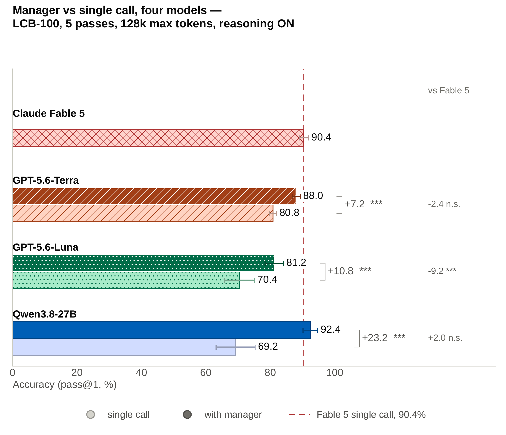
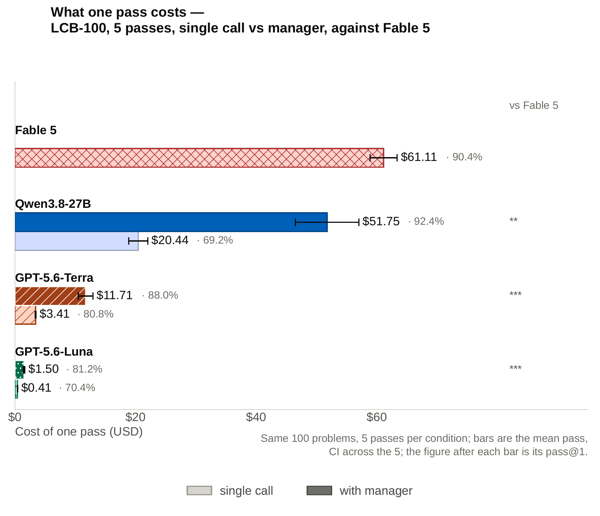
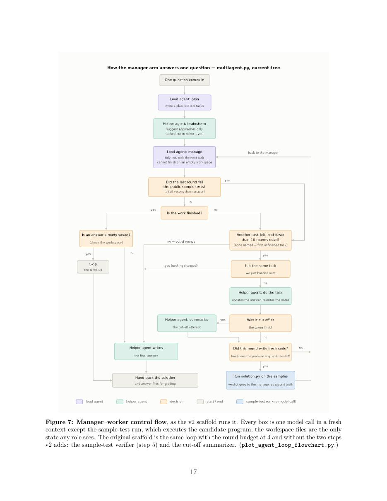

# Zero-Shot Self-Orchestration with Ledger-Based Control for Improved LLM Coding Performance

> **Source** : arXiv:2608.26480v1 [cs.MA], 27 août 2026 — <https://arxiv.org/abs/2608.26480> (copie du PDF sous `pdf/arxiv-2608.26480.pdf`)
> **Auteurs** : Victor Gao¹, Vida Khosrowshahi¹, Ali Khosrowshahi¹, Xihao Sun, Juhyun Lee, Simon (Sang Won) Lee† — Persis Capital Inc. (¹ contribution égale ; † auteur correspondant)
> **Récupéré le** : 2026-09-12 — **Statut** : Preprint, 27 pages
> Export Markdown fidèle du texte intégral du PDF. Figure 7 (flux de contrôle) rendue sous `images/arxiv-2608.26480/` ; les figures 1 et 2 sont mises en miroir depuis le dépôt compagnon sous `images/github-gvs5h/`. Dépôt compagnon (code, prompts, données de runs) : export `github-slee-persis-gvs5h.md`.
> **Pertinence pour ce dépôt** : orchestration inference-time SANS entraînement d'un modèle unique (manager–workers sur un workspace fichiers partagé — plan, task list, notes, solution courante) ; mêmes ingrédients que le harnais AVO (workspace persistant, notes, décomposition, contextes frais bornés) mesurés avec arms appariés et tests de significativité ; gains les plus forts sur les petits modèles ouverts (Qwen3.8-27B +23,4 pts, atteint le niveau frontier en auto-hébergé) et sur les modèles sans raisonnement ; gains conditionnels — Qwen3.6-35B (le modèle de travail de ce dépôt) y est le perdant type (−1 à −9 avec raisonnement coupé, +18 avec raisonnement clampé à 32k) ; mécanismes documentés par transcripts (gestion de contexte, décomposition, « forcer l'idée sur le disque avant l'épuisement du budget ») directement pertinents pour la boucle P→I→E→B et le superviseur.

---

## Abstract

Multi-agent large language model systems are widely reported to beat single-model baselines, but the evidence is mixed, and comparisons are usually confounded: pipelines change token budgets, tool calls, and prompts simultaneously, so an aggregate gain rarely reveals what actually helped. We investigate the effect of introducing the manager–worker scaffold over a shared filesystem workspace, with no training and no per-benchmark tuning, measured against the same model answering in a single pass. Across nine models — five open-weight, spanning 9B to ∼2.8T parameters, and four frontier closed models — on the 100 latest hard LiveCodeBench problems, the scaffold's benefit is real but conditional: large and statistically significant for some (Qwen3.8-27B +23.4, GPT-5.6-Luna +10.6 and GPT-5.6-Terra +8.0, each over five paired passes; Kimi-K3 +30.4 and Minimax-M3 +11.0 over five paired passes with reasoning off, both at p < 10⁻⁴, and +42 and +12 in a single pass at a 128k cap) and null or negative for others (Qwen3.6-35B −1 to −9 with reasoning off). With the manager, Opus-5 achieves the highest score in the study at 91% in one pass. Running a manager roughly triples the token bill, but it buys accuracy more cheaply than moving to a larger model does: GPT-5.6-Terra with a manager nearly matches Fable 5's single-call accuracy (85.0 against 87.4, p = 0.59) at a fifth of the price ($11.71 against $61.11 per 100-problem pass, p < 10⁻⁴), and the Qwen-27B arm does it for $51.75 on weights anyone can self-host. Our transcript analysis finds several mechanisms behind the gains, of which two recur: context management, in which short worker calls and shared notes organize state and reduce truncation, and problem decomposition. Improvements are modest for large models with reasoning enabled, but larger for some models with reasoning disabled and for smaller models with reasoning enabled.

## 1 Introduction

Large Language Models (LLMs) are increasingly deployed not as single-shot predictors but as agents: models wrapped in a scaffold that lets them plan, call tools, keep notes, and revise their own work over multiple turns. A popular next step is to use a system of several such agents together, on the intuition that a team that decomposes a problem, critiques one another, and pools partial results should outperform a single model answering in a single pass. That intuition has produced a large literature [1], but the evidence is mixed [2] and much of it is confounded [3]: multi-agent pipelines usually change several factors at once, including token budgets, tool calls, prompts, and retrieval, so an aggregate gain over a single call rarely identifies which factor helped.

Our comparison holds the underlying model and problem set fixed while comparing two conditions: the same model answering in a single pass and the same model operating within a manager-plus-workers scaffold over a shared filesystem workspace. The scaffold requires additional test-time computation but no training or per-benchmark tuning. Its coordination is dynamic rather than learned: the manager revises the task list after each round, chooses the next step, and decides when to stop. Every role uses the same model in a fresh context.

### 1.1 Related work

We group prior multi-agent LLM systems into four families according to how they coordinate, and then compare our design with each family. These systems build on single-agent scaffolds that add structure around one model: ReAct [4] interleaves reasoning traces with tool actions, Reflexion [5] has an agent verbally critique its own attempt and retry from that reflection, and Self-Refine [6] iterates generate→feedback→revise within a single model. Our worker role is an instance of that idea; what we vary is the coordination layer above it.

**(a) Learned / trained orchestrators.** Here the coordination policy itself is trained: a model learns to decompose a task, assemble a team, and route or role-assign sub-tasks. It is the line closest to what we do. Sakana AI's Fugu [7] packages a whole multi-agent orchestration system behind a single model API — a learned coordinator that, per query, assembles and coordinates a pool of expert LLM workers, verifies, and synthesises. Its authors position it against two alternatives: multi-agent workflows that users must design, tune and operate, and coordination built on fixed communication patterns or single-step routing — Fugu instead trains the orchestrator itself to decide, adaptively and per query, how to use its agent pool. The more general of its two ICLR 2026 foundations is the Conductor [8], a 7B model RL-trained (GRPO) to design worker communication topologies and per-worker prompts — reaching state of the art on GPQA-Diamond and LiveCodeBench by orchestrating other models rather than solving problems itself. What is learned here is the workflow structure itself. (Its companion, Trinity, learns only role assignment over a fixed structure, and we discuss it under (b).) Earlier learned-combination work includes query routers such as RouteLLM [9], which trains a router on preference data to pick a model per query. Our system is the training-free counterpart to this family: the manager is a fixed prompt with no learning, which lets us ask how much of the orchestration benefit is available without training, and when it materialises.

**(b) Fixed task lists and hand-designed workflows.** Roles and their hand-off order are specified in advance and every problem flows through the same pipeline. MetaGPT [10] encodes a software company's SOPs across PM/architect/engineer/QA roles; ChatDev [11] runs a chat-driven design→code→test waterfall; AutoGen [12] provides configurable conversable agents; CAMEL [13] fixes a role-playing pair. For code specifically, AgentCoder [14] pairs a coder with test-designer and test-executor roles in a fixed loop, and MapCoder [15] runs a fixed four-agent pipeline — example recall, planning, code generation, debugging. Trinity [16] sits at the boundary of this family and the learned one: it fixes a three-role workflow — Thinker, Worker, Verifier — but uses a small evolution-strategy-trained coordinator to decide, each turn, which LLM fills each of the three fixed roles. The structure is hand-designed; only the per-turn model assignment is learned. This family is closest to ours in spirit, but its pipeline is static, whereas our manager re-curates the task list every step and decides for itself when to stop.

**(c) Shared-blackboard and decentralised contributions.** Here agents coordinate through a shared external store or aggregation rule rather than a hard-coded pipeline. Most relevant to us, ARIADNE [17] targets exactly our setting, program generation, with a blackboard-driven MCTS: candidate solutions are explored under a reward signal, with a shared blackboard as the working memory that the search reads and writes. LbMAS [18] likewise mediates all agent communication through a global blackboard, choosing agents dynamically from board state rather than a fixed template, which also cuts the overall prompt length across agents. In the fully decentralised direction, multi-agent debate [19] has agents critique and revise toward consensus (a "society of minds"), and sampling-and-voting [20] shows raw agent count alone can lift accuracy; see Guo et al. [1] for a survey. Mixture-of-Agents [21] aggregates in layers rather than in one vote: several proposer models answer, and an aggregator model synthesises their answers into the next layer's input. As a zero-shot orchestrator, nothing is trained — the aggregator is an off-the-shelf model given a fixed synthesis prompt, and which model sits in which layer is chosen by hand from win rate and output diversity. Our workspace is a shared store that keeps each call's context short, similar to the blackboard used in ARIADNE/LbMAS, but our coordination is a single manager's plain task-list loop, with no MCTS, no reward model, and no learned search policy.

**(d) Budget-controlled comparisons.** A separate line of work asks not how coordination is decided but whether reported multi-agent gains survive equalising test-time compute. Wang et al. [22] price each strategy in tokens and compare at a matched budget: several of the more elaborate ones keep little of their advantage over plain self-consistency once the spend is held equal, which is their argument for reporting budget alongside accuracy as a matter of course. Tran and Kiela [3] match the intermediate reasoning-token budget between a single agent and several multi-agent architectures across Qwen3, DeepSeek-R1-Distill-Llama and Gemini 2.5, and find that single-agent systems match or outperform multi-agent ones on multi-hop reasoning once thinking tokens are held constant; they motivate this with a Data Processing Inequality argument — routing information through additional agents cannot add information — and predict that "multi-agent systems become competitive when a single agent's effective context utilization is degraded, or when more compute is expended." Our experiment does not attempt an equal-token comparison on the same model: the manager–worker loop necessarily spends more tokens than the single-agent baseline, and we ask whether that additional spend buys better solutions — not whether orchestration is more information-efficient per token. We also compare the cost-effectiveness of using this scaffold on a cheaper model against fewer tokens on an expensive model.

### 1.2 Our experiment

Throughout, we use *agent* to mean a separately prompted model invocation with a distinct role and a fresh context; all agents share the same underlying model. We call this *zero-shot self-orchestration*: inference-time orchestration in which the orchestrator is neither trained for orchestration nor provided task-specific demonstrations of how to decompose or coordinate the problem.

Our design sits between the three families:

- **A shared filesystem workspace.** The workspace serves as a persistent shared ledger, containing a plan, a task list, an accumulating notes file, and the current best solution. All roles read and write these files, so the state of the computation persists across agent invocations rather than residing in any one context window.
- **A manager that adapts the plan.** A manager instance reads the problem, writes an overarching plan, and then runs a loop: it inspects progress, curates the task list, spawns a fresh worker to do the single most valuable next task, and verifies the output against the sample cases (in the v2 scaffold, §3), repeating until it judges the problem solved or a small round budget is exhausted. There is no fixed pipeline — the manager decides, per problem, what happens next.
- **No training, no per-benchmark tuning.** Every role is the same model invoked in a fresh context with a short generic prompt. As a zero-shot orchestrator, nothing is trained or hand-tuned against the problem set. The two conditions hold the model, the benchmark and the solver temperature fixed; the "manager" condition adds the orchestration calls, their role-specific prompts, the shared workspace state and the test-time compute that comes with them.

This design measures the effect of the manager–worker scaffold relative to the corresponding single-call baseline while holding the model and problem set fixed.

## 2 Results

### 2.1 Pinned-backend arms at 128k with thinking on — five passes

Our headline condition is four models run five independent times each at a 128k cap with thinking on, on the 100 latest hard LiveCodeBench problems (LCB-100, §3.2). Every arm is served on a pinned backend — the GPT-5.6 pair by the official OpenAI API, Qwen3.8-27B by our own vLLM, Claude Fable 5 by the Anthropic Messages API — and every arm runs the v2 scaffold (§3). Every condition here is repeated five times. The earlier runs of §2.4 cover more models, but only their 16k reasoning-off condition repeats; the rest are one pass each, through a gateway whose routing proved to be the main source of run-to-run noise.

**Table 1 : LCB-100 pass@1 (%), five independent passes.** At a 128k cap with thinking on, all arms served on a pinned backend and run on the v2 scaffold (§3). Mean ± standard deviation (SD) across passes; ∆ is the paired per-pass difference (manager − single).

| Model | Serving | Single | Manager | ∆ | Per-pass ∆ |
|---|---|---|---|---|---|
| Claude Fable 5 | Anthropic | 87.4 ± 1.1 | –ᵇ | – | –ᵇ |
| GPT-5.6-Terra | OpenAI | 77.0 ± 1.0 | 85.0 ± 1.0 | +8.0 ± 0.0ᶜ | +8, +8, +8, +8, +8 |
| GPT-5.6-Luna | OpenAI | 67.2 ± 4.3 | 77.8 ± 2.0 | +10.6 ± 5.1 | +17, +7, +13, +4, +12 |
| Qwen3.8-27B | local vLLM | 63.0 ± 4.1ᵃ | 86.4 ± 2.7 | +23.4 ± 6.6 | +15, +20, +29, +22, +31 |

> ᵃ Qwen3.8-27B's manager arm ran at 128k, but its single arm was generated at a 250k cap. The column reports that arm cap-matched back to 128k so the row is like-for-like; the procedure is described in §3.2. As generated at 250k it scores 65.6 ± 4.6 for ∆ = +20.8 ± 7.0 (§2.3).
> ᵇ Fable 5 was run single-only, so it contributes a single-call figure and no ∆. Its per-pass scores are 86, 87, 87, 88, 89.
> ᶜ The zero SD is a coincidence of aggregates, not a fixed set of problems. Across the five passes the manager wins 9/10/10/11/11 problems the single call loses and loses 1/2/2/3/3 that it wins; the two move together and happen to net to +8 each time. The underlying sets churn: 29 distinct problems are manager-only in at least one pass, and only one is manager-only in all five.

**All three models evaluated in both conditions benefit from the manager**, and the five repeated passes show that the gains are not single-pass artifacts. Terra, already strong single-shot at 77.0, moves +8.0. Luna gains +10.6 ± 5.1, and the manager also halves its run-to-run spread (4.3 → 2.0 SD). Luna's per-pass ∆ ranges from +4 to +17, so the effect size is real but the per-pass estimate is unstable; Terra's narrow band is the more reliable of the two.

**Qwen3.8-27B shows the largest gain of the three**, +23.4 ± 6.6 (+15 at worst). The manager arm reaches 86.4 ± 2.7 — comparable to Fable 5 and Opus-5's (§2.4) single-call scores — and it does so while narrowing the spread from 4.1 → 2.7 SD. The direction matches the reasoning-on pattern of §2.4: the smaller the model, the more the scaffold has to add.

Figure 1 compares the four models. Ordered by single-call score, the manager's gain shrinks monotonically as the single call gets stronger — +23.4, +10.6, +8.0 — and Fable 5's lone bar marks where that trend is heading: the scaffold buys most where the model unaided is weakest, and the three managed arms converge into a band a few points below the best single call in the study rather than passing it.

> **Figure 1 : Manager vs. single call.** 128k × 5 passes, reasoning on. Bars are pass@1 on the same 100 problems, the line through each the 95% CI across the 5 passes (t, df = 4). "Single call" is one call with no tools and no loop; Fable 5 ran single-only, so it has one bar. Short brackets are with manager − single call, long brackets the same arm against Fable 5. Both are paired sign-flip permutation tests, unit = problem (n = 100), Holm-corrected within each family of 3: \* p < .05, \*\* p < .01, \*\*\* p < .001. The three within-model ∆ all clear p < 1e-4; against Fable 5, p = Qwen3.8-27B 0.73, GPT-5.6-Luna 4.6 × 10⁻⁴, GPT-5.6-Terra 0.59. Every arm is at a 128k cap and re-scored on the corrected evaluator (§3.3); Qwen3.8-27B's single arm is the 128k cap-matched replay of a 250k generation, which §3.2 describes and §2.2 costs out.

**Cap-matching.** The arms are not natively cap-matched. The GPT-5.6 pair ran both arms at 128k, so did Fable 5's single arm and Qwen3.8's manager arm, but Qwen3.8's single arm ran at 250k, and it spent that budget: its one call per problem hit `finish_reason=length` at 250,000 tokens on 124 of 500 problem-passes. We therefore replay that arm at 128k by the procedure in §3.2, which cuts 150 of the 500 generations. What the cap is worth, and how much of the ∆ turns on it, is quantified in §2.3.

**Per-problem agreement.** Pass@1 differences can hide compensating gains and losses, so we also count, over every problem × pass, where exactly one arm succeeded. Fable 5 is absent here for want of a second arm:

**Table 2 : Per-problem agreement between the two arms.** Counted over every problem × pass, 500 per model.

| Model | Manager only | Single only | Both | Neither | Exact McNemar p |
|---|---|---|---|---|---|
| Qwen3.8-27Bᵃ | 125 | 8 | 307 | 60 | 4 × 10⁻²⁸ |
| GPT-5.6-Luna | 71 | 18 | 318 | 93 | 1 × 10⁻⁸ |
| GPT-5.6-Terra | 51 | 11 | 374 | 64 | 3 × 10⁻⁷ |

> ᵃ Counted against Qwen3.8's cap-matched 128k single arm, matching its row in §2.1. Against the as-generated 250k arm the split is 114 / 10 / 318 / 58 (p = 2 × 10⁻²³): cap-matching moves twelve problem-passes from "both" to "manager only" and two from "single only" to "neither", with one moving back — on arc194_e the 128k cut lands inside the reasoning, where the fallback of §3.2 finds a whole program that the 250k answer had been cut off part-way through.

All three clear significance comfortably: in every case the manager wins around four times as many problem-passes as it loses, or better. Qwen3.8's split is the most lopsided in the study at 125 against 8 — nearly sixteen to one, a net of 117 problem-passes, which is the whole +23.4. Luna's is the closest, 71 against 18, and Terra's is the smallest in absolute terms, 51 against 11 for a net of 40.

### 2.2 What the scaffold costs

Every ∆ in §2.1 is bought with tokens. The manager replaces one call with a plan, a brainstorm, a verifier and up to ten worker rounds, and every one of those is billed: +153% on Qwen3.8-27B ($20.44 to $51.75 a pass), +266% on GPT-5.6-Luna ($0.41 to $1.50) and +244% on GPT-5.6-Terra ($3.41 to $11.71), every one of them clear per run and per problem. Roughly, the scaffold triples the bill, and that is what the gains in §2.1 cost. Every arm priced here is at the same 128k output cap, Qwen3.8-27B's single call included (§3.2).

**Table 3 : What one pass cost each arm.** List rate × the tokens it consumed.

| Arm | Rate $/MTok in / out | In (MTok) | Out (MTok) | $/pass | $/solved |
|---|---|---|---|---|---|
| Qwen3.8-27B single | $0.35 / $2.75 | 0.0753 | 7.4247 | $20.44 | $0.32 |
| Qwen3.8-27B manager | $0.35 / $2.75 | 1.5053 | 18.6277 | $51.75 | $0.60 |
| GPT-5.6-Luna single | $0.20 / $1.20 | 0.0661 | 0.3299 | $0.41 | $0.006 |
| GPT-5.6-Luna manager | $0.20 / $1.20 | 1.1686 | 1.0522 | $1.50 | $0.019 |
| GPT-5.6-Terra single | $2 / $12 | 0.0661 | 0.2728 | $3.41 | $0.044 |
| GPT-5.6-Terra manager | $2 / $12 | 1.1098 | 0.7911 | $11.71 | $0.14 |
| Fable 5 single | $10 / $50 | 0.0899 | 1.2043 | $61.11 | $0.70 |

> List rates: Qwen3.8-27B [25], GPT-5.6-Luna and GPT-5.6-Terra [23], Fable 5 [24].

**Table 4 : The differences between those costs.** Tested per run and per problem.

| Comparison | ∆ $/pass | p (per pass, n = 5) | p (per problem, n = 100) |
|---|---|---|---|
| Qwen3.8-27B: manager − single | +31.31 | 8.7 × 10⁻⁵ | < 3.5 × 10⁻⁵ |
| GPT-5.6-Luna: manager − single | +1.09 | 4.3 × 10⁻⁵ | < 3.5 × 10⁻⁵ |
| GPT-5.6-Terra: manager − single | +8.30 | 8.7 × 10⁻⁵ | < 3.5 × 10⁻⁵ |
| Fable 5 single − Qwen3.8-27B manager | +9.36 | 0.0051 | 0.20 |
| Fable 5 single − GPT-5.6-Luna manager | +59.61 | 9.5 × 10⁻⁷ | < 3.5 × 10⁻⁵ |
| Fable 5 single − GPT-5.6-Terra manager | +49.40 | 1.3 × 10⁻⁸ | < 3.5 × 10⁻⁵ |
| GPT-5.6-Terra single − GPT-5.6-Luna manager | +1.91 | 2.1 × 10⁻⁷ | < 3.5 × 10⁻⁵ |

> **Figure 2 : The scaffold's bill.** Cost of one pass over the same 100 problems. Table 3 is the arithmetic behind every bar: published list rate, the tokens one pass of that arm actually consumed, and their product. No cached-input discount is taken, and Qwen3.8-27B is priced at OpenRouter market rates. Table 4 tests the gaps. Light bars are the single call, dark bars the manager, all at a 128k output cap. ∆ is tested per run (Welch, n = 5 vs 5) and per problem (paired sign-flip, n = 100), Holm-corrected across the seven comparisons.

> **Figure 3 : Cost against accuracy** (voir le PDF, p. 7). One point per arm; a line joins each model's two arms. x is dollars for one pass over the 100 problems (log scale), y is pass@1; the bar through each point is the 95% CI across the 5 passes (t, df = 4). Light fill = single call, dark = with manager, and the line joins the two arms of one model. Qwen3.8-27B's single arm is the 128k cap-matched one on BOTH axes — score from the replay, output tokens capped at 128,000 per call to match. Priced as generated at 250k it would sit at $29.08 rather than $20.44. Retried and discarded attempts are counted: they were generated and would be billed. The cheapest arm is GPT-5.6-Luna, single call at $0.41 a pass and the most accurate is Fable-5, single call at $61.11 — a 149× spread in price for +20.2 points.

Figure 3 plots price against accuracy for all seven arms and connects each model's two conditions. The joint view reveals three patterns that neither measure shows alone.

**The base cost varies considerably across models.** A single-call pass generates 7.4M output tokens on Qwen3.8-27B against 0.33M on GPT-5.6-Luna and 0.27M on GPT-5.6-Terra. The open model thinks its way to 63.0% at length; the OpenAI models reach 67.2% and 77.0% in a twentieth of the tokens. Since thinking bills as output, a bill here is as much a fact about how much reasoning a provider lets a model emit as about the scaffold wrapped around it.

**The scaffold's move is up and to the right in every case.** It buys accuracy with money: 9.7 points per extra dollar on GPT-5.6-Luna, 1.0 on GPT-5.6-Terra, 0.7 on Qwen3.8-27B.

**Costs vary widely, while the frontier is nearly flat at the top.** The cheapest arm and the most accurate are 149× apart in price for 20.2 points, and the last 2.4 of those points cost more than the first 17.8.

**Three comparisons along the frontier.** First, GPT-5.6-Terra with a manager nearly matches Fable 5 for a fifth of the price: 85.0 against 87.4, at $11.71 a pass against $61.11. Those 2.4 points are within error (p = 0.59, Figure 1), and the one-sided 95% bound allows a deficit of 5.8 points, while the savings are significant (p < 10⁻⁴ both per run and per problem). Both arms are priced off API list rates in effect when the experiments were run [23, 24].

Second, Qwen3.8-27B with a manager reaches 86.4 against Fable 5's 87.4, and does it for less: $51.75 a pass against $61.11, a $9.36 saving per 100-problem pass (p = 0.005). The one point between them is not resolved either (p = 0.73, Figure 1; a 95% deficit of up to 4.8 points allowed). The costs are calculated with a rate of $0.35/$2.75 per MTok from a third-party OpenRouter host [25]. Our test was run locally, and anyone with capable hardware could potentially host it with a lower cost.

Third, the two GPT-5.6 models provide the clearest case in the paper for spending on the scaffold rather than on the model. GPT-5.6-Luna with a manager matches GPT-5.6-Terra's single call on accuracy at 44% of the price: 77.8 against 77.0, for $1.50 against $3.41. The price half is decisive — $1.91 a pass, p = 2.1 × 10⁻⁷ across runs and p < 3.5 × 10⁻⁵ across problems (Table 4). The 0.8-point lead is not itself significant (two-sided p = 0.76), but there is no sign of a deficit either, and the one-sided 95% bound rules out Luna's manager trailing by more than 2.4 points.

### 2.3 The effect of truncation

An empty solution is an automatic fail, so any condition that emits fewer empty solutions gains pass@1. Across the seven pinned-backend arms of §2.1 we can separate that channel from genuine problem-solving exactly, because these runs carry per-call `finish_reason`. Two counts are involved: a *cap hit* is a graded generation that reached the token limit (`finish_reason=length`) — for the single arms that is their one call, for the manager its final answer call — while *no code* is a problem-pass that ended with nothing the extractor could grade. A call can hit the cap and still be graded, because the model often writes a complete solution inside its reasoning before the cap arrives. Out of 500 problem-passes per arm, single (s) / manager (m):

**Table 5 : Cap hits and empty solutions per arm.** Single (s) / manager (m), out of 500 problem-passes each.

| Model | Cap hits s / m | No code s / m | of which refusals | Cap |
|---|---|---|---|---|
| GPT-5.6-Terra | 0 / 0 | 0 / 0 | 0 | 128kᵇ |
| GPT-5.6-Luna | 0 / 0 | 0 / 0 | 0 | 128kᵇ |
| Qwen3.8-27B | 150 / 5 | 35 / 0 | 0 | 128kᵃ |
| Claude Fable 5 | 3 / – | 9 / – | 6 | 128kᵇ |

> ᵃ Every count in this table is at a 128k cap, so the rows are like-for-like. Qwen3.8's manager arm ran natively at 128k; its single arm was run at 250k and is counted here cap-matched back to 128k. The 250k counts are given below.
> ᵇ A hard ceiling rather than a chosen setting: the GPT-5.6 family and Fable 5 both cap a synchronous API response at 128k output tokens (§3.2), so for these three arms a truncation cannot be relieved by raising the cap. Qwen3.8-27B, served locally, has no such ceiling — which is why its single arm could be run at 250k at all.

**The two OpenAI arms never truncate and never emit an empty solution** — zero cap hits and zero empty answers across all 2,000 problem-passes. Their ∆s in §2.1 therefore contain no rescue component at all.

**On Qwen3.8-27B the two counts differ by more than a factor of four.** At 128k its single arm is cut off on 150 of 500 problem-passes, yet only 35 end with nothing to grade. The large majority of cut-off generations still contain a complete solution, written inside the reasoning stream before the cap arrived and recovered from there by the extractor. A cut-off rate is not a loss rate. Against those 35 the manager has zero: it is not truncation-free internally — 108 of its 3,235 calls across the five passes hit the cap, 95 of them workers, touching 75 of the 500 problem-passes — but the loop absorbs them, because a cut-off worker costs a round, not the answer.

**Exploratory: the same run with the 128k limit lifted.** Qwen3.8-27B was run locally at its native context window of 262,144 tokens [26], so it was able to generate more than 128k tokens. Its single arm was in fact generated at 250k, with a 128k output cap imposed after the fact. Reading these outputs to their natural end recovers what the limit was hiding. We treat the reading as exploratory — it is cap-matched to nothing else in the paper, so it cannot carry a ∆ against the 128k manager arm — but it bounds what the extra budget is worth:

**Table 6 : Qwen3.8-27B's single arm read at both caps.** Cap-matched to 128k, and as generated at 250k.

| Qwen3.8-27B single | pass@1 | Cut off by the cap | No code at all |
|---|---|---|---|
| 128k (cap-matched, §2.1) | 63.0 ± 4.1 | 150 / 500 (30.0 %) | 35 / 500 (7.0 %) |
| 250k (as generated) | 65.6 ± 4.6 | 124 / 500 (24.8 %) | 21 / 500 (4.2 %) |

The tokens past 128k are worth 2.6 points, and they earn them by shrinking the tail rather than by lifting the run as a whole: 26 fewer generations end mid-stream and 14 fewer problem-passes finish with nothing to grade, with the per-pass no-code count falling 5/5/6/7/12 → 4/2/3/4/8. The pass that keeps the worst tail is also, at 128k, the joint lowest-scoring of the five. So on this model the cap acts less like a score multiplier than like a tax on the hardest few problems per pass.

**Manager "rescue," measured directly.** Of the single Qwen3.8-27B arm's 35 no-code cells, the manager passed 25, failed 10, and left none empty. This mechanism results in a 25/500 = 5.0 point increase to the manager's score, about a fifth of the manager's +23.4 point total improvement over the single pass.

**What the empty cells cost each model.** Re-scoring each single arm over only the problem-passes where it emitted code measures the same effect for every row:

**Table 7 : Each single arm re-scored over only the problem-passes where it emitted code.**

| Model (single arm) | As scored | Emitted code | Restricted to those |
|---|---|---|---|
| GPT-5.6-Terra | 77.0 | 500/500 | 77.0 |
| GPT-5.6-Luna | 67.2 | 500/500 | 67.2 |
| Qwen3.8-27B | 63.0 | 465/500 | 67.7 (+4.7) |
| Claude Fable 5 | 87.4 | 491/500 | 89.0 (+1.6) |

**Refusals — a failure mode unique to Fable 5.** Six of Fable 5's nine empty cells are not truncations but safety refusals: the API returned `stop_reason=refusal` with no content. All six fall on three ordinary competitive-programming problems, none of them security- or biology-adjacent, and none is deterministic — problem 3739 was refused in three of five passes, 3682 in two, abc393_e in one. We score them as failures and do not configure a fallback model, because a cell labelled Fable 5 has to contain Fable 5's outcome; a silent rescue by a different model would contaminate the measurement. The cost is about 1.2 points of the 87.4, and it is a penalty no other arm in this paper pays. The remaining three empty cells are true truncations, all on a single problem (arc191_d) that spends the full 128k reasoning without emitting an answer — the cap bounds thinking and answer together, so that is a possible outcome rather than a malformed response [27].

### 2.4 Earlier results — the OpenRouter-served model set

The five models below were served through the OpenRouter gateway and run on the original scaffold, so they are not directly comparable to the pinned-backend arms of §2.1: both the serving path and the scaffold version differ (§3).

**Table 8 : LCB-100 pass@1 (%), single → manager.** For the OpenRouter-served models on the original scaffold. "–" = not run; Qwen3.5-9B thinking-on returns reasoning-only replies and is unusable. The seven pinned-backend, five-pass arms are reported separately in §2.1 and are not pooled here, because both the serving path and the scaffold version differ.

| Model | Params | 128k · ON (1 pass) | 128k · OFF (1 pass) | 16k · OFF (×5) |
|---|---|---|---|---|
| Opus-5 | n/a | 85 → 91 (+6) | – | – |
| Kimi-K3 | ∼2.8T | 83 → 82 (−1) | 32 → 74 (+42) | 32.2 → 62.6 (+30.4) |
| Minimax-M3 | 428B | 60 → 66 (+6) | 25 → 37 (+12) | 21.2 → 32.2 (+11.0) |
| Qwen3.6-35B | 35B | 25 → 43 (+18) | 35 → 26 (−9) | 27.8 → 26.6 (−1.2) |
| Qwen3.5-9B | 9B | unusable | 17 → 20 (+3) | 14.6 → 21.8 (+7.2) |

With thinking on:

1. **Opus-5 tops the study at 85 → 91.** The +6 is a net of seven problems gained and one lost.
2. **The largest gains come from smaller models.** Ordered by scale, the single curve rises +60 pts (35B→Opus) and the manager curve +48 pts (Figure 4).

> **Figure 4** (voir le PDF, p. 11) : Manager vs. single, reasoning on, 128k, one pass. 128k max tokens, reasoning ON — effort:high for Kimi and Opus, and a 20k reasoning budget requested for Qwen and Minimax that providers often did not honour. ∆ = with manager − single call, in percentage points. One pass means no within-model repeat, so no per-model p is shown. Non-empty completions per 100 (single→manager): Qwen3.6-35B 34→68, Minimax-M3 92→93, Kimi-K3 97→100, Opus-5 97→100. Empty or truncated output scores as a fail, so ∆ partly tracks emit rate. Pairwise Tukey p: 35B vs 428B 0.19 n.s.; 35B vs 2.8T 0.0088; 35B vs Opus-5 0.19 n.s.; 428B vs 2.8T 0.65 n.s.; 428B vs Opus-5 1 n.s.; 2.8T vs Opus-5 0.65 n.s.

**Thinking off — cheaper runs, more passes.** Reasoning-off runs are far cheaper (no long reasoning tokens), so we ran five independent passes per condition at a 16k cap, plus a one-pass 128k.

**Significance.** Run-to-run spread across the five 16k passes is small — per-condition SD of 0.5–4.8 points single, 1.8–3.6 with the manager — so the deltas are not noise. Per model we run a paired sign-flip permutation test with the problem as the unit (n = 100), Holm-corrected across the four models, and report 95% confidence intervals across the five passes (Figure 5). The manager effect is significant for three of four models:

**Table 9 : Manager − single over the five 16k passes, reasoning off.**

| Model | ∆ (mgr − single) | Holm p | Significance |
|---|---|---|---|
| Kimi-K3 | +30.4 | < 2 × 10⁻⁵ | \*\*\* |
| Minimax-M3 | +11.0 | 6 × 10⁻⁵ | \*\*\* |
| Qwen3.5-9B | +7.2 | 4 × 10⁻⁴ | \*\*\* |
| Qwen3.6-35B | −1.2 | 0.7 | n.s. |

**Differences between models.** A Tukey HSD separates Kimi-K3 from all three others, and Minimax-M3 from Qwen3.6-35B (p = 0.0038); Qwen3.5-9B sits between them and separates from neither (p = 0.71, 0.087). So the manager helps Kimi most and Minimax-M3 more than Qwen3.6-35B; where the 9B belongs cannot be resolved from 100 problems.

**128k control.** One reasoning-off pass at the larger cap largely eliminates truncation and reproduces the ordering — Kimi +42, Minimax +12, Qwen3.5-9B +3, Qwen3.6-35B −9 (Figure 6). Empty output is not fully removed: single-arm emit rates run 79–96% against 92–100% for the manager, so part of the gap at the small end remains an emit-rate effect. It cannot explain Kimi, where a 4-point emit gap accompanies a +42-point score gap. Unlike the thinking-on setting, the single and manager curves diverge here (single +15 pts, manager +54 pts end to end), though the two settings span different model sets. From 35B upward the manager's advantage grows with model strength rather than converging.

**Truncation in this model set.** The 16k runs predate the per-call `finish_reason` instrumentation of §2.3, so the truncation channel can only be bounded here, not decomposed. At 128k it is negligible everywhere except Qwen3.6-35B with thinking on, which truncates on 48 of 100 single-call problems because its reasoning is clamped at a provider ceiling of 32k, far below the cap — an artifact of the gateway, not of the model. At the tight 16k cap the single arm produces no code on 13–43 problems depending on the model while the manager loses far fewer (Qwen3.5-9B 43 → 7, Minimax 35 → 5, Kimi 13 → 1). And the problems lost to the cap are the hard ones: those producing no code in at least three of the five 16k passes go on to pass at 0–25% at 128k, against 27–37% for the rest, so the manager's emit-rate advantage is concentrated where the answers were hardest to reach anyway.

Rescue is directly observable on the one model with enough truncation to measure it: of Qwen3.6-35B's 48 single-truncated problems the manager passed 21, left 15 still empty and filled but failed 12. Opus-5 truncated 3 and the manager passed all 3; Minimax-M3 and Kimi-K3 never truncate at 128k, so for them there is nothing to rescue and their deltas cannot be attributed to this channel at all.

> **Figures 5 et 6** (voir le PDF, p. 13–14) : Reasoning off, 16k × 5 passes et 128k × 1-pass control. Pairwise Tukey p (16k) : 9B vs 35B 0.087 n.s.; 9B vs 428B 0.71 n.s.; 9B vs 2.8T 1.4 × 10⁻⁹; 35B vs 428B 0.0038; 35B vs 2.8T 1.2 × 10⁻¹³; 428B vs 2.8T 5.4 × 10⁻⁷. (128k) : 9B vs 35B 0.35 n.s.; 9B vs 428B 0.6 n.s.; 9B vs 2.8T 7.6 × 10⁻⁷; 35B vs 428B 0.021; 35B vs 2.8T 5.3 × 10⁻¹¹; 428B vs 2.8T 2.5 × 10⁻⁴.

## 3 Method

§3.1 describes the current scaffold, v2, which produced the pinned-backend results in §2.1 and is shown in Figure 7. An original version produced the OpenRouter-served set of §2.4. It is the same loop and the same prompts, with four things absent, all of them on the manager arm:

| | v2 (§3.1, §2.1) | original (§2.4) |
|---|---|---|
| Round budget (MAX_ITERS) | 10 manager→worker cycles | 4 |
| Sample-test verifier (step 5) | yes | absent |
| Cut-off summarizer | yes | absent |
| Workspace files feeding a prompt | size-bounded | unbounded |

Because the single-call baseline is one call under either version, the difference touches only the manager arm — so manager-minus-single deltas are not strictly comparable across the two groups, and we report them as separate conditions rather than pooling them into one table.

### 3.1 The manager–worker loop

Every role uses the same underlying model, called in a fresh context and coordinating only through the shared workspace:

| Fichier | Rôle |
|---|---|
| `<ws>/task.md` | the problem statement |
| `<ws>/plan.md` | the manager's overarching plan |
| `<ws>/tasks.json` | the task list `[{id, desc, status, result}]` |
| `<ws>/notes.md` | accumulated ideas / findings / partial proofs |
| `<ws>/solution.py` | current best code |

The control flow (Figure 7) is:

1. **Manager — plan.** The manager reads the problem and writes a 3–6 sentence strategy plus 3–6 concrete seed tasks.
2. **Worker — brainstorm (ideation).** The first worker does not write a solution; it identifies the core difficulty, lists candidate approaches and pitfalls, and appends them to `notes.md`, proposing next steps.
3. **Manager — manage (loop).** The manager folds the plan and the brainstorm into one curated task list (merging duplicates, marking done items, adding only genuinely new sub-tasks), then either declares the problem done or names the single next task.
4. **Worker — do the task.** A fresh worker executes that one task, rewrites `solution.py`, appends what it did to `notes.md`, and proposes remaining steps.
5. **Verifier — run the sample tests** (absent from the original scaffold, §3). Whenever the round's worker produced a fresh candidate, the program is executed against the problem's public sample tests — the stdin-format tests, which cover 73 of the pinned 100 problems; the 27 LeetCode-style problems carry functional/call-based public tests the engine does not execute, so they are checked only by the hidden-test grader. The pass/fail verdict, with the first failing case, is fed back to the manager and treated as ground truth: a failing run overrides a done verdict, forcing the loop to continue with a fix-or-switch task. Control returns to the manager (step 3).
6. **Finalizer.** A finalization worker emits the definitive solution whenever the loop ends without a clean sign-off — the round budget is spent, the manager reissues a task it just handed out, or it names no task at all. The call is skipped when the manager declares the problem done and a usable solution is already on disk, so a redundant final pass cannot overwrite a correct answer.

Guards keep the loop cheap and safe: a round budget of 10 manager→worker cycles (MAX_ITERS); a no-progress guard (if the manager reissues the exact task it just handed out, the loop stops); and a cut-off summarizer — a worker that hits the token cap mid-attempt has its partial thinking summarized by a fresh short call so its ideas still reach the manager. The original scaffold ran the same no-progress guard, but with the budget at 4 and no summarizer (§3).

The single-call baseline is the same model, at the same temperature as the manager arm's workers (0.2), given the same problem in exactly one call — no shared workspace, no loop, and no other role in the prompt. The manager's generative calls use slightly higher temperatures, where the work is generative rather than executive: 0.3 to write the plan and 0.4 to brainstorm, against 0.2 for task execution and for curating the task list. These settings are identical in both scaffold versions. It receives the solver system prompt verbatim; the manager arm's workers receive that same prompt wrapped in a subagent preamble and a four-section output contract, and their user message additionally carries the plan, the accumulated notes and the current artifact. The two conditions differ only in that scaffold.

> **Figure 7 : Manager–worker control flow, as the v2 scaffold runs it.** Every box is one model call in a fresh context except the sample-test run, which executes the candidate program; the workspace files are the only state any role sees. The original scaffold is the same loop with the round budget at 4 and without the two steps v2 adds: the sample-test verifier (step 5) and the cut-off summarizer. (`plot_agent_loop_flowchart.py`.)

### 3.2 Benchmark and protocol

**Benchmark:** LiveCodeBench code-generation, release_v6 [28]. We take the 100 latest problems in the hard split (by contest date). Using the latest problems reduces training-data contamination [28]. Solutions are graded by LiveCodeBench's own hidden-test evaluator.

**Models:** Qwen3.5-9B [29] (9B), Qwen3.6-35B-A3B [30] (35B total, 3B active per token), Qwen3.8-27B [26] (27B, open weights, served locally in FP8), Minimax-M3 [31] (428B total, ∼23B active), Kimi-K3 [32] (∼2.8T total, ∼16 of 896 experts active per token), and the closed frontier models Opus-5 [33] (size undisclosed), two GPT-5.6 variants, Terra and Luna [34] (sizes undisclosed), and Claude Fable 5 [33] (size undisclosed) — nine model configurations in all.

Serving splits the set in two, separating models in §2.1 from §2.4. The five models of §2.4 were served through a single OpenAI-compatible gateway (OpenRouter) on the original scaffold, so that within that set the only thing varying is the model. The four models of §2.1 are each served on a pinned backend under the v2 scaffold (§3) — Terra and Luna by the OpenAI API, Qwen3.8-27B by our own vLLM, Fable 5 by the Anthropic Messages API — because gateway routing proved to be the dominant source of run-to-run noise (§4.5). Fable 5 was run single-only, so it contributes a single-call figure and no manager delta.

**Conditions:** The pinned-backend set of §2.1 runs at one setting — a 128k output cap, reasoning on, ×5 passes. Terra, Luna and Qwen3.8-27B are run in both single and manager conditions; Fable 5 is run single-only, as a reference arm. The cap is a per-call `max_tokens` bound on generation, not a context-window limit. 128k is also the ceiling some providers impose on a single response — Opus-5, Fable 5 and the GPT-5.6 family all cap a synchronous API response at 128k output tokens [33, 34], so for those arms the cap is the provider's hard limit rather than an experimental choice. Qwen3.8-27B, served locally, has no such response ceiling; what bounds it instead is its 262,144-token context window [26], which prompt and output share. The 250k output setting used for §2.3 is close to the largest output the model can produce at all. The gateway-served set of §2.4 are run at the three settings below:

- 128k output cap, reasoning on, ×1 pass — thinking enabled (native `reasoning_effort` for models that support it; a bounded 20k reasoning budget for open models that do not).
- 16k output cap, reasoning off, ×5 passes — 5 independent passes per condition to measure run-to-run variance and support paired significance tests.
- 128k output cap, reasoning off, ×1 pass — removes the small cap as a confound.

**Thinking:** The output cap and the scaffold are matched across the seven pinned-backend arms of §2.1. Thinking depth is not, because no two of these providers expose the same control over it. Qwen3.8-27B, on our own vLLM, is sent no `reasoning_effort` at all: the Qwen chat template leaves thinking on and unbudgeted, so the only thing bounding it is the 128k `max_tokens`, which on this stack covers reasoning and answer together. The two GPT-5.6 arms are likewise sent no `reasoning_effort`, leaving them at OpenAI's model default. Fable 5 has thinking set to adaptive with `display: summarized` — the most this API hands back, since no setting returns the raw chain of thought — and `output_config.effort` set as high, which is also the API default [27].

**Instrumentation:** In the two 128k-cap conditions, every model call's `finish_reason` and completion-token count is logged, and each problem's final record carries a status in {ok, truncated, empty_stop, empty, error}. The 16k × 5-pass runs predate that instrumentation: their records carry only the extracted code and its pass/fail, so per-call outcomes cannot be recovered for that condition. An empty code field is considered a failure.

**Cap-matching:** One arm is not natively cap-matched to its partner: Qwen3.8-27B's single call was generated at 250k while its manager arm ran at 128k (§2.1). To compare them at one cap we replay the stored generations rather than re-running the model. Each generation is truncated to 128,000 output tokens and the solution re-extracted from that prefix, after which it is scored on the same evaluator as every other cell (§3.3). Three details matter for interpreting the result:

- **Truncation is token-exact**, using the serving stack's own tokenizer, not a character-count approximation. The cases that decide the outcome are exactly those where a complete code block sits just before or just after the boundary, so an approximate cut would misclassify precisely the problems the procedure exists to settle.
- **What is truncated is the whole output stream**, reasoning then answer, because that is what the original cap bounded. Where the cut lands decides what the extractor sees: past the reasoning it sees a truncated answer; inside the reasoning the answer does not exist at all, and the harness's empty-content fallback hands it the truncated reasoning instead. That fallback is why so many cut-off generations still yield gradeable code (§2.3).
- **The cap is invisible to the model, which is what makes the replay exact.** This arm ran on our own vLLM, where `max_tokens` is a parameter the server enforces: it never enters the prompt and does not affect the model's output. Generation simply cuts off when the limit is reached. The records show that 124 of the 500 calls end at `finish_reason=length`, cut off abruptly rather than wound up. Nor is this local to vLLM: surfacing a budget to a model takes a separate, opt-in mechanism, and Anthropic ships `task_budget` precisely so a model can "finish gracefully … rather than cutting off mid-action," while `max_tokens` remains the enforced ceiling that "truncates the response" [27]. There is therefore no difference from genuine re-run at 128k.

**Statistics:** Reported ±SD is the sample SD (divisor n − 1 = 4) of the five pass scores. Five-pass comparisons: paired sign-flip permutation test on per-problem mean ∆ (n = 100 problems; 2 × 10⁵ resamples), Holm-corrected where a family of models is tested; 95% t-intervals for the mean pass@1 across the five independent passes (df = 4). Pooled problem×pass agreement tables use exact McNemar on the pooled discordants.

### 3.3 A correction to the evaluator

While inspecting transcripts for §4.1 we found a defect in the LiveCodeBench harness itself, and every number in §2.1–§2.3 is reported after fixing it. The evaluator does not run a candidate as a subprocess; it executes it in-process with `sys.stdin` replaced by a mock. That mock's binary view implemented `readline()` as `inputs.split(b"\n")[0]` — a stateless expression that returns the first line on every call. A program reading multi-line input through `sys.stdin.buffer.readline()` therefore read line 1 repeatedly and scored wrong no matter how correct it was. The text-mode `sys.stdin.readline` was patched to a proper iterator and behaved correctly, and `buffer.read()` returns the whole payload and was also unaffected, which is why the common `sys.stdin.buffer.read().split()` idiom never exposed it. We replaced the mock's binary view with one backed by a BytesIO so that reads advance a position, and re-scored every stored generation; no model was re-run.

This defect warrants explicit reporting for two reasons. First, it interacts badly with the v2 verifier: that step runs the candidate as a real subprocess (§3.1, step 5), where `buffer.readline()` works correctly, so the manager was told its solution passed the public samples for programs the grader then marked wrong — the one signal in the loop meant to be external and trustworthy, certifying the wrong answer. Second, the exposure is uneven across models rather than a constant offset: 311 of the 3,456 §2.1 outputs containing code use the idiom, and 97% of those were scored wrong against 20% for the outputs that do not. Fable 5 never uses it and its scores are unchanged to the decimal. The §2.4 model set reaches for it once in 5,012 generations, and then through an alias rather than the literal spelling — Kimi-K3's single call on abc396_g binds `sys.stdin.buffer` to a name and calls `readline()` on that. Every §2.4 number is re-scored on the fixed evaluator all the same, and exactly one cell moves: Kimi's 128k thinking-on single arm, from 82 to 83. Because usage of the idiom is a property of a model's coding style, a harness bug of this shape is not a wash across a leaderboard — it silently penalises the models whose style happens to trip it.

## 4 Discussion

### 4.1 Where the manager clearly helps (transcript evidence)

Each example is a problem that the single call failed and the manager solved. We include one per model, with each illustrating a different mechanism.

- **Surfacing the efficiency trap for a weak model** (Qwen3.5-9B, 128k, reasoning off, LCB abc385_d). On a path-simulation problem that counts houses lying on each move segment, the single 9B pass timed out — it ran a naïve per-segment scan. The manager's brainstorm flagged, in writing, that this check is O(N · M) ≈ 4 × 10¹⁰ and prescribed a range-query structure before any code, which the workers then filled in. For a small model, the workspace supplies exactly the up-front planning a single pass skips (cf. §4.3).
- **Escaping a stuck / over-long single pass** (Qwen3.6-35B, reasoning on, LCB abc394_f). The single call was cut off mid-reasoning at 32,768 tokens and returned nothing at all. The manager solved it in one worker cycle: the brainstorm crystallized the structural insight (an "alkane" subtree needs a degree-4 centre and ≥ 5 vertices) and the worker implemented an iterative DFS to avoid the recursion-depth failure that also affects many single calls. Across all manager-arm calls for this model, the same 32k ceiling was hit 117 times. With several attempts per problem, one clamped call no longer costs the problem.
- **Splitting a two-objective algorithm into separate sub-DPs** (Minimax-M3, reasoning on, LCB 3701). The task needs both the minimum edit cost of a "good caption" (runs of equal letters, each ≥ 3 long) and, among optimal captions, the lexicographically smallest. The single-pass program printed nothing on a small case (cdcd, whose answer is cccc) — its lexicographic-reconstruction branch was broken. The manager split the coupled objectives across worker cycles — one worker implementing the forward cost DP over capped run-lengths (dp[i][c][k]), a separate worker a suffix DP used purely for the lexicographic reconstruction — turning one tangled solution into two independently-written pieces.
- **Forcing an explicit reduction before coding** (Kimi-K3, 128k, reasoning off, LCB 3687). The single pass returned a wrong answer that over-counted the longest unique-value path (9 and 3 where the answers were 6 and 2), never shrinking its window on a repeated value. The manager's brainstorm step first wrote the reduction into notes.md — "this is longest-substring-without-repeating-characters along each root-to-leaf path; maintain a window start via last-seen depths; O(n) DFS" — and only then did a worker implement it, over two manager→worker cycles. The scaffold turned an implicit leap into an explicit, written plan the next call could build on.
- **Replacing an over-engineered structure with a smaller one** (GPT-5.6-Terra, reasoning on, LCB 3688). The task is a maximum-subarray sum where all occurrences of one chosen value may first be deleted. The single pass wrote 4,615 characters implementing a segment tree carrying minimum, second-minimum, maximum and a lazy add — a Segment-Tree-Beats-shaped structure indexed by candidate negative value — and got it wrong. The manager's plan named the actual difficulty in advance: the state must be "compressed so it does not require maintaining all distinct values per index". Nine calls later the manager arm returned 1,860 characters: one segment tree over the standard (total, best-prefix, best-suffix, best-subarray) merge. The scaffold's contribution here is subtraction — a correct solution 2.5× smaller than the failed one — which is the opposite of the usual worry that a scaffold adds machinery. Manager-only win in four of five passes.
- **Deriving the bounding lemma before coding** (GPT-5.6-Luna, reasoning on, LCB abc397_e). A tree on N K vertices must be decomposed into N paths of exactly K vertices. The single pass carried a set of unfinished path lengths per subtree (open_sets) — a general state it never managed to close — across 4,092 characters. The manager's brainstorm first established the lemma that makes the problem tractable: at any vertex there are at most two unfinished paths, and they must either extend through the vertex or join into one complete path of exactly K. With the branching bounded in writing, a worker implemented the postorder scan directly, in 2,166 characters over five calls. Manager-only win in two of five passes.
- **Rescuing a call that dissolved into self-verification** (Qwen3.8-27B, reasoning on, LCB abc397_g). Maximise the shortest 1-to-N distance after raising exactly K of M edges to weight 1. The single call spent all 250,000 tokens and never emitted a program: what the extractor recovered is the tail of its own edge-case interrogation ("Now, let's think about if the min-cut graph's min cut capacity is not equal to min cost labeling … We proved. Good."), the §4.2 failure mode in its pure form. Strikingly, that reasoning had already reached the right idea — it is discussing the min-cut formulation — and could not stop to write it down. The manager arm committed the same reduction to plan.md as a plan (binary-search the target distance D; feasibility is a vertex-labelling minimised by an s-t cut on a layered graph), then had a worker implement it: five calls, 3,548 characters, and a manager-only win in all five passes. The scaffold's role is not supplying the insight but forcing it onto disk before the budget runs out.
- **Writing the proof before the code** (Opus-5, reasoning on, LCB abc388_e). On maximising the number of disjoint (top, bottom) pairs with 2 · top ≤ bottom, the single pass emitted code whose feasibility test over-counted — reporting 225 pairs where 220 is optimal. The manager first recorded the justification in notes.md — an exchange argument that the K smallest elements as tops, matched in sorted order to the K largest as bottoms, is optimal, and that feasibility is monotone in K (licensing a binary search) — then had one worker implement it and a second harden it. This is a genuine correction, not truncation relief: separating the argument from the implementation caught an error the one-shot attempt made.

### 4.2 Truncation and large-context management

With multiple workers, organized notes replace an overflowing context window. State lives in plan.md, tasks.json, and notes.md rather than in one ever-growing transcript. Each worker sees a compact, curated view (plan + notes + current solution + one task) instead of the full history, which both lowers per-call length and keeps the salient facts in view. The workspace is, in effect, external memory that the token cap cannot truncate.

A crowded context or an unbounded generation does not merely risk being cut off — it can actively degrade a model, and the effect may be worse in the smaller models. Left to fill a long output, a weaker model risks losing the thread and looping. On abc399_e (Qwen3.8-27B single, reasoning on, 250k cap) the model produced 675,000 characters of reasoning, spent the entire 250,000-token budget, and emitted no solution at all; inside that stream it repeated the single line "Alphabet 5 with a↔b, c↔d, e→e fixed, and one letter? no." 7,743 times. Eight of the fourteen generations that spent the full budget without emitting code loop on the same template — "Now, let's consider if there is a possibility of … no." — inventing hypothetical edge cases against a candidate solution and answering each one, hundreds to thousands of times over, without ever terminating. This is the mechanism behind the otherwise odd finding of §2.3 that most cut-off generations still contain a complete solution: the model had reached an answer and then talked past the cap re-checking it.

The manager breaks the work into short, self-contained calls, each far from the cap, so the model's work actually reaches the disk. Bounding each call's workload, context and length is thus a guard against this collapse as well as a cost saving.

The same mechanism extends beyond this benchmark. A task whose inputs, working state, or intended output simply do not fit — a codebase larger than the context window, or a deliverable longer than the per-call output ceiling described in §3.2 — is not solvable in one call at any reasoning effort. Decomposing the task into a sequence of bounded steps allows the model to complete more complex tasks that would exceed a model's context window or API thinking/output limit outright.

### 4.3 A large effect on thinking-disabled models

The manager provides the largest benefit when the base model is least effective at self-organizing its own reasoning, and that weakness takes two forms. The first is having no internal planning stage at all: with thinking disabled, a single call jumps straight to code, and the scaffold's brainstorm-then-plan structure gives the model an alternative space to plan — on disk, across calls — that it would otherwise not use (Kimi +42, Minimax +12 at 128k-off). The second is thinking that runs away: Qwen3.6-35B with reasoning on spends its whole budget deliberating — 48 of its 100 single calls were cut off mid-thought, each at a provider-side 32,768-token output clamp, which is therefore that arm's modal completion length by a wide margin — and it gains +18, its largest gain in any condition. Where a model can both plan internally and stop on its own, the scaffold has less to add. The workspace substitutes for the reasoning a model cannot organize for itself.

### 4.4 Regressions: when the manager hurts

The manager is not free. Its deliberation can settle on a worse answer than a single call would have produced:

- **Deliberating its way into an algorithm it had already rejected.** On LCB 3765 (Qwen3.6-35B, 128k-off) the single pass wrote a correct convex-hull-optimized O(n²) dynamic program. The scaffold's ideation stage identified that same optimization and talked itself out of it — "implementing CHT is complex and error-prone" — committing instead to an O(n³) table its own notes call "too slow for Python," on the reasoning that the "test cases are weak." The one worker round then implemented that plan with a further bug, returning dp[n][n] — the all-singletons partition — rather than the minimum over subarray counts its own task list specified. The result is both wrong and, at 19 s for n = 1000 against 0.3 s, far too slow. Qwen3.6-35B is the standout loser with reasoning off (∆ of −1.2 at 16k and −9 at 128k): the compact, correct code is more often disturbed than helped by decomposition.

In practice, the scaffold can backfire when deliberation produces a worse plan than the model's initial approach and the manager fails to detect the regression.

**Two inexpensive, training-free additions may address these failures**, one for each part of the failure above — the plan that was wrong, and the implementation that went unchecked. First, **fresh-perspective workers**. Because every worker inherits the accumulated notes and the current solution, a wrong early approach anchors everything downstream — the failing rewrite of 3765 built on an approach its own ideation stage had already judged too slow, instead of reconsidering it. Spawning some workers with the raw problem statement and no prior context would give the manager an independent attempt to compare against the evolving one, and keep whichever is better; in effect this protects the tight single-shot solution that the scaffold otherwise disturbs, and diversifies away from a bad initial framing (the intuition behind sampling-and-voting and debate; [20, 19]). Second, **verification instead of trust**. Our manager currently takes each worker's solved report and the notes at face value (in the v2 scaffold, it performs only a sanity check using existing sample cases provided by the problem). A confidently-wrong DP, or a degenerate notes entry like the abc399_e loop (§4.2), propagates unchecked and can overwrite a correct intermediate answer. Adding a verifier that runs each candidate against a comprehensive suite of generated tests (or, for mathematics, checks the argument with proof-verification software) before the manager accepts it would catch precisely the regressions we observe, at the cost of extra calls.

### 4.5 Limitations

- **Serving-provider reliability (OpenRouter), §2.4 only.** The five models of §2.4 were run through OpenRouter's multi-provider routing, which proved a substantial and time-varying confound. This is the limitation that motivated the pinned-backend set of §2.1: those seven arms each talk to exactly one backend and are free of everything in this item, which is also why they — not the broader §2.4 sweep — carry the paper's headline claims. Individual providers intermittently stalled (no response within multi-minute wall-clock caps), dropped the response mid-stream (IncompleteRead), returned error objects instead of a completion (missing choices, 5xx/504s), clamped output below the requested cap (e.g. truncating generations at 32k while advertising 262k), or returned reasoning-only replies with content=null. When no provider yielded a usable completion, the attempt was recorded with no code and scored as a failure. Reported pass@1 therefore counts infrastructure failures as wrong answers, making absolute levels a conservative lower bound. Exact numbers are not perfectly reproducible, since they depend partly on provider health at run time. The relative single-vs-manager comparison is less sensitive to this confound because both conditions use the same provider pool, although provider-level variation cannot be ruled out.
- **Provider-served weights may vary (§2.4 only).** OpenRouter does not guarantee a single quantization or build per model; a config pinned to one provider set can be served differently than another, adding a second, smaller source of run-to-run variation on top of decoding temperature. The §2.1 arms are pinned to one backend each, and the single locally served arm (Qwen3.8-27B) to a specific FP8 checkpoint, so this does not apply to them.
- **Single pass in §2.4.** The thinking-on/off comparisons in §2.4 are one pass per condition (to limit API cost), so per-model significance there rests on the 16k five-pass runs; those deltas should be read as point estimates within the ∼4.5 pp pass-to-pass variation the 16k five-pass runs show on a manager-minus-single delta (individual arms vary by ∼2.7 pp). This is the other reason §2.1 repeats every condition five times, and it is why Opus-5's 85 → 91 — the highest score in the paper — remains a single-pass point estimate rather than a measured effect.
- **Fable 5 has no manager arm.** It was run single-only, so the strongest single-call result in the paper is also the one condition where we cannot say what the scaffold would do.
- **Refusals are scored as failures, and only one arm can incur them.** Fable 5 returned `stop_reason=refusal` on 6 of 500 problem-passes, spread sporadically over three ordinary problems (§2.3). We deliberately configure no fallback model, since a cell labelled Fable 5 must contain Fable 5's outcome, but the consequence is that its 87.4 carries ∼1.2 points of classifier penalty that no other arm in the paper is exposed to, and that the refusals add variance rather than a constant offset. Comparisons against Fable 5 are therefore mildly conservative in its disfavour.
- **Qwen3.8's 128k single arm is a replay, not an independent run.** Those generations were produced at 250k and truncated to 128k after the fact (§3.2). It is the right comparison for isolating the cap — identical generations either side — but it cannot capture any way the model might have budgeted its reasoning differently had it been told the smaller limit up front. A model that knows it has 128k may stop exploring sooner and write its answer earlier, in which case the replay understates what a real 128k run would score; we report the as-generated 250k reading alongside it throughout so the difference is visible rather than assumed.
- **A 9B model with thinking on was untestable.** Qwen3.5-9B with reasoning enabled could not be evaluated in any configuration we tried. Through OpenRouter it generates unbounded reasoning and returns reasoning-only replies (content=null, finish=error) or truncates before an answer appears, and no token or effort setting fixed it; every attempt was archived rather than graded. Locally the blocker was different: the checkpoint refused batching on ollama, leaving one sequence at a time and zero completed calls in a 34-minute smoke test. We report it as a model limitation rather than a data point, and it bounds how small a "thinking" model this scaffold can be applied to.
- **One benchmark family.** All reported results are competitive-programming code generation. Math and knowledge benchmarks (AIME, MATH-500, GPQA, HLE) were run in exploratory form but are not reported here: on a probe of the ten hardest problems in each, the frontier models sit at or near ceiling (Opus-5 100% on AIME, GPQA and MATH-500), leaving little headroom in which to measure a scaffold effect.

## 5 Conclusion

Holding the underlying model fixed, a lightweight manager–worker scaffold over a shared workspace with no training or task-specific tuning improves all three models measured with both arms on a pinned backend and the verifier-gated v2 scaffold, over five paired passes each: Qwen3.8-27B by +23.4, GPT-5.6-Luna by +10.6 and GPT-5.6-Terra by +8.0 points. The Qwen3.8 result is the most striking: a 27B open-weight model with the scaffold reaches 86.4, level with the best single-call result in the study (Claude Fable 5, 87.4 ± 1.1, run without any scaffold) and above Opus-5's single-call 85. It also lifts Opus-5 from 85 to 91 with thinking on, the highest absolute score observed in the study, although this single-pass result warrants replication. With reasoning off, the scaffold improves three of the four open models by +3 to +42 points, with the largest gains for Minimax-M3 and Kimi-K3. At the tight 16k cap, these models also show substantial reductions in unusable output, while Kimi-K3's +42-point gain at 128k occurs with zero recorded truncations in either arm. The results are conditional, however: Qwen3.6-35B shows no significant improvement at 16k and a −9-point change at 128k with reasoning off. These results provide a baseline against which more complex systems involving heterogeneous models or code verification can be compared.

What the scaffold costs is the other half of the result. A manager roughly triples the bill, but in many cases it is still cheaper than switching to a larger model. With the manager, GPT-5.6-Terra lands 2.4 points short of Fable 5, unresolved at p = 0.59, for $11.71 a pass against $61.11. Qwen3.8-27B with a manager lands 1.0 point short, with a much lower parameter count suitable for local inference. The same trade shows up where GPT-5.6-Luna behind a manager matches GPT-5.6-Terra's unaided single call at 44% of the price, having started 9.8 points behind it. On this evidence the scaffold may be a cost effective way of improving results.

## References

1. T. Guo, X. Chen, Y. Wang, R. Chang, S. Pei, N. V. Chawla, O. Wiest, and X. Zhang, "Large language model based multi-agents: A survey of progress and challenges," arXiv:2402.01680, 2024.
2. Q. Wang, Z. Wang, Y. Su, H. Tong, and Y. Song, "Rethinking the bounds of LLM reasoning: Are multi-agent discussions the key?" in Proc. ACL, 2024, arXiv:2402.18272.
3. D. Tran and D. Kiela, "Single-agent LLMs outperform multi-agent systems on multi-hop reasoning under equal thinking token budgets," arXiv:2604.02460, 2026.
4. S. Yao, J. Zhao, D. Yu, N. Du, I. Shafran, K. Narasimhan, and Y. Cao, "ReAct: Synergizing reasoning and acting in language models," in Proc. ICLR, 2023, arXiv:2210.03629.
5. N. Shinn, F. Cassano, E. Berman, A. Gopinath, K. Narasimhan, and S. Yao, "Reflexion: Language agents with verbal reinforcement learning," in Proc. NeurIPS, 2023, arXiv:2303.11366.
6. A. Madaan et al., "Self-refine: Iterative refinement with self-feedback," in Proc. NeurIPS, 2023, arXiv:2303.17651.
7. Sakana AI, "Sakana Fugu technical report," arXiv:2606.21228, 2026.
8. S. Nielsen, E. Cetin, P. Schwendeman, Q. Sun, J. Xu, and Y. Tang, "Learning to orchestrate agents in natural language with the Conductor," in Proc. ICLR, 2026, arXiv:2512.04388.
9. I. Ong, A. Almahairi, V. Wu, W.-L. Chiang, T. Wu, J. E. Gonzalez, M. W. Kadous, and I. Stoica, "RouteLLM: Learning to route LLMs with preference data," in Proc. ICLR, 2025, arXiv:2406.18665.
10. S. Hong et al., "MetaGPT: Meta programming for a multi-agent collaborative framework," in Proc. ICLR, 2024, arXiv:2308.00352.
11. C. Qian et al., "ChatDev: Communicative agents for software development," in Proc. ACL, 2024, arXiv:2307.07924.
12. Q. Wu et al., "AutoGen: Enabling next-gen LLM applications via multi-agent conversation," in Proc. COLM, 2024, arXiv:2308.08155.
13. G. Li, H. A. A. K. Hammoud, H. Itani, D. Khizbullin, and B. Ghanem, "CAMEL: Communicative agents for 'mind' exploration of large language model society," in Proc. NeurIPS, 2023, arXiv:2303.17760.
14. D. Huang, J. M. Zhang, M. Luck, Q. Bu, Y. Qing, and H. Cui, "AgentCoder: Multi-agent-based code generation with iterative testing and optimisation," arXiv:2312.13010, 2023.
15. M. A. Islam, M. E. Ali, and M. R. Parvez, "MapCoder: Multi-agent code generation for competitive problem solving," in Proc. ACL, 2024, arXiv:2405.11403.
16. J. Xu, Q. Sun, P. Schwendeman, S. Nielsen, E. Cetin, and Y. Tang, "TRINITY: An evolved LLM coordinator," in Proc. ICLR, 2026, arXiv:2512.04695.
17. M. Wei, X. Chen, X. Niu, and S. Chen, "ARIADNE: Agentic reward-informed adaptive decision exploration via blackboard-driven MCTS for competitive program generation," arXiv:2605.02431, 2026.
18. B. Han and S. Zhang, "Exploring advanced LLM multi-agent systems based on blackboard architecture," arXiv:2507.01701, 2025.
19. Y. Du, S. Li, A. Torralba, J. B. Tenenbaum, and I. Mordatch, "Improving factuality and reasoning in language models through multiagent debate," in Proc. ICML, 2024, arXiv:2305.14325.
20. J. Li, Q. Zhang, Y. Yu, Q. Fu, and D. Ye, "More agents is all you need," Trans. Mach. Learn. Res., 2024, arXiv:2402.05120.
21. J. Wang, J. Wang, B. Athiwaratkun, C. Zhang, and J. Zou, "Mixture-of-Agents enhances large language model capabilities," in Proc. ICLR, 2025, arXiv:2406.04692.
22. J. Wang, S. Jain, D. Zhang, B. Ray, V. Kumar, and B. Athiwaratkun, "Reasoning in token economies: Budget-aware evaluation of LLM reasoning strategies," in Proc. EMNLP, 2024, arXiv:2406.06461.
23. OpenAI. "API pricing." Accessed: Aug. 25, 2026. <https://developers.openai.com/api/docs/pricing>. Short-context tier; the long-context tier and the cached-input discount are not applied here.
24. Anthropic. "Pricing." Accessed: Aug. 25, 2026. <https://platform.claude.com/docs/en/about-claude/pricing>. Base input and output rates; the Batch API discount and the prompt-caching multipliers are not applied here.
25. OpenRouter. "Qwen3.8-27B." Accessed: Aug. 25, 2026. <https://openrouter.ai/qwen/qwen3.8-27b>. The hosted list rate the local vLLM run is priced at.
26. Qwen Team. "Qwen3.8-27B model card." Hugging Face. Accessed: Aug. 25, 2026. <https://huggingface.co/Qwen/Qwen3.8-27B>. 27B parameters; context window 262,144 tokens, confirmed against the FP8 checkpoint as served here (vLLM reports max_model_len = 262144 for Qwen/Qwen3.8-27B-FP8).
27. Anthropic. "Effort," "Thinking" and "Task budgets." Accessed: Aug. 25, 2026. <https://platform.claude.com/docs/en/build-with-claude/effort>, <https://platform.claude.com/docs/en/build-with-claude/thinking> and <https://platform.claude.com/docs/en/build-with-claude/task-budgets>. `effort` takes low, medium, high, xhigh or max, and "the API default is high" — setting it explicitly "produces exactly the same behavior as omitting the effort parameter entirely." On Fable 5 "thinking is already on: no configuration needed," `display` defaults to omitted, and "no display setting returns the raw chain of thought." Reasoning tokens "are billed as output tokens, even when the thinking text isn't returned to you, and they count toward max_tokens alongside the response text" — it is "a hard limit on total output, thinking plus response text." On the cap itself: `task_budget` is what makes a budget visible ("the model sees a running countdown"), and it is advisory, whereas "the enforced limit on total output tokens is still max_tokens, which truncates the response."
28. N. Jain et al., "LiveCodeBench: Holistic and contamination free evaluation of large language models for code," arXiv:2403.07974, 2024.
29. Qwen Team. "Qwen3.5: Towards native multimodal agents." Accessed: Aug. 17, 2026. <https://qwen.ai/blog?id=qwen3.5> and <https://huggingface.co/Qwen/Qwen3.5-9B>. Published February 2026; Qwen3.5-9B: 9B parameters.
30. Qwen Team. "Qwen3.6-35B-A3B model card." Hugging Face. Accessed: Aug. 17, 2026. <https://huggingface.co/Qwen/Qwen3.6-35B-A3B>. Published April 2026; 35B total parameters, 3B activated per token.
31. MiniMax. "MiniMax-M3." Accessed: Aug. 19, 2026. <https://www.minimax.io/blog/minimax-m3> and <https://huggingface.co/MiniMaxAI/MiniMax-M3>. Released 1 June 2026; ∼428B total parameters, ∼23B activated per token.
32. Moonshot AI. "Kimi K3." Accessed: Aug. 19, 2026. <https://www.kimi.ai/blog/kimi-k3> and <https://platform.kimi.ai/docs/guide/kimi-k3-quickstart>. ∼2.8T total parameters, Mixture-of-Experts with 896 experts and ∼16 activated per token.
33. Anthropic. "Claude models overview." Accessed: Aug. 14, 2026. <https://platform.claude.com/docs/en/about-claude/models/overview>
34. OpenAI. "GPT-5.6 model documentation." Accessed: Aug. 19, 2026. <https://developers.openai.com/api/docs/guides/latest-model> and <https://developers.openai.com/api/docs/models/gpt-5.6-luna>. Three variants (Sol, Terra, Luna), closed weights, parameter counts not published.
