# VISTA: A Visual Harness for Reasoning in an Interactive World

> **Source** : <https://vista-research.github.io/>
> **Publié le** : 2026-08-05 — **Récupéré le** : 2026-08-27
> Export Markdown fidèle de la page projet (images locales sous `images/vista-research/` ; les vidéos `.mp4` restent des liens vers le site d'origine).

---

**VISTA — Aug 5, 2026**

*VISTA completes all 25 public ARC-AGI-3 games with a perfect score.*

**Auteurs** : Qiushi Han\*, Keya Hu\*, Linlu Qiu\*, Cathy Wu, Kaiming He — Massachusetts Institute of Technology (\* co-leads)

[[Vidéo] figures/sp80-levels1-3.mp4](<https://vista-research.github.io/figures/sp80-levels1-3.mp4>)

**Sommaire** : 1. What is ARC-AGI-3? · 2. VISTA: A Visual Harness · 3. The Complete Pipeline · 4. VISTA Results on ARC-AGI-3 · 5. What This Shows and What's Next

How can an AI model understand and interact with an unfamiliar world?

The physical world is continuous and high-dimensional, and consists of information from different modalities. It is also dynamic and inherently changing all the time: an action may trigger a sequence of events and changes of the world states. As humans, we perceive the world through multiple senses, reason about the world in our brain, and take actions based on our understanding and past experience. This process robustly supports us in understanding and acting in the world, even in an unfamiliar environment.

But do existing AI models have such capability? We show that a similar idea also applies to them: a general-purpose multimodal model can observe the world through high-dimensional sensory inputs, reason about the world in a fuzzy but flexible manner, recall past experience through a lossless memory mechanism, and effectively take actions to interact with the world to achieve the goal.

To study this idea, we use ARC-AGI-3, a suite of interactive visual games in which an agent must discover the rules and goals of unfamiliar worlds through interaction. We introduce **VISTA** , a visual harness that gives a general-purpose multimodal model **long-horizon vision**. The agent directly observes the world through continuous high-dimensional sensory data, in this case raw PNG images, reasons about the world in its own way, recalls past observations in their original detail when needed, and takes actions to explore the world and achieve the goal.

Using Claude Opus 5.0 as the base model, VISTA completes all 25 public games, with a **100% win rate** and a perfect **100** Relative Human Action Efficiency (RHAE) score. It is also efficient, using **56.0%** fewer actions than first-time human players, and robust to different sensory inputs. We aim for a minimalist design, avoiding complex systems and task-specific engineering, instead focusing on a simple setup that supports the model to perceive and reason about the world in a natural way. While we use ARC-AGI-3 as a testbed, the same method extends naturally to other interactive environments. Our results demonstrate the potential of general-purpose multimodal models in understanding and acting in the physical world.

1.

## What is ARC-AGI-3?

[[Vidéo] figures/game-grid.mp4](<https://vista-research.github.io/figures/game-grid.mp4>)

Play again

Eighteen of the 25 public ARC-AGI-3 environments, each showing a complete VISTA run. The agent receives observations and available actions, but no description of the objects, mechanics, or goal.

[ARC-AGI-3](<https://arxiv.org/abs/2603.24621>) extends the abstract reasoning of [ARC-AGI-1](<https://arxiv.org/abs/1911.01547>) and [ARC-AGI-2](<https://arxiv.org/abs/2505.11831>) into interactive visual games. Unlike ARC-AGI-1 and ARC-AGI-2, which present static input-output transformations, ARC-AGI-3 requires the agent to explore a dynamic world through interaction. Each game begins without instructions, known rules, or a stated goal. At each step, the agent observes the current state and chooses from the available actions. The resulting observation provides evidence about what the action did and how the game may work. A game contains a sequence of levels that share underlying mechanics while introducing new objects, layouts, or constraints. The agent must infer object roles, transition rules, hidden state, and possible goals from experience, then carry that understanding into later levels.

Performance evaluation combines completion with efficiency. Relative to first-time human players, an agent receives more credit when it solves levels using fewer actions. A completed level receives full credit when the agent uses no more actions than the first-time-human baseline; an unfinished level receives zero credit, while a completed but less action-efficient level receives partial credit. ARC-AGI-3 therefore measures how efficiently an agent learns and completes the games through interaction and past experience.

[**Explore and play the public ARC-AGI-3 games →**](<https://arcprize.org/tasks>)

2.

## VISTA: A Visual Harness

VISTA uses three key designs: perception through natural high-dimensional visual input, reasoning through language, and memory management through lossless visual memory.

### Visual perception

The agent perceives the world by directly observing the original sensory input, in this case by reading 2D PNG images. This allows it to observe the world as faithfully as possible to the original information. A raw image retains spatial information, allowing the agent to reason directly about objects and their spatial relations.

In our experiments, the agent receives a 512 by 512 PNG image of the current rendered state, a nearest-neighbor upscaling (8x) of the official 64 by 64 frame with one-pixel grid lines between cells. We note that the agent is never told that the world is a 64 by 64 grid; the 512 by 512 PNG images are all it receives. It can also request an enlarged view of any rectangular region of the board, and thus, in principle, has intact information access.

In this way, the model must leverage its visual priors during reasoning, and we indeed observe that it forms and discovers visual concepts. Our framework is not restricted to 2D images as observation representations, and generalizes to more realistic cases, such as a 3D observation, as we demonstrate later.

Comparing different observation representations

In ARC-AGI-3, a 2D image is a natural way to represent the world, but it does not have to be the only way. The same world can be given to the agent as sensory input with different numbers of dimensions: a 1D flattened textual grid, where each color is represented by an integer, or a 3D scene rendered from the same game.

These mappings are fully reversible and theoretically preserve the same information, but they do not necessarily support the same computation. We find that while the agent is still able to perform well with the textual grid, it is less efficient in terms of token usage. We also find that the agent is still able to act effectively in the 3D scene, a form that is closer to how humans perceive the real physical world.

| Representation                                                                                                                      | What the agent receives                                                                                                                   |
|-------------------------------------------------------------------------------------------------------------------------------------|-------------------------------------------------------------------------------------------------------------------------------------------|
| **Text grid**                                                                                                                       |
| 64 by 64 integers, one color is represented by one integer.                                                                         |                                                                                                                                           |
|                                                                                                                                     |
|                                                                                                                                     |
|     0 0 0 0 0 0 0 0 0 0 0 0 0 0 0 0 0 0 0 0 0 0 0 0 0 0 0 0 0 0 0 0 0 0 0 0 0 0 0 0 0 0 0 0 0 0 0 0 0 0 0 0 0 0 0 0 0 0 0 0 0 0 0 0 |
|     0 0 0 0 0 0 0 0 0 0 0 0 0 0 0 0 0 0 0 0 0 0 0 0 0 0 0 0 0 0 0 0 0 0 0 0 0 0 0 0 0 0 0 0 0 0 0 0 0 0 0 0 0 0 0 0 0 0 0 0 0 0 0 0 |
|     0 0 0 0 0 0 0 0 0 0 0 0 0 0 0 0 0 0 0 0 0 0 0 0 0 0 0 0 0 0 0 0 0 0 0 0 0 0 0 0 0 0 0 0 0 0 0 0 0 0 0 0 0 0 0 0 0 0 0 0 0 0 0 0 |
|     0 0 0 0 0 0 0 0 0 0 0 0 0 0 0 0 0 0 0 0 0 0 0 0 0 0 0 0 0 0 0 0 0 0 0 0 0 0 0 0 0 0 0 0 0 0 0 0 0 0 0 0 0 0 0 0 0 0 0 0 0 0 0 0 |
|     0 0 0 0 0 0 0 0 0 0 0 0 0 0 0 0 0 0 0 0 0 0 0 0 0 0 0 0 0 0 0 0 0 0 0 0 0 0 0 0 0 0 0 0 0 0 0 0 0 0 0 0 0 0 0 0 0 0 0 0 0 0 0 0 |
|     0 0 0 0 0 0 0 0 0 0 0 0 0 0 0 0 0 0 0 0 0 0 0 0 0 0 0 0 0 0 0 0 0 0 0 0 0 0 0 0 0 0 0 0 0 0 0 0 0 0 0 0 0 0 0 0 0 0 0 0 0 0 0 0 |
|     0 0 0 0 0 0 0 0 0 0 0 0 0 0 0 0 0 0 0 0 0 0 0 0 0 0 0 0 0 0 0 0 0 0 0 0 0 0 0 0 0 0 0 0 0 0 0 0 0 0 0 0 0 0 0 0 0 0 0 0 0 0 0 0 |
|     0 0 0 0 0 0 0 0 0 0 0 0 0 0 0 0 0 0 0 0 0 0 0 0 0 0 0 0 0 0 0 0 0 0 0 0 0 0 0 0 0 0 0 0 0 0 0 0 0 0 0 0 0 0 0 0 0 0 0 0 0 0 0 0 |
|     0 0 0 0 0 0 0 0 0 0 0 0 0 0 0 0 0 0 0 0 0 0 0 0 0 0 0 0 0 0 0 0 0 0 0 0 0 0 0 0 0 0 0 0 0 0 0 0 0 0 0 0 0 0 0 0 0 0 0 0 0 0 0 0 |
|     0 0 0 0 0 0 0 0 0 0 0 0 0 0 0 0 0 0 0 0 0 0 0 0 0 0 0 0 0 0 0 0 0 9 9 9 9 9 9 9 9 9 9 9 9 9 9 9 9 9 9 9 9 9 9 9 9 0 0 0 0 0 0 0 |
|     0 0 0 0 0 0 0 0 0 0 0 0 0 0 0 0 0 0 0 0 0 0 0 0 0 0 0 0 0 0 0 0 0 9 9 9 9 9 9 9 9 9 9 9 9 9 9 9 9 9 9 9 9 9 9 9 9 0 0 0 0 0 0 0 |
|     0 0 0 0 0 0 0 0 0 0 0 0 0 0 0 0 0 0 0 0 0 0 0 0 0 0 0 0 0 0 0 0 0 9 9 9 9 9 9 9 9 9 9 9 9 9 9 9 9 9 9 9 9 9 9 9 9 0 0 0 0 0 0 0 |
|     0 0 0 0 0 0 0 0 0 0 0 0 0 0 0 0 0 0 0 0 0 0 0 0 0 0 0 0 0 0 0 0 0 9 9 9 2 5 5 5 5 5 5 5 5 5 5 5 5 5 5 2 2 2 0 0 0 0 0 0 0 0 0 0 |
|     0 0 0 0 0 0 0 0 0 0 0 0 0 0 0 0 0 0 0 0 0 0 0 0 0 0 0 0 0 0 0 0 0 9 9 9 2 5 5 5 5 5 5 5 5 5 5 5 5 5 5 8 8 8 0 0 0 0 0 0 0 0 0 0 |
|     0 0 0 0 0 0 0 0 0 0 0 0 0 0 0 0 0 0 0 0 0 0 0 0 0 0 0 0 0 0 0 0 0 9 9 9 2 5 5 5 5 5 5 5 5 5 5 5 5 5 5 8 8 8 0 0 0 0 0 0 0 0 0 0 |
|     0 0 0 0 0 0 0 0 0 0 0 0 0 0 0 0 0 0 0 0 0 0 0 0 0 0 0 0 0 0 0 0 0 9 9 9 4 4 4 0 0 0 9 9 9 0 0 0 0 0 0 8 8 8 0 0 0 0 0 0 0 0 0 0 |
|     0 0 0 0 0 0 0 0 0 0 0 0 0 0 0 0 0 0 0 0 0 0 0 0 0 0 0 0 0 0 0 0 0 9 9 9 4 4 4 0 0 0 9 9 9 0 0 0 0 0 0 8 8 8 0 0 0 0 0 0 0 0 0 0 |
|     0 0 0 0 0 0 0 0 0 0 0 0 0 0 0 0 0 0 0 0 0 0 0 0 0 0 0 0 0 0 0 0 0 9 9 9 4 4 4 0 0 0 9 9 9 0 0 0 0 0 0 8 8 8 0 0 0 0 0 0 0 0 0 0 |
|     0 0 0 0 0 0 0 0 0 0 0 0 0 0 0 0 0 0 0 0 0 0 0 0 0 0 0 0 0 0 0 0 0 9 9 9 4 4 4 0 0 0 9 9 9 0 0 0 0 0 0 8 8 8 0 0 0 0 0 0 0 0 0 0 |
|     0 0 0 0 0 0 0 0 0 0 0 0 0 0 0 0 0 0 0 0 0 0 0 0 0 0 0 0 0 0 0 0 0 9 9 9 4 4 4 0 0 0 9 9 9 0 0 0 0 0 0 8 8 8 0 0 0 0 0 0 0 0 0 0 |
|     0 0 0 0 0 0 0 0 0 0 0 0 0 0 0 0 0 0 0 0 0 0 0 0 0 0 0 0 0 0 0 0 0 9 9 9 4 4 4 0 0 0 9 9 9 0 0 0 0 0 0 8 8 8 0 0 0 0 0 0 0 0 0 0 |
|     0 0 0 0 0 0 0 0 0 0 0 0 0 0 0 0 0 0 0 0 0 0 0 0 0 0 0 0 0 0 0 0 0 9 9 9 4 4 4 0 0 0 9 9 9 0 0 0 0 0 0 8 8 8 0 0 0 0 0 0 0 0 0 0 |
|     0 0 0 0 0 0 0 0 0 0 0 0 0 0 0 0 0 0 0 0 0 0 0 0 0 0 0 0 0 0 0 0 0 9 9 9 4 4 4 0 0 0 9 9 9 0 0 0 0 0 0 8 8 8 0 0 0 0 0 0 0 0 0 0 |
|     0 0 0 0 0 0 0 0 0 0 0 0 0 0 0 0 0 0 0 0 0 0 0 0 0 0 0 0 0 0 0 0 0 9 9 9 4 4 4 0 0 0 9 9 9 0 0 0 0 0 0 8 8 8 0 0 0 0 0 0 0 0 0 0 |
|     0 0 0 0 0 0 0 0 0 0 0 0 0 0 0 0 0 0 0 0 0 0 0 0 0 0 0 0 0 0 0 0 0 9 9 9 4 4 4 0 0 0 9 9 9 0 0 0 0 0 0 8 8 8 0 0 0 0 0 0 0 0 0 0 |
|     0 0 0 0 0 0 0 0 0 0 0 0 0 0 0 0 0 0 0 0 0 0 0 0 0 0 0 0 0 0 0 0 0 9 9 9 4 4 4 0 0 0 9 9 9 0 0 0 0 0 0 8 8 8 0 0 0 0 0 0 0 0 0 0 |
|     0 0 0 0 0 0 0 0 0 0 0 0 0 0 0 0 0 0 0 0 0 0 0 0 0 0 0 0 0 0 0 0 0 9 9 9 4 4 4 0 0 0 9 9 9 0 0 0 0 0 0 8 8 8 0 0 0 0 0 0 0 0 0 0 |
|     0 0 0 0 0 0 0 0 0 0 0 0 0 0 0 0 0 0 0 0 0 0 0 0 0 0 0 0 0 0 0 0 0 0 0 0 4 4 4 0 0 0 9 9 9 0 0 0 0 0 0 8 8 8 0 0 0 0 0 0 0 0 0 0 |
|     0 0 0 0 0 0 0 0 0 0 0 0 0 0 0 0 0 0 0 0 0 0 0 0 0 0 0 0 0 0 0 0 0 0 0 0 4 4 4 0 0 0 9 9 9 0 0 0 0 0 0 8 8 8 0 0 0 0 0 0 0 0 0 0 |
|     0 0 0 0 0 0 0 0 0 0 0 0 0 0 0 0 0 0 0 0 0 0 0 0 0 0 0 0 0 0 0 0 0 0 0 0 4 4 4 0 0 0 9 9 9 0 0 0 0 0 0 8 8 8 0 0 0 0 0 0 0 0 0 0 |
|     0 0 0 0 0 0 0 0 0 0 0 0 0 0 0 0 0 0 0 0 0 0 0 0 0 0 0 0 0 0 0 0 0 0 0 0 4 4 4 0 0 0 9 9 9 0 0 0 0 0 0 8 7 8 0 0 0 0 0 0 0 0 0 0 |
|     0 0 0 0 0 0 0 0 0 0 0 0 0 0 0 0 0 0 0 0 0 0 0 0 0 0 0 0 0 0 0 0 0 0 0 0 4 4 4 0 0 0 9 9 9 0 0 0 0 0 0 7 7 7 0 0 0 0 0 0 0 0 0 0 |
|     0 0 0 0 0 0 0 0 0 0 0 0 0 0 0 0 0 0 0 0 0 0 0 0 0 0 0 0 0 0 0 0 0 0 0 0 4 4 4 0 0 0 9 9 9 0 0 0 0 0 0 8 7 8 0 0 0 0 0 0 0 0 0 0 |
|     0 0 0 0 0 0 0 0 0 0 0 0 0 0 0 0 0 0 0 0 0 0 0 0 0 0 0 0 0 0 0 0 0 0 0 0 4 4 4 0 0 0 9 9 9 0 0 0 0 0 0 0 0 0 0 0 0 0 0 0 0 0 0 0 |
|     0 0 0 0 0 0 0 0 0 0 0 0 0 0 0 0 0 0 0 0 0 0 0 0 0 0 0 0 0 0 0 0 0 0 0 0 4 4 4 0 0 0 9 9 9 0 0 0 0 0 0 0 0 0 0 0 0 0 0 0 0 0 0 0 |
|     0 0 0 0 0 0 0 0 0 0 0 0 0 0 0 0 0 0 0 0 0 0 0 0 0 0 0 0 0 0 0 0 0 0 0 0 4 4 4 0 0 0 9 9 9 0 0 0 0 0 0 0 0 0 0 0 0 0 0 0 0 0 0 0 |
|     0 0 0 0 0 0 0 0 0 0 0 0 0 0 0 0 0 0 0 0 0 0 0 0 0 0 0 0 0 0 0 0 0 0 0 0 4 4 4 0 0 0 9 9 9 0 0 0 0 0 0 0 0 0 0 0 0 0 0 0 0 0 0 0 |
|     0 0 0 0 0 0 0 0 0 0 0 0 0 0 0 0 0 0 0 0 0 0 0 0 0 0 0 0 0 0 0 0 0 0 0 0 4 4 4 0 0 0 9 9 9 0 0 0 0 0 0 0 0 0 0 0 0 0 0 0 0 0 0 0 |
|     0 0 0 0 0 0 0 0 0 0 0 0 0 0 0 0 0 0 0 0 0 0 0 0 0 0 0 0 0 0 0 0 0 0 0 0 4 4 4 0 0 0 9 9 9 0 0 0 0 0 0 0 0 0 0 0 0 0 0 0 0 0 0 0 |
|     0 0 0 0 0 0 0 0 0 2 6 6 6 6 6 6 6 6 6 6 6 6 6 6 6 6 6 6 6 6 6 6 6 6 6 6 4 4 4 0 0 0 9 9 9 0 0 0 0 0 0 0 0 0 0 0 0 0 0 0 0 0 0 0 |
|     0 0 0 0 0 0 0 0 0 2 6 6 6 6 6 6 6 6 6 6 6 6 6 6 6 6 6 6 6 6 6 6 6 6 6 6 4 4 4 0 0 0 9 9 9 0 0 0 0 0 0 0 0 0 0 0 0 0 0 0 0 0 0 0 |
|     0 0 0 0 0 0 0 0 0 2 6 6 6 6 6 6 6 6 6 6 6 6 6 6 6 6 6 6 6 6 6 6 6 6 6 6 2 2 2 0 0 0 9 9 9 0 0 0 0 0 0 0 0 0 0 0 0 0 0 0 0 0 0 0 |
|     0 0 0 0 0 0 0 0 0 0 0 0 0 0 0 0 0 0 0 0 0 0 0 0 0 0 0 0 0 0 0 0 0 0 0 0 0 0 0 0 0 0 9 9 9 0 0 0 0 0 0 0 0 0 0 0 0 0 0 0 0 0 0 0 |
|     0 0 0 0 0 0 0 0 0 0 0 0 0 0 0 0 0 0 0 0 0 0 0 0 0 0 0 0 0 0 0 0 0 0 0 0 0 0 0 0 0 0 9 9 9 0 0 0 0 0 0 0 0 0 0 0 0 0 0 0 0 0 0 0 |
|     0 0 0 0 0 0 0 0 0 0 0 0 0 0 0 0 0 0 0 0 0 0 0 0 0 0 0 0 0 0 0 0 0 0 0 0 0 0 0 0 0 0 9 9 9 0 0 0 0 0 0 0 0 0 0 0 0 0 0 0 0 0 0 0 |
|     0 0 0 0 0 0 0 0 0 0 0 0 0 0 0 0 0 0 0 0 0 0 0 0 0 0 0 0 0 0 0 0 0 0 0 0 0 0 0 0 0 0 0 0 0 0 0 0 0 0 0 0 0 0 0 0 0 0 0 0 0 0 0 0 |
|     0 0 0 0 0 0 0 0 0 0 0 0 0 0 0 0 0 0 0 0 0 0 0 0 0 0 0 0 0 0 0 0 0 0 0 0 0 0 0 0 0 0 0 0 0 0 0 0 0 0 0 0 0 0 0 0 0 0 0 0 0 0 0 0 |
|     0 0 0 0 0 0 0 0 0 0 0 0 0 0 0 0 0 0 0 0 0 0 0 0 0 0 0 0 0 0 0 0 0 0 0 0 0 0 0 0 0 0 0 0 0 0 0 0 0 0 0 0 0 0 0 0 0 0 0 0 0 0 0 0 |
|     0 0 0 0 0 0 0 0 0 0 0 0 0 0 0 0 0 0 0 0 0 0 0 0 0 0 0 0 0 0 0 0 0 0 0 0 0 0 0 0 0 0 0 0 0 0 0 0 0 0 0 0 0 0 0 0 0 0 0 0 0 0 0 0 |
|     0 0 0 0 0 0 0 0 0 0 0 0 0 0 0 0 0 0 0 0 0 0 0 0 0 0 0 0 0 0 0 0 0 0 0 0 0 0 0 0 0 0 0 0 0 0 0 0 0 0 0 0 0 0 0 0 0 0 0 0 0 0 0 0 |
|     0 0 0 0 0 0 0 0 0 0 0 0 0 0 0 0 0 0 0 0 0 0 0 0 0 0 0 0 0 0 0 0 0 0 0 0 0 0 0 0 0 0 0 0 0 0 0 0 0 0 0 0 0 0 0 0 0 0 0 0 0 0 0 0 |
|     0 0 0 0 0 0 0 0 0 0 0 0 0 0 0 0 0 0 0 0 0 0 0 0 0 0 0 0 0 0 0 0 0 0 0 0 0 0 0 0 0 0 0 0 0 0 0 0 0 0 0 0 0 0 0 0 0 0 0 0 0 0 0 0 |
|     0 0 0 0 0 0 0 0 0 0 0 0 0 0 0 0 0 0 0 0 0 0 0 0 0 0 0 0 0 0 0 0 0 0 0 0 0 0 0 0 0 0 0 0 0 0 0 0 0 0 0 0 0 0 0 0 0 0 0 0 0 0 0 0 |
|     0 0 0 0 0 0 0 0 0 0 0 0 0 0 0 0 0 0 0 0 0 0 0 0 0 0 0 0 0 0 0 0 0 0 0 0 0 0 0 0 0 0 0 0 0 0 0 0 0 0 0 0 0 0 0 0 0 0 0 0 0 0 0 0 |
|     0 0 0 3 3 3 3 3 3 3 3 3 3 3 3 3 0 0 3 3 3 3 3 3 3 3 3 3 3 3 3 0 0 3 3 3 3 3 3 3 3 3 3 3 3 3 0 0 3 3 3 3 3 3 3 3 3 3 3 3 3 0 0 0 |
|     0 0 0 3 1 1 1 1 1 2 1 1 1 1 1 3 0 0 3 1 1 1 1 1 2 1 1 1 1 1 3 0 0 3 1 1 1 1 1 2 1 1 1 1 1 3 0 0 3 1 1 1 1 1 2 1 1 1 1 1 3 0 0 0 |
|     0 0 0 3 1 6 6 6 1 2 1 6 6 6 1 3 0 0 3 1 4 4 4 1 2 1 4 4 4 1 3 0 0 3 1 5 5 5 1 2 1 5 5 5 1 3 0 0 3 1 8 8 8 1 2 1 8 8 8 1 3 0 0 0 |
|     0 0 0 3 1 6 1 1 1 2 1 1 1 6 1 3 0 0 3 1 4 1 1 1 2 1 1 1 4 1 3 0 0 3 1 5 1 1 1 2 1 1 1 5 1 3 0 0 3 1 8 1 1 1 2 1 1 1 8 1 3 0 0 0 |
|     0 0 0 3 1 6 6 6 1 2 1 6 6 6 1 3 0 0 3 1 4 4 4 1 2 1 4 4 4 1 3 0 0 3 1 5 5 5 1 2 1 5 5 5 1 3 0 0 3 1 8 8 8 1 2 1 8 8 8 1 3 0 0 0 |
|     0 0 0 3 1 1 1 1 1 2 1 1 1 1 1 3 0 0 3 1 1 1 1 1 2 1 1 1 1 1 3 0 0 3 1 1 1 1 1 2 1 1 1 1 1 3 0 0 3 1 1 1 1 1 2 1 1 1 1 1 3 0 0 0 |
|     0 0 0 3 3 3 3 3 3 3 3 3 3 3 3 3 0 0 3 3 3 3 3 3 3 3 3 3 3 3 3 0 0 3 3 3 3 3 3 3 3 3 3 3 3 3 0 0 3 3 3 3 3 3 3 3 3 3 3 3 3 0 0 0 |
|     0 0 0 0 0 0 0 0 0 0 0 0 0 0 0 0 0 0 0 0 0 0 0 0 0 0 0 0 0 0 0 0 0 0 0 0 0 0 0 0 0 0 0 0 0 0 0 0 0 0 0 0 0 0 0 0 0 0 0 0 0 0 0 0 |
|     0 0 0 0 0 0 0 0 0 0 0 0 0 0 0 0 0 0 0 0 0 0 0 0 0 0 0 0 0 0 0 0 0 0 0 0 0 0 0 0 0 0 0 0 0 0 0 0 0 0 0 0 0 0 0 0 0 0 0 0 0 0 0 0 |
|     2 2 2 2 2 2 2 2 2 2 2 2 2 2 2 2 2 2 2 2 2 2 2 2 2 2 2 2 2 2 2 2 2 2 2 2 2 2 2 2 2 2 2 2 2 2 2 1 1 1 1 1 1 1 1 1 1 1 1 1 1 1 1 1 |
|                                                                                                                                     |
| **2D image**                                                                                                                        |
| A 512 by 512 PNG, an image render of the same 64 by 64 integer grid.                                                                | 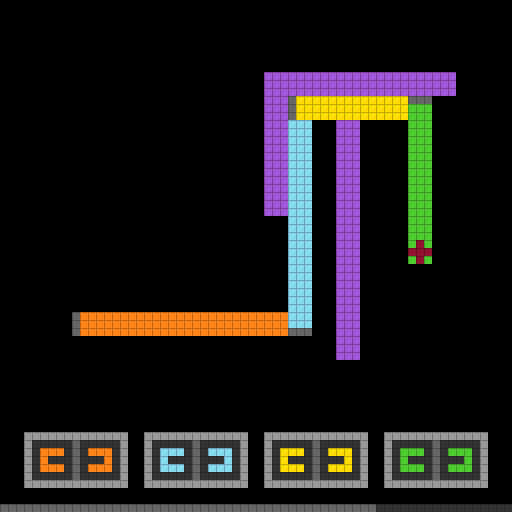 |
| **3D render**                                                                                                                       |
| A 3D rendering of the same game.                                                                                                    | 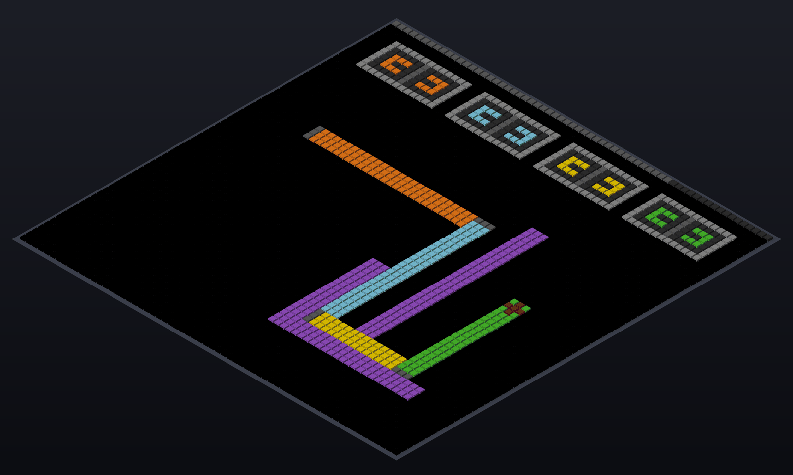                      |

### Language reasoning

Observations are turned into hypotheses by natural language to support the agent’s decision making. In ARC-AGI-3, the agent needs to figure out the role of each object, the underlying mechanism of how the world works, the criteria for winning, and so on. We choose to let the agent reason in free-form language without particular constraints: it decides what to reason about, what language to use, and when and how long to reason. It can also take notes, revise its hypotheses as it gathers more evidence, and use them to guide its next action.

Comparing different reasoning processes

An alternative approach commonly used to tackle ARC-AGI is to reason with a code world model, where the agent abstracts the world into a set of symbolic programs. Program-based agents such as [Schema](<https://schema-harness.github.io/>), [Tycho](<https://github.com/NIMI-research/Tycho>), and [Retrodict](<https://github.com/ryanbbrown/Retrodict>) turn the traces they collect while exploring the world into an executable reconstruction of the game: a state representation, transition rules, and often goal conditions. Because that reconstruction is executable, it can be checked against what the agent has already seen and searched over to choose an action.

We think much of the reasoning that leads to a good action can be carried out in a fuzzy manner. Natural language reasoning behaves more similarly to human beings and turns out to suffice for even these challenging ARC-AGI-3 games.

The table below compares the two approaches using the same rule from the [LF52 game](<https://arcprize.org/tasks/lf52>): its jumping mechanism, illustrated below. A faithful program has to name the board, the coordinates of every object, the conditions under which a move is legal, and the state update it produces. A descriptive sentence, in contrast, cannot be executed, but it is enough to convey the rule. Free-form language therefore gives the agent the maximum level of flexibility in the reasoning process.

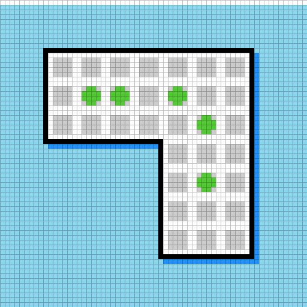1 · The boardGreen pegs sit on a grid of gray holes.

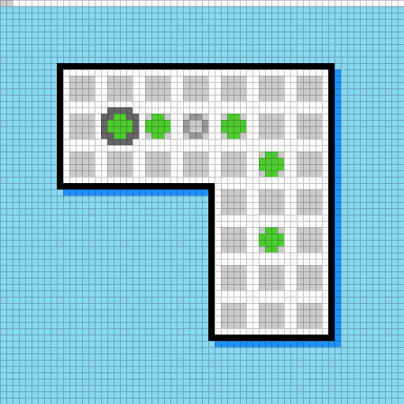2 · SelectClicking a green selects it, and a landing hole appears two cells away.

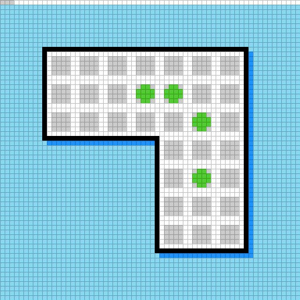3 · JumpThe green lands in the hole. Its source and the peg it crossed are now empty.

|                                                                                                                                                                                                                                                  | Program-based reasoning                                                                            | Free-form language (ours)                                        |
|--------------------------------------------------------------------------------------------------------------------------------------------------------------------------------------------------------------------------------------------------|----------------------------------------------------------------------------------------------------|------------------------------------------------------------------|
| How the rule is written                                                                                                                                                                                                                          | An executable reconstruction of the game: state representation, transition rules, goal conditions. | Sentences, in whatever terms the model finds useful at the time. |
| Example rule                                                                                                                                                                                                                                     |                                                                                                    |
|                                                                                                                                                                                                                                                  |
|                                                                                                                                                                                                                                                  |
|     def _moves(g, src, tile_set):                                                                                                                                                                                                                |
|         cells = set(tile_set)                                                                                                                                                                                                                    |
|         cells.update(_slider_cells(g))                                                                                                                                                                                                           |
|         cells.update(_lock_slider_cells(g))                                                                                                                                                                                                      |
|         x, y = src                                                                                                                                                                                                                               |
|         ans = []                                                                                                                                                                                                                                 |
|         for dx, dy in ((0,-6),(0,6),(-6,0),(6,0)):                                                                                                                                                                                               |
|             mid = (x+dx, y+dy)                                                                                                                                                                                                                   |
|             dst = (x+2*dx, y+2*dy)                                                                                                                                                                                                               |
|             if (mid in cells and dst in cells and                                                                                                                                                                                                |
|                 _cell_has_peg(g, mid, tile_set) and                                                                                                                                                                                              |
|                 not _cell_has_peg(g, dst, tile_set)):                                                                                                                                                                                            |
|                 ans.append((dst, mid))                                                                                                                                                                                                           |
|         return ans                                                                                                                                                                                                                               |
|                                                                                                                                                                                                                                                  |
| One of 71 functions, calling three of the others. [See the full world model released by the Schema team](<https://huggingface.co/datasets/schema-harness/arc-agi-3-schema-traces/blob/main/gpt_5_6_sol/gpt_5_6_sol_max_lf52/world_model_v5.py>). |                                                                                                    |
|                                                                                                                                                                                                                                                  |
|   * Green pegs make standard orthogonal jumps on 48 px-spaced gray holes: click source, then an empty landing two cells away. A jumped standard green is removed.                                                                                |
|   * Purple/pink pedestal pieces are fixed persistent jump posts. Any movable piece can jump across one; the post remains.                                                                                                                        |
|   * Red cross pieces are movable persistent jumpers/posts. Red and green can jump over each other without removing either, so alternating jumps moves a persistent pair along a line.                                                            |
|                                                                                                                                                                                                                                                  |
| Three of the core jumping rules the agent wrote in `GUIDE.md` for this game.                                                                                                                                                                     |
| Size                                                                                                                                                                                                                                             | Roughly **4,000** lines of Python for this game.                                                   | A page of notes.                                                 |
| What can be done with it                                                                                                                                                                                                                         | Explicit and executable.                                                                           | Implicit and fuzzy.                                              |

### Lossless visual memory

As the game progresses, the agent accumulates a record of its observations. When a new event happens, the agent may need to return to earlier frames to check details or compare them with new evidence. In standard VLMs and LLMs, the core memory mechanism is the KV cache, which the model can only attend over implicitly: it is typically compressed, lossy, and of limited horizon. In that case, the visual states of past turns may be lost, or not effectively stored, in the agent’s reasoning process.

A core design of VISTA is to maintain the game states as an explicit visual memory, which stores every frame returned by the environment, together with its turn and frame index, in a _lossless way_. The agent can then use an `inspect` tool to select earlier states, intermediate animation frames, or spatial regions and view them again through the same visual input. Several views can be requested together for read-only comparison. For small discrete details, `read_pixels` returns exact color samples from a selected region. This visual memory ensures that the complete pixel history remains accessible, and the agent decides which past frame or region to bring back into view through this “explicit attention mechanism” at frame, region, or pixel level.

Comparing different memory mechanisms

Over long interactions, an agent must retain information from earlier observations. Different memory mechanisms preserve different parts of that experience.

| Memory                 | What is kept                                                           | What is lost                                                                                                                                        | How it comes back                                         |
|------------------------|------------------------------------------------------------------------|-----------------------------------------------------------------------------------------------------------------------------------------------------|-----------------------------------------------------------|
| Context window         | Recent turns, as tokens and activations in the KV cache.               | Whatever falls outside the window. The context length and the compaction mechanism decide what goes, and older visual detail is compressed or lost. | Implicit attention over what still fits.                  |
| Program world model    | Observations distilled into code: state, transitions, goal conditions. | Anything the reconstruction does not model, and the past visual frames themselves.                                                                  | Executing the reconstruction.                             |
| Written text notes     | The model’s own description of what happened.                          | Everything not written down. The model chooses what to drop.                                                                                        | Re-reading its own text.                                  |
| Lossless visual memory | Every returned frame at full resolution, indexed by turn and frame.    | Nothing.                                                                                                                                            | `inspect` and `read_pixels`, on the model’s own decision. |

The key property of visual memory is that all visual information the agent has received about the world remains retrievable in its original form: any frame the game has returned, and any region within it, can be brought back at full resolution whenever the model decides it matters.

We also allow the model to take notes in a minimal file, `GUIDE.md`, that describes the core idea of the game. This gives it an additional way to keep information, but in a high-level and abstract form.

3.

## The Complete Pipeline

One agent plays each game from its first observation to completion. It begins with only the current visual state and available actions: no instructions, stated rules, or goal. On each turn it observes, reasons, and executes one game action. The same agent can revisit visual memory or maintain two notes whenever useful. When the model approaches its context limit, it writes a concise continuation state, then resumes from the current visual state in a fresh context. Its notes, visual memory, and action history remain available. Every game uses the same interface and short prompt.

One turn of the agent A cycle from observe to reason to act. The last returned frame becomes the next observation, while every returned frame is preserved in visual memory. The model can revisit that memory and read or update its notes on demand. Agent notes high-level rules · scratchpad Visual memory Information preserved losslessly Optional read · update Optional inspect · read_pixels all returned frames 01 Observe current visual state · available actions 02 Reason hypothesize · predict · plan 03 Act play executes one action last returned frame becomes next observation **One turn of the agent.** The same interface is used for every game. Every returned frame enters the visual memory.

### Observe

A single action may produce a sequence of animation frames. Every returned frame enters the visual memory in order, and the final frame becomes the next current visual state, together with game status and level progress.

Looking back is available but optional. The model may act on the current frame alone, or call `inspect` to bring an earlier state, an intermediate animation frame, or an enlarged region back into view, and `read_pixels` to look at details. Which past moment to re-examine, and whether to re-examine anything at all, is the model’s decision rather than a fixed step in the loop.

### Reason, then act

The model uses the current visual state, past evidence, and its notes to maintain a revisable understanding of the game. It reasons and plans in free-form language. Before calling `play`, the prompt asks it to state the visual result it expects. We ask the agent to write notes that build and use a compact, revisable model of the game and its current state (see prompt below). The word `compact` encourages the model to organize its observations into higher-level abstractions, in the spirit of Occam’s razor; the word `revisable` allows for updates and corrections as new evidence becomes available.

The notes externalize the agent’s understanding of the world. `GUIDE.md` holds what may remain useful across levels, while `WORKING.md` is a scratchpad for the current level. Together they give us a readable view of the abstractions the agent uses when exploring the world.

The agent prompt
    
    
    # Visual game task
    
    Complete the game with as few game actions as possible.
    
    Build and use a compact, revisable model of the game and its current state. Update it as new evidence changes what is supported.
    
    Before each `play`, briefly state what you expect to see. Afterward, briefly state all visible changes, expected or not.
    
    Keep concise, durable, revisable game understanding in `GUIDE.md`; use `WORKING.md` as a scratchpad when useful.

4.

## VISTA Results on ARC-AGI-3

We instantiate VISTA with two general-purpose multimodal model backends: Opus 5.0 through the Claude Code CLI and GPT-5.6 Sol through the Codex CLI. Each backend is run independently on all 25 public ARC-AGI-3 games. The model receives PNG observations, public game status and progress, and the currently available actions. Within each backend, the same prompt, tools, model, and reasoning setting are used across games.

ARC-AGI-3 uses Relative Human Action Efficiency (RHAE): completed levels are scored by the squared ratio between a first-time human action baseline and the agent’s actions, later levels receive greater weight, and the final score is averaged across games. Only environment actions enter this count; internal reasoning and read-only inspection are free under the scoring protocol. See the official [scoring methodology](<https://docs.arcprize.org/methodology>) for the complete definition.

With Opus 5.0, VISTA completes all 183 levels across all 25 games. Its mean game score is **100.00** , with **25 perfect game scores** , using 7,542 game actions (**56%** fewer than humans). With GPT-5.6 Sol, VISTA also completes all 183 levels across the 25 public games. Its mean game score is 98.27, with 22 perfect game scores. The remaining 1.73 points are concentrated in a small number of levels where the model spends extra actions discovering a mechanism or recovering from an incorrect game model.

Select a model below to view its complete 25-game result table and level-by-level breakdown. Each available replay link opens the recorded trajectory, including game actions, public model output, visual inspections, and agent notes.

ModelClaude Opus 5.0GPT-5.6 Sol

Claude Code CLI

### Claude Opus 5.0

Effortxhigh

Mean score
    100.00

Games completed
    25 / 25

Perfect games
    25 / 25

Actions · agent / human
    **7,542** / 17,135

| Task                                                                                                             | Score  | Actions                                                                                                                                                                                                                                                                                                                                                                                                                                                                                                                                                                                                                                                                                                                                                                                                                                                                                                                                         | Progress | Status | Replay                                                                                        |
|------------------------------------------------------------------------------------------------------------------|--------|-------------------------------------------------------------------------------------------------------------------------------------------------------------------------------------------------------------------------------------------------------------------------------------------------------------------------------------------------------------------------------------------------------------------------------------------------------------------------------------------------------------------------------------------------------------------------------------------------------------------------------------------------------------------------------------------------------------------------------------------------------------------------------------------------------------------------------------------------------------------------------------------------------------------------------------------------|----------|--------|-----------------------------------------------------------------------------------------------|
| 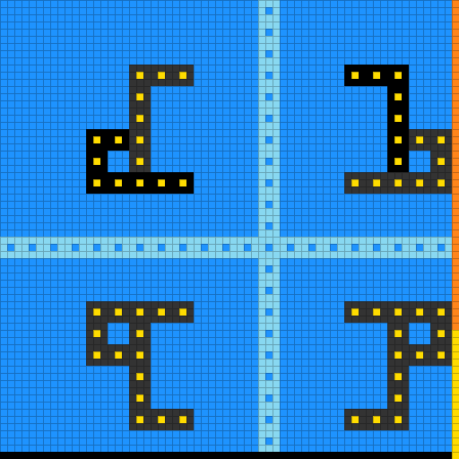[ar25](<https://arcprize.org/tasks/ar25>) | 100.00 | **270** / 748**Cumulative progress** 0.36× human __Agent __Human Human: level 1 completed at 32 cumulative actionsHuman: level 2 completed at 82 cumulative actionsHuman: level 3 completed at 157 cumulative actionsHuman: level 4 completed at 194 cumulative actionsHuman: level 5 completed at 283 cumulative actionsHuman: level 6 completed at 442 cumulative actionsHuman: level 7 completed at 675 cumulative actionsHuman: level 8 completed at 748 cumulative actionsAgent: level 1 completed at 16 cumulative actionsAgent: level 2 completed at 33 cumulative actionsAgent: level 3 completed at 74 cumulative actionsAgent: level 4 completed at 97 cumulative actionsAgent: level 5 completed at 126 cumulative actionsAgent: level 6 completed at 184 cumulative actionsAgent: level 7 completed at 222 cumulative actionsAgent: level 8 completed at 270 cumulative actions0480374748Levels# ActionsAgent **270** Human **748** |  8 / 8   | WIN    | [View replay](<https://vista-research.github.io/replays/claude-opus-5/games/ar25/index.html>) |

|  Level| Agent actions| Human actions| Agent / Human| Level score  
---|---|---|---|---  
1| 16| 32| 0.50×| 115.00  
2| 17| 50| 0.34×| 115.00  
3| 41| 75| 0.55×| 115.00  
4| 23| 37| 0.62×| 115.00  
5| 29| 89| 0.33×| 115.00  
6| 58| 159| 0.36×| 115.00  
7| 38| 233| 0.16×| 115.00  
8| 48| 73| 0.66×| 115.00  
|                                                                                                                  |
|                                                                                                                  |
| 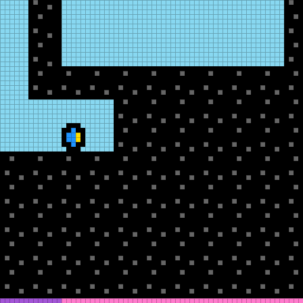[bp35](<https://arcprize.org/tasks/bp35>) | 100.00 | **449** / 651**Cumulative progress** 0.69× human __Agent __Human Human: level 1 completed at 21 cumulative actionsHuman: level 2 completed at 69 cumulative actionsHuman: level 3 completed at 113 cumulative actionsHuman: level 4 completed at 151 cumulative actionsHuman: level 5 completed at 184 cumulative actionsHuman: level 6 completed at 271 cumulative actionsHuman: level 7 completed at 357 cumulative actionsHuman: level 8 completed at 488 cumulative actionsHuman: level 9 completed at 651 cumulative actionsAgent: level 1 completed at 16 cumulative actionsAgent: level 2 completed at 66 cumulative actionsAgent: level 3 completed at 100 cumulative actionsAgent: level 4 completed at 121 cumulative actionsAgent: level 5 completed at 177 cumulative actionsAgent: level 6 completed at 220 cumulative actionsAgent: level 7 completed at 274 cumulative actionsAgent: level 8 completed at 337 cumulative actionsAgent: level 9 completed at 449 cumulative actions0590326651Levels# ActionsAgent **449** Human **651** |  9 / 9 | WIN | [View replay](<https://vista-research.github.io/replays/claude-opus-5/games/bp35/index.html>) |

|  Level| Agent actions| Human actions| Agent / Human| Level score  
---|---|---|---|---  
1| 16| 21| 0.76×| 115.00  
2| 50| 48| 1.04×| 92.16  
3| 34| 44| 0.77×| 115.00  
4| 21| 38| 0.55×| 115.00  
5| 56| 33| 1.70×| 34.73  
6| 43| 87| 0.49×| 115.00  
7| 54| 86| 0.63×| 115.00  
8| 63| 131| 0.48×| 115.00  
9| 112| 163| 0.69×| 115.00  
|                                                                                                                  |
|                                                                                                                  |
| 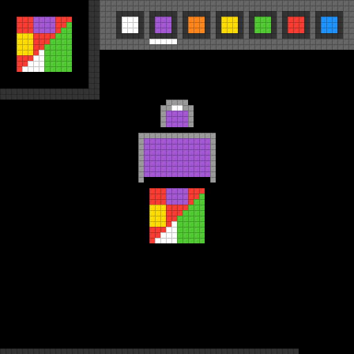[cd82](<https://arcprize.org/tasks/cd82>) | 100.00 | **92** / 171**Cumulative progress** 0.54× human __Agent __Human Human: level 1 completed at 55 cumulative actionsHuman: level 2 completed at 63 cumulative actionsHuman: level 3 completed at 104 cumulative actionsHuman: level 4 completed at 125 cumulative actionsHuman: level 5 completed at 148 cumulative actionsHuman: level 6 completed at 171 cumulative actionsAgent: level 1 completed at 23 cumulative actionsAgent: level 2 completed at 29 cumulative actionsAgent: level 3 completed at 45 cumulative actionsAgent: level 4 completed at 59 cumulative actionsAgent: level 5 completed at 72 cumulative actionsAgent: level 6 completed at 92 cumulative actions036086171Levels# ActionsAgent **92** Human **171** |  6 / 6 | WIN | [View replay](<https://vista-research.github.io/replays/claude-opus-5/games/cd82/index.html>) |

|  Level| Agent actions| Human actions| Agent / Human| Level score  
---|---|---|---|---  
1| 23| 55| 0.42×| 115.00  
2| 6| 8| 0.75×| 115.00  
3| 16| 41| 0.39×| 115.00  
4| 14| 21| 0.67×| 115.00  
5| 13| 23| 0.57×| 115.00  
6| 20| 23| 0.87×| 115.00  
|                                                                                                                  |
|                                                                                                                  |
| 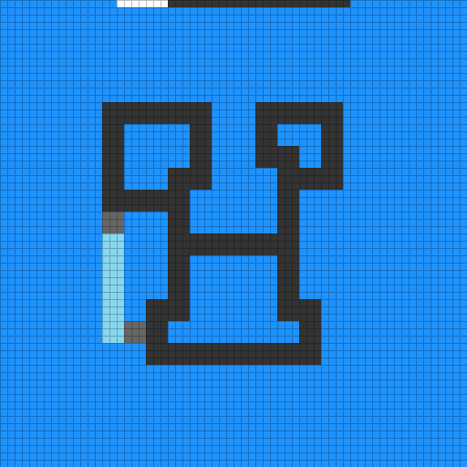[cn04](<https://arcprize.org/tasks/cn04>) | 100.00 | **235** / 789**Cumulative progress** 0.30× human __Agent __Human Human: level 1 completed at 29 cumulative actionsHuman: level 2 completed at 83 cumulative actionsHuman: level 3 completed at 168 cumulative actionsHuman: level 4 completed at 468 cumulative actionsHuman: level 5 completed at 676 cumulative actionsHuman: level 6 completed at 789 cumulative actionsAgent: level 1 completed at 15 cumulative actionsAgent: level 2 completed at 48 cumulative actionsAgent: level 3 completed at 71 cumulative actionsAgent: level 4 completed at 101 cumulative actionsAgent: level 5 completed at 194 cumulative actionsAgent: level 6 completed at 235 cumulative actions0360395789Levels# ActionsAgent **235** Human **789** |  6 / 6 | WIN | [View replay](<https://vista-research.github.io/replays/claude-opus-5/games/cn04/index.html>) |

|  Level| Agent actions| Human actions| Agent / Human| Level score  
---|---|---|---|---  
1| 15| 29| 0.52×| 115.00  
2| 33| 54| 0.61×| 115.00  
3| 23| 85| 0.27×| 115.00  
4| 30| 300| 0.10×| 115.00  
5| 93| 208| 0.45×| 115.00  
6| 41| 113| 0.36×| 115.00  
|                                                                                                                  |
|                                                                                                                  |
| 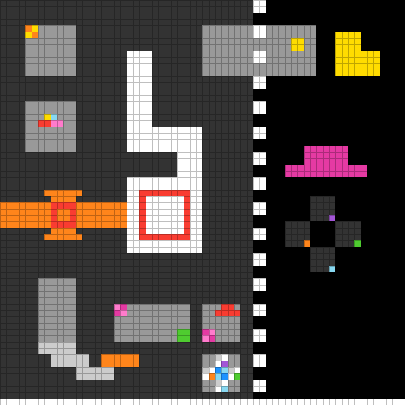[dc22](<https://arcprize.org/tasks/dc22>) | 100.00 | **635** / 1228**Cumulative progress** 0.52× human __Agent __Human Human: level 1 completed at 59 cumulative actionsHuman: level 2 completed at 161 cumulative actionsHuman: level 3 completed at 228 cumulative actionsHuman: level 4 completed at 326 cumulative actionsHuman: level 5 completed at 650 cumulative actionsHuman: level 6 completed at 1228 cumulative actionsAgent: level 1 completed at 31 cumulative actionsAgent: level 2 completed at 74 cumulative actionsAgent: level 3 completed at 119 cumulative actionsAgent: level 4 completed at 181 cumulative actionsAgent: level 5 completed at 359 cumulative actionsAgent: level 6 completed at 635 cumulative actions03606141228Levels# ActionsAgent **635** Human **1,228** |  6 / 6 | WIN | [View replay](<https://vista-research.github.io/replays/claude-opus-5/games/dc22/index.html>) |

|  Level| Agent actions| Human actions| Agent / Human| Level score  
---|---|---|---|---  
1| 31| 59| 0.53×| 115.00  
2| 43| 102| 0.42×| 115.00  
3| 45| 67| 0.67×| 115.00  
4| 62| 98| 0.63×| 115.00  
5| 178| 324| 0.55×| 115.00  
6| 276| 578| 0.48×| 115.00  
|                                                                                                                  |
|                                                                                                                  |
| 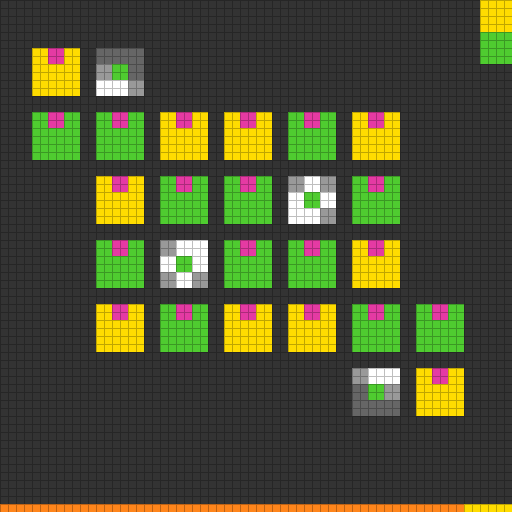[ft09](<https://arcprize.org/tasks/ft09>) | 100.00 | **80** / 208**Cumulative progress** 0.38× human __Agent __Human Human: level 1 completed at 43 cumulative actionsHuman: level 2 completed at 55 cumulative actionsHuman: level 3 completed at 78 cumulative actionsHuman: level 4 completed at 106 cumulative actionsHuman: level 5 completed at 171 cumulative actionsHuman: level 6 completed at 208 cumulative actionsAgent: level 1 completed at 4 cumulative actionsAgent: level 2 completed at 11 cumulative actionsAgent: level 3 completed at 25 cumulative actionsAgent: level 4 completed at 46 cumulative actionsAgent: level 5 completed at 67 cumulative actionsAgent: level 6 completed at 80 cumulative actions0360104208Levels# ActionsAgent **80** Human **208** |  6 / 6 | WIN | [View replay](<https://vista-research.github.io/replays/claude-opus-5/games/ft09/index.html>) |

|  Level| Agent actions| Human actions| Agent / Human| Level score  
---|---|---|---|---  
1| 4| 43| 0.09×| 115.00  
2| 7| 12| 0.58×| 115.00  
3| 14| 23| 0.61×| 115.00  
4| 21| 28| 0.75×| 115.00  
5| 21| 65| 0.32×| 115.00  
6| 13| 37| 0.35×| 115.00  
|                                                                                                                  |
|                                                                                                                  |
| 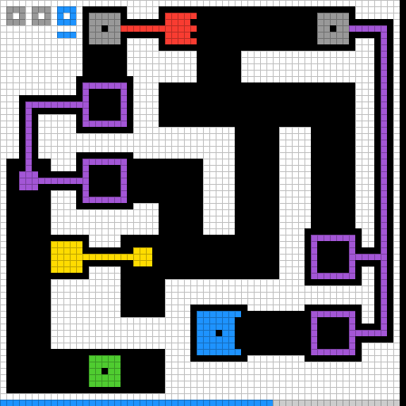[g50t](<https://arcprize.org/tasks/g50t>) | 100.00 | **321** / 879**Cumulative progress** 0.37× human __Agent __Human Human: level 1 completed at 78 cumulative actionsHuman: level 2 completed at 253 cumulative actionsHuman: level 3 completed at 432 cumulative actionsHuman: level 4 completed at 662 cumulative actionsHuman: level 5 completed at 758 cumulative actionsHuman: level 6 completed at 812 cumulative actionsHuman: level 7 completed at 879 cumulative actionsAgent: level 1 completed at 39 cumulative actionsAgent: level 2 completed at 70 cumulative actionsAgent: level 3 completed at 138 cumulative actionsAgent: level 4 completed at 169 cumulative actionsAgent: level 5 completed at 219 cumulative actionsAgent: level 6 completed at 278 cumulative actionsAgent: level 7 completed at 321 cumulative actions0470440879Levels# ActionsAgent **321** Human **879** |  7 / 7 | WIN | [View replay](<https://vista-research.github.io/replays/claude-opus-5/games/g50t/index.html>) |

|  Level| Agent actions| Human actions| Agent / Human| Level score  
---|---|---|---|---  
1| 39| 78| 0.50×| 115.00  
2| 31| 175| 0.18×| 115.00  
3| 68| 179| 0.38×| 115.00  
4| 31| 230| 0.13×| 115.00  
5| 50| 96| 0.52×| 115.00  
6| 59| 54| 1.09×| 83.77  
7| 43| 67| 0.64×| 115.00  
|                                                                                                                  |
|                                                                                                                  |
| 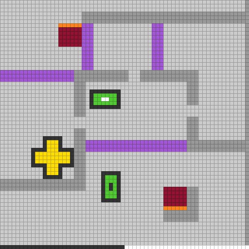[ka59](<https://arcprize.org/tasks/ka59>) | 100.00 | **302** / 730**Cumulative progress** 0.41× human __Agent __Human Human: level 1 completed at 28 cumulative actionsHuman: level 2 completed at 137 cumulative actionsHuman: level 3 completed at 188 cumulative actionsHuman: level 4 completed at 239 cumulative actionsHuman: level 5 completed at 272 cumulative actionsHuman: level 6 completed at 404 cumulative actionsHuman: level 7 completed at 730 cumulative actionsAgent: level 1 completed at 13 cumulative actionsAgent: level 2 completed at 47 cumulative actionsAgent: level 3 completed at 80 cumulative actionsAgent: level 4 completed at 118 cumulative actionsAgent: level 5 completed at 138 cumulative actionsAgent: level 6 completed at 190 cumulative actionsAgent: level 7 completed at 302 cumulative actions0470365730Levels# ActionsAgent **302** Human **730** |  7 / 7 | WIN | [View replay](<https://vista-research.github.io/replays/claude-opus-5/games/ka59/index.html>) |

|  Level| Agent actions| Human actions| Agent / Human| Level score  
---|---|---|---|---  
1| 13| 28| 0.46×| 115.00  
2| 34| 109| 0.31×| 115.00  
3| 33| 51| 0.65×| 115.00  
4| 38| 51| 0.75×| 115.00  
5| 20| 33| 0.61×| 115.00  
6| 52| 132| 0.39×| 115.00  
7| 112| 326| 0.34×| 115.00  
|                                                                                                                  |
|                                                                                                                  |
| 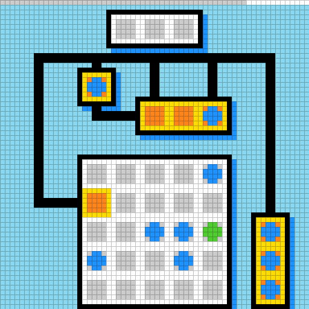[lf52](<https://arcprize.org/tasks/lf52>) | 100.00 | **881** / 1339**Cumulative progress** 0.66× human __Agent __Human Human: level 1 completed at 32 cumulative actionsHuman: level 2 completed at 113 cumulative actionsHuman: level 3 completed at 173 cumulative actionsHuman: level 4 completed at 244 cumulative actionsHuman: level 5 completed at 449 cumulative actionsHuman: level 6 completed at 597 cumulative actionsHuman: level 7 completed at 841 cumulative actionsHuman: level 8 completed at 950 cumulative actionsHuman: level 9 completed at 1114 cumulative actionsHuman: level 10 completed at 1339 cumulative actionsAgent: level 1 completed at 10 cumulative actionsAgent: level 2 completed at 60 cumulative actionsAgent: level 3 completed at 113 cumulative actionsAgent: level 4 completed at 163 cumulative actionsAgent: level 5 completed at 265 cumulative actionsAgent: level 6 completed at 464 cumulative actionsAgent: level 7 completed at 649 cumulative actionsAgent: level 8 completed at 719 cumulative actionsAgent: level 9 completed at 828 cumulative actionsAgent: level 10 completed at 881 cumulative actions051006701339Levels# ActionsAgent **881** Human **1,339** |  10 / 10 | WIN | [View replay](<https://vista-research.github.io/replays/claude-opus-5/games/lf52/index.html>) |

|  Level| Agent actions| Human actions| Agent / Human| Level score  
---|---|---|---|---  
1| 10| 32| 0.31×| 115.00  
2| 50| 81| 0.62×| 115.00  
3| 53| 60| 0.88×| 115.00  
4| 50| 71| 0.70×| 115.00  
5| 102| 205| 0.50×| 115.00  
6| 199| 148| 1.34×| 55.31  
7| 185| 244| 0.76×| 115.00  
8| 70| 109| 0.64×| 115.00  
9| 109| 164| 0.66×| 115.00  
10| 53| 225| 0.24×| 115.00  
|                                                                                                                  |
|                                                                                                                  |
| 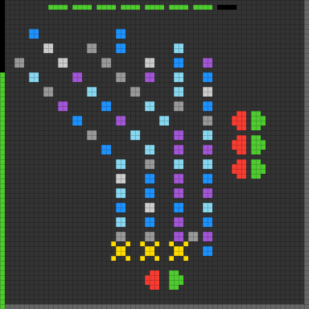[lp85](<https://arcprize.org/tasks/lp85>) | 100.00 | **111** / 388**Cumulative progress** 0.29× human __Agent __Human Human: level 1 completed at 17 cumulative actionsHuman: level 2 completed at 55 cumulative actionsHuman: level 3 completed at 86 cumulative actionsHuman: level 4 completed at 102 cumulative actionsHuman: level 5 completed at 143 cumulative actionsHuman: level 6 completed at 203 cumulative actionsHuman: level 7 completed at 229 cumulative actionsHuman: level 8 completed at 388 cumulative actionsAgent: level 1 completed at 9 cumulative actionsAgent: level 2 completed at 22 cumulative actionsAgent: level 3 completed at 38 cumulative actionsAgent: level 4 completed at 51 cumulative actionsAgent: level 5 completed at 62 cumulative actionsAgent: level 6 completed at 82 cumulative actionsAgent: level 7 completed at 89 cumulative actionsAgent: level 8 completed at 111 cumulative actions0480194388Levels# ActionsAgent **111** Human **388** |  8 / 8 | WIN | [View replay](<https://vista-research.github.io/replays/claude-opus-5/games/lp85/index.html>) |

|  Level| Agent actions| Human actions| Agent / Human| Level score  
---|---|---|---|---  
1| 9| 17| 0.53×| 115.00  
2| 13| 38| 0.34×| 115.00  
3| 16| 31| 0.52×| 115.00  
4| 13| 16| 0.81×| 115.00  
5| 11| 41| 0.27×| 115.00  
6| 20| 60| 0.33×| 115.00  
7| 7| 26| 0.27×| 115.00  
8| 22| 159| 0.14×| 115.00  
|                                                                                                                  |
|                                                                                                                  |
| 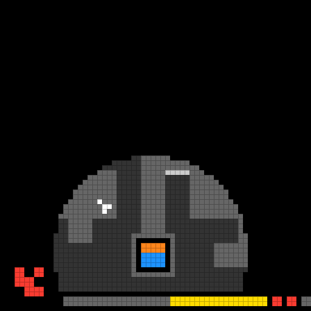[ls20](<https://arcprize.org/tasks/ls20>) | 100.00 | **517** / 776**Cumulative progress** 0.67× human __Agent __Human Human: level 1 completed at 22 cumulative actionsHuman: level 2 completed at 145 cumulative actionsHuman: level 3 completed at 218 cumulative actionsHuman: level 4 completed at 302 cumulative actionsHuman: level 5 completed at 398 cumulative actionsHuman: level 6 completed at 590 cumulative actionsHuman: level 7 completed at 776 cumulative actionsAgent: level 1 completed at 22 cumulative actionsAgent: level 2 completed at 101 cumulative actionsAgent: level 3 completed at 150 cumulative actionsAgent: level 4 completed at 215 cumulative actionsAgent: level 5 completed at 287 cumulative actionsAgent: level 6 completed at 401 cumulative actionsAgent: level 7 completed at 517 cumulative actions0470388776Levels# ActionsAgent **517** Human **776** |  7 / 7 | WIN | [View replay](<https://vista-research.github.io/replays/claude-opus-5/games/ls20/index.html>) |

|  Level| Agent actions| Human actions| Agent / Human| Level score  
---|---|---|---|---  
1| 22| 22| 1.00×| 100.00  
2| 79| 123| 0.64×| 115.00  
3| 49| 73| 0.67×| 115.00  
4| 65| 84| 0.77×| 115.00  
5| 72| 96| 0.75×| 115.00  
6| 114| 192| 0.59×| 115.00  
7| 116| 186| 0.62×| 115.00  
|                                                                                                                  |
|                                                                                                                  |
| 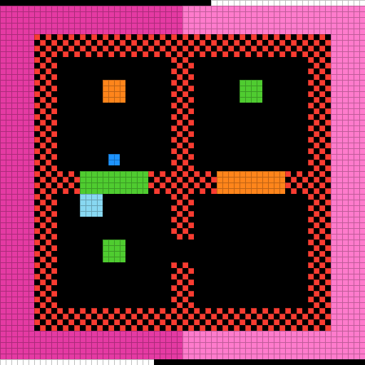[m0r0](<https://arcprize.org/tasks/m0r0>) | 100.00 | **256** / 1107**Cumulative progress** 0.23× human __Agent __Human Human: level 1 completed at 30 cumulative actionsHuman: level 2 completed at 141 cumulative actionsHuman: level 3 completed at 344 cumulative actionsHuman: level 4 completed at 370 cumulative actionsHuman: level 5 completed at 870 cumulative actionsHuman: level 6 completed at 1107 cumulative actionsAgent: level 1 completed at 18 cumulative actionsAgent: level 2 completed at 41 cumulative actionsAgent: level 3 completed at 108 cumulative actionsAgent: level 4 completed at 123 cumulative actionsAgent: level 5 completed at 177 cumulative actionsAgent: level 6 completed at 256 cumulative actions03605541107Levels# ActionsAgent **256** Human **1,107** |  6 / 6 | WIN | [View replay](<https://vista-research.github.io/replays/claude-opus-5/games/m0r0/index.html>) |

|  Level| Agent actions| Human actions| Agent / Human| Level score  
---|---|---|---|---  
1| 18| 30| 0.60×| 115.00  
2| 23| 111| 0.21×| 115.00  
3| 67| 203| 0.33×| 115.00  
4| 15| 26| 0.58×| 115.00  
5| 54| 500| 0.11×| 115.00  
6| 79| 237| 0.33×| 115.00  
|                                                                                                                  |
|                                                                                                                  |
| 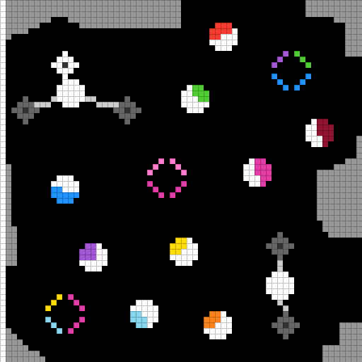[r11l](<https://arcprize.org/tasks/r11l>) | 100.00 | **68** / 233**Cumulative progress** 0.29× human __Agent __Human Human: level 1 completed at 22 cumulative actionsHuman: level 2 completed at 55 cumulative actionsHuman: level 3 completed at 106 cumulative actionsHuman: level 4 completed at 132 cumulative actionsHuman: level 5 completed at 184 cumulative actionsHuman: level 6 completed at 233 cumulative actionsAgent: level 1 completed at 3 cumulative actionsAgent: level 2 completed at 13 cumulative actionsAgent: level 3 completed at 24 cumulative actionsAgent: level 4 completed at 37 cumulative actionsAgent: level 5 completed at 52 cumulative actionsAgent: level 6 completed at 68 cumulative actions0360117233Levels# ActionsAgent **68** Human **233** |  6 / 6 | WIN | [View replay](<https://vista-research.github.io/replays/claude-opus-5/games/r11l/index.html>) |

|  Level| Agent actions| Human actions| Agent / Human| Level score  
---|---|---|---|---  
1| 3| 22| 0.14×| 115.00  
2| 10| 33| 0.30×| 115.00  
3| 11| 51| 0.22×| 115.00  
4| 13| 26| 0.50×| 115.00  
5| 15| 52| 0.29×| 115.00  
6| 16| 49| 0.33×| 115.00  
|                                                                                                                  |
|                                                                                                                  |
| 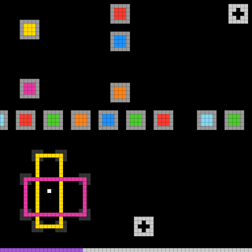[re86](<https://arcprize.org/tasks/re86>) | 100.00 | **593** / 1255**Cumulative progress** 0.47× human __Agent __Human Human: level 1 completed at 26 cumulative actionsHuman: level 2 completed at 68 cumulative actionsHuman: level 3 completed at 154 cumulative actionsHuman: level 4 completed at 262 cumulative actionsHuman: level 5 completed at 451 cumulative actionsHuman: level 6 completed at 590 cumulative actionsHuman: level 7 completed at 1014 cumulative actionsHuman: level 8 completed at 1255 cumulative actionsAgent: level 1 completed at 21 cumulative actionsAgent: level 2 completed at 59 cumulative actionsAgent: level 3 completed at 106 cumulative actionsAgent: level 4 completed at 161 cumulative actionsAgent: level 5 completed at 224 cumulative actionsAgent: level 6 completed at 285 cumulative actionsAgent: level 7 completed at 392 cumulative actionsAgent: level 8 completed at 593 cumulative actions04806281255Levels# ActionsAgent **593** Human **1,255** |  8 / 8 | WIN | [View replay](<https://vista-research.github.io/replays/claude-opus-5/games/re86/index.html>) |

|  Level| Agent actions| Human actions| Agent / Human| Level score  
---|---|---|---|---  
1| 21| 26| 0.81×| 115.00  
2| 38| 42| 0.90×| 115.00  
3| 47| 86| 0.55×| 115.00  
4| 55| 108| 0.51×| 115.00  
5| 63| 189| 0.33×| 115.00  
6| 61| 139| 0.44×| 115.00  
7| 107| 424| 0.25×| 115.00  
8| 201| 241| 0.83×| 115.00  
|                                                                                                                  |
|                                                                                                                  |
| 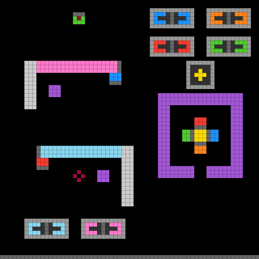[s5i5](<https://arcprize.org/tasks/s5i5>) | 100.00 | **251** / 638**Cumulative progress** 0.39× human __Agent __Human Human: level 1 completed at 20 cumulative actionsHuman: level 2 completed at 109 cumulative actionsHuman: level 3 completed at 215 cumulative actionsHuman: level 4 completed at 269 cumulative actionsHuman: level 5 completed at 431 cumulative actionsHuman: level 6 completed at 469 cumulative actionsHuman: level 7 completed at 555 cumulative actionsHuman: level 8 completed at 638 cumulative actionsAgent: level 1 completed at 13 cumulative actionsAgent: level 2 completed at 39 cumulative actionsAgent: level 3 completed at 77 cumulative actionsAgent: level 4 completed at 112 cumulative actionsAgent: level 5 completed at 140 cumulative actionsAgent: level 6 completed at 167 cumulative actionsAgent: level 7 completed at 213 cumulative actionsAgent: level 8 completed at 251 cumulative actions0480319638Levels# ActionsAgent **251** Human **638** |  8 / 8 | WIN | [View replay](<https://vista-research.github.io/replays/claude-opus-5/games/s5i5/index.html>) |

|  Level| Agent actions| Human actions| Agent / Human| Level score  
---|---|---|---|---  
1| 13| 20| 0.65×| 115.00  
2| 26| 89| 0.29×| 115.00  
3| 38| 106| 0.36×| 115.00  
4| 35| 54| 0.65×| 115.00  
5| 28| 162| 0.17×| 115.00  
6| 27| 38| 0.71×| 115.00  
7| 46| 86| 0.53×| 115.00  
8| 38| 83| 0.46×| 115.00  
|                                                                                                                  |
|                                                                                                                  |
| 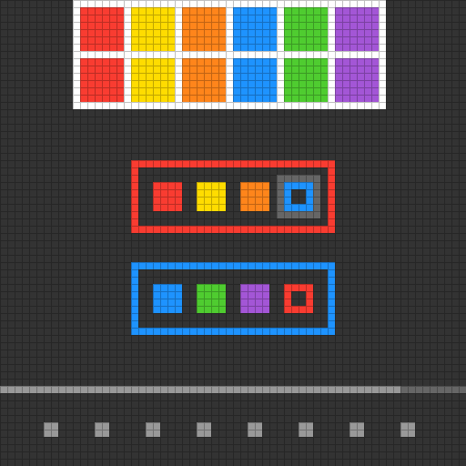[sb26](<https://arcprize.org/tasks/sb26>) | 100.00 | **124** / 213**Cumulative progress** 0.58× human __Agent __Human Human: level 1 completed at 18 cumulative actionsHuman: level 2 completed at 46 cumulative actionsHuman: level 3 completed at 64 cumulative actionsHuman: level 4 completed at 83 cumulative actionsHuman: level 5 completed at 114 cumulative actionsHuman: level 6 completed at 137 cumulative actionsHuman: level 7 completed at 195 cumulative actionsHuman: level 8 completed at 213 cumulative actionsAgent: level 1 completed at 9 cumulative actionsAgent: level 2 completed at 24 cumulative actionsAgent: level 3 completed at 39 cumulative actionsAgent: level 4 completed at 54 cumulative actionsAgent: level 5 completed at 71 cumulative actionsAgent: level 6 completed at 90 cumulative actionsAgent: level 7 completed at 107 cumulative actionsAgent: level 8 completed at 124 cumulative actions0480107213Levels# ActionsAgent **124** Human **213** |  8 / 8 | WIN | [View replay](<https://vista-research.github.io/replays/claude-opus-5/games/sb26/index.html>) |

|  Level| Agent actions| Human actions| Agent / Human| Level score  
---|---|---|---|---  
1| 9| 18| 0.50×| 115.00  
2| 15| 28| 0.54×| 115.00  
3| 15| 18| 0.83×| 115.00  
4| 15| 19| 0.79×| 115.00  
5| 17| 31| 0.55×| 115.00  
6| 19| 23| 0.83×| 115.00  
7| 17| 58| 0.29×| 115.00  
8| 17| 18| 0.94×| 112.11  
|                                                                                                                  |
|                                                                                                                  |
| 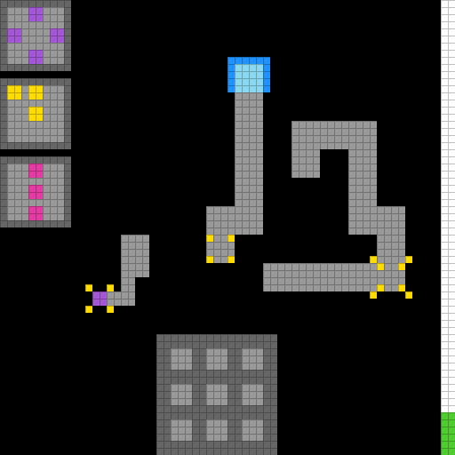[sc25](<https://arcprize.org/tasks/sc25>) | 100.00 | **176** / 350**Cumulative progress** 0.50× human __Agent __Human Human: level 1 completed at 36 cumulative actionsHuman: level 2 completed at 42 cumulative actionsHuman: level 3 completed at 74 cumulative actionsHuman: level 4 completed at 157 cumulative actionsHuman: level 5 completed at 300 cumulative actionsHuman: level 6 completed at 350 cumulative actionsAgent: level 1 completed at 19 cumulative actionsAgent: level 2 completed at 25 cumulative actionsAgent: level 3 completed at 58 cumulative actionsAgent: level 4 completed at 80 cumulative actionsAgent: level 5 completed at 141 cumulative actionsAgent: level 6 completed at 176 cumulative actions0360175350Levels# ActionsAgent **176** Human **350** |  6 / 6 | WIN | [View replay](<https://vista-research.github.io/replays/claude-opus-5/games/sc25/index.html>) |

|  Level| Agent actions| Human actions| Agent / Human| Level score  
---|---|---|---|---  
1| 19| 36| 0.53×| 115.00  
2| 6| 6| 1.00×| 100.00  
3| 33| 32| 1.03×| 94.03  
4| 22| 83| 0.27×| 115.00  
5| 61| 143| 0.43×| 115.00  
6| 35| 50| 0.70×| 115.00  
|                                                                                                                  |
|                                                                                                                  |
| 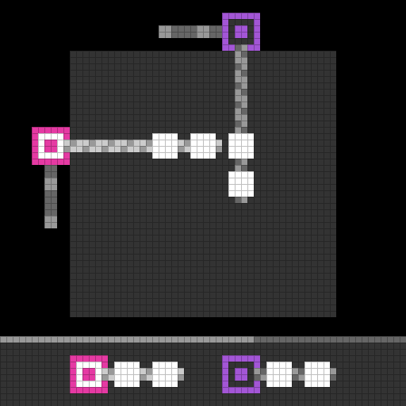[sk48](<https://arcprize.org/tasks/sk48>) | 100.00 | **525** / 1070**Cumulative progress** 0.49× human __Agent __Human Human: level 1 completed at 61 cumulative actionsHuman: level 2 completed at 238 cumulative actionsHuman: level 3 completed at 339 cumulative actionsHuman: level 4 completed at 442 cumulative actionsHuman: level 5 completed at 672 cumulative actionsHuman: level 6 completed at 853 cumulative actionsHuman: level 7 completed at 978 cumulative actionsHuman: level 8 completed at 1070 cumulative actionsAgent: level 1 completed at 15 cumulative actionsAgent: level 2 completed at 45 cumulative actionsAgent: level 3 completed at 91 cumulative actionsAgent: level 4 completed at 150 cumulative actionsAgent: level 5 completed at 253 cumulative actionsAgent: level 6 completed at 315 cumulative actionsAgent: level 7 completed at 394 cumulative actionsAgent: level 8 completed at 525 cumulative actions04805351070Levels# ActionsAgent **525** Human **1,070** |  8 / 8 | WIN | [View replay](<https://vista-research.github.io/replays/claude-opus-5/games/sk48/index.html>) |

|  Level| Agent actions| Human actions| Agent / Human| Level score  
---|---|---|---|---  
1| 15| 61| 0.25×| 115.00  
2| 30| 177| 0.17×| 115.00  
3| 46| 101| 0.46×| 115.00  
4| 59| 103| 0.57×| 115.00  
5| 103| 230| 0.45×| 115.00  
6| 62| 181| 0.34×| 115.00  
7| 79| 125| 0.63×| 115.00  
8| 131| 92| 1.42×| 49.32  
|                                                                                                                  |
|                                                                                                                  |
| 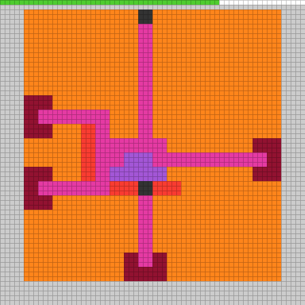[sp80](<https://arcprize.org/tasks/sp80>) | 100.00 | **121** / 518**Cumulative progress** 0.23× human __Agent __Human Human: level 1 completed at 39 cumulative actionsHuman: level 2 completed at 97 cumulative actionsHuman: level 3 completed at 122 cumulative actionsHuman: level 4 completed at 270 cumulative actionsHuman: level 5 completed at 366 cumulative actionsHuman: level 6 completed at 518 cumulative actionsAgent: level 1 completed at 7 cumulative actionsAgent: level 2 completed at 15 cumulative actionsAgent: level 3 completed at 25 cumulative actionsAgent: level 4 completed at 53 cumulative actionsAgent: level 5 completed at 85 cumulative actionsAgent: level 6 completed at 121 cumulative actions0360259518Levels# ActionsAgent **121** Human **518** |  6 / 6 | WIN | [View replay](<https://vista-research.github.io/replays/claude-opus-5/games/sp80/index.html>) |

|  Level| Agent actions| Human actions| Agent / Human| Level score  
---|---|---|---|---  
1| 7| 39| 0.18×| 115.00  
2| 8| 58| 0.14×| 115.00  
3| 10| 25| 0.40×| 115.00  
4| 28| 148| 0.19×| 115.00  
5| 32| 96| 0.33×| 115.00  
6| 36| 152| 0.24×| 115.00  
|                                                                                                                  |
|                                                                                                                  |
| 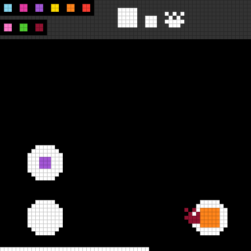[su15](<https://arcprize.org/tasks/su15>) | 100.00 | **90** / 361**Cumulative progress** 0.25× human __Agent __Human Human: level 1 completed at 22 cumulative actionsHuman: level 2 completed at 64 cumulative actionsHuman: level 3 completed at 90 cumulative actionsHuman: level 4 completed at 205 cumulative actionsHuman: level 5 completed at 241 cumulative actionsHuman: level 6 completed at 272 cumulative actionsHuman: level 7 completed at 280 cumulative actionsHuman: level 8 completed at 320 cumulative actionsHuman: level 9 completed at 361 cumulative actionsAgent: level 1 completed at 10 cumulative actionsAgent: level 2 completed at 20 cumulative actionsAgent: level 3 completed at 33 cumulative actionsAgent: level 4 completed at 42 cumulative actionsAgent: level 5 completed at 48 cumulative actionsAgent: level 6 completed at 63 cumulative actionsAgent: level 7 completed at 68 cumulative actionsAgent: level 8 completed at 76 cumulative actionsAgent: level 9 completed at 90 cumulative actions0590181361Levels# ActionsAgent **90** Human **361** |  9 / 9 | WIN | [View replay](<https://vista-research.github.io/replays/claude-opus-5/games/su15/index.html>) |

|  Level| Agent actions| Human actions| Agent / Human| Level score  
---|---|---|---|---  
1| 10| 22| 0.45×| 115.00  
2| 10| 42| 0.24×| 115.00  
3| 13| 26| 0.50×| 115.00  
4| 9| 115| 0.08×| 115.00  
5| 6| 36| 0.17×| 115.00  
6| 15| 31| 0.48×| 115.00  
7| 5| 8| 0.63×| 115.00  
8| 8| 40| 0.20×| 115.00  
9| 14| 41| 0.34×| 115.00  
|                                                                                                                  |
|                                                                                                                  |
| 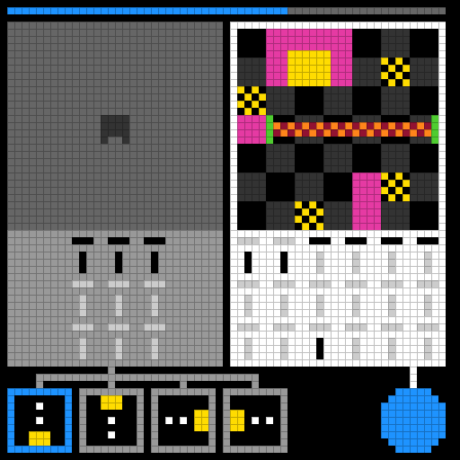[tn36](<https://arcprize.org/tasks/tn36>) | 100.00 | **156** / 317**Cumulative progress** 0.49× human __Agent __Human Human: level 1 completed at 32 cumulative actionsHuman: level 2 completed at 104 cumulative actionsHuman: level 3 completed at 130 cumulative actionsHuman: level 4 completed at 170 cumulative actionsHuman: level 5 completed at 200 cumulative actionsHuman: level 6 completed at 255 cumulative actionsHuman: level 7 completed at 317 cumulative actionsAgent: level 1 completed at 16 cumulative actionsAgent: level 2 completed at 37 cumulative actionsAgent: level 3 completed at 49 cumulative actionsAgent: level 4 completed at 64 cumulative actionsAgent: level 5 completed at 84 cumulative actionsAgent: level 6 completed at 111 cumulative actionsAgent: level 7 completed at 156 cumulative actions0470159317Levels# ActionsAgent **156** Human **317** |  7 / 7 | WIN | [View replay](<https://vista-research.github.io/replays/claude-opus-5/games/tn36/index.html>) |

|  Level| Agent actions| Human actions| Agent / Human| Level score  
---|---|---|---|---  
1| 16| 32| 0.50×| 115.00  
2| 21| 72| 0.29×| 115.00  
3| 12| 26| 0.46×| 115.00  
4| 15| 40| 0.38×| 115.00  
5| 20| 30| 0.67×| 115.00  
6| 27| 55| 0.49×| 115.00  
7| 45| 62| 0.73×| 115.00  
|                                                                                                                  |
|                                                                                                                  |
| 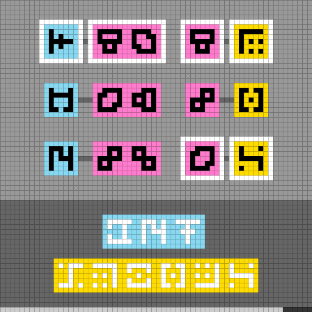[tr87](<https://arcprize.org/tasks/tr87>) | 100.00 | **204** / 414**Cumulative progress** 0.49× human __Agent __Human Human: level 1 completed at 54 cumulative actionsHuman: level 2 completed at 112 cumulative actionsHuman: level 3 completed at 152 cumulative actionsHuman: level 4 completed at 197 cumulative actionsHuman: level 5 completed at 268 cumulative actionsHuman: level 6 completed at 414 cumulative actionsAgent: level 1 completed at 68 cumulative actionsAgent: level 2 completed at 97 cumulative actionsAgent: level 3 completed at 123 cumulative actionsAgent: level 4 completed at 144 cumulative actionsAgent: level 5 completed at 167 cumulative actionsAgent: level 6 completed at 204 cumulative actions0360207414Levels# ActionsAgent **204** Human **414** |  6 / 6 | WIN | [View replay](<https://vista-research.github.io/replays/claude-opus-5/games/tr87/index.html>) |

|  Level| Agent actions| Human actions| Agent / Human| Level score  
---|---|---|---|---  
1| 68| 54| 1.26×| 63.06  
2| 29| 58| 0.50×| 115.00  
3| 26| 40| 0.65×| 115.00  
4| 21| 45| 0.47×| 115.00  
5| 23| 71| 0.32×| 115.00  
6| 37| 146| 0.25×| 115.00  
|                                                                                                                  |
|                                                                                                                  |
| 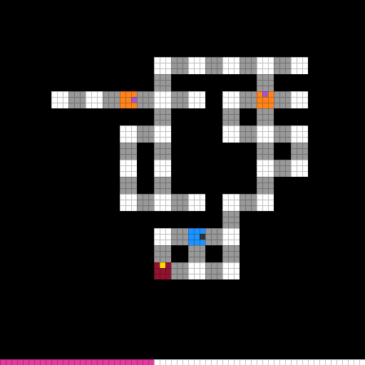[tu93](<https://arcprize.org/tasks/tu93>) | 100.00 | **192** / 462**Cumulative progress** 0.42× human __Agent __Human Human: level 1 completed at 19 cumulative actionsHuman: level 2 completed at 35 cumulative actionsHuman: level 3 completed at 69 cumulative actionsHuman: level 4 completed at 111 cumulative actionsHuman: level 5 completed at 234 cumulative actionsHuman: level 6 completed at 314 cumulative actionsHuman: level 7 completed at 328 cumulative actionsHuman: level 8 completed at 351 cumulative actionsHuman: level 9 completed at 462 cumulative actionsAgent: level 1 completed at 18 cumulative actionsAgent: level 2 completed at 33 cumulative actionsAgent: level 3 completed at 52 cumulative actionsAgent: level 4 completed at 69 cumulative actionsAgent: level 5 completed at 98 cumulative actionsAgent: level 6 completed at 128 cumulative actionsAgent: level 7 completed at 142 cumulative actionsAgent: level 8 completed at 163 cumulative actionsAgent: level 9 completed at 192 cumulative actions0590231462Levels# ActionsAgent **192** Human **462** |  9 / 9 | WIN | [View replay](<https://vista-research.github.io/replays/claude-opus-5/games/tu93/index.html>) |

|  Level| Agent actions| Human actions| Agent / Human| Level score  
---|---|---|---|---  
1| 18| 19| 0.95×| 111.42  
2| 15| 16| 0.94×| 113.78  
3| 19| 34| 0.56×| 115.00  
4| 17| 42| 0.40×| 115.00  
5| 29| 123| 0.24×| 115.00  
6| 30| 80| 0.38×| 115.00  
7| 14| 14| 1.00×| 100.00  
8| 21| 23| 0.91×| 115.00  
9| 29| 111| 0.26×| 115.00  
|                                                                                                                  |
|                                                                                                                  |
| 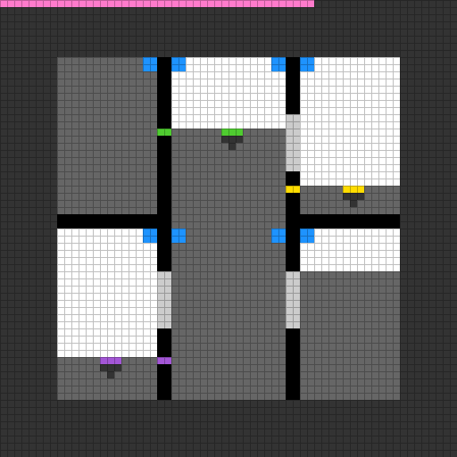[vc33](<https://arcprize.org/tasks/vc33>) | 100.00 | **180** / 447**Cumulative progress** 0.40× human __Agent __Human Human: level 1 completed at 7 cumulative actionsHuman: level 2 completed at 25 cumulative actionsHuman: level 3 completed at 69 cumulative actionsHuman: level 4 completed at 130 cumulative actionsHuman: level 5 completed at 261 cumulative actionsHuman: level 6 completed at 295 cumulative actionsHuman: level 7 completed at 447 cumulative actionsAgent: level 1 completed at 8 cumulative actionsAgent: level 2 completed at 16 cumulative actionsAgent: level 3 completed at 39 cumulative actionsAgent: level 4 completed at 60 cumulative actionsAgent: level 5 completed at 109 cumulative actionsAgent: level 6 completed at 131 cumulative actionsAgent: level 7 completed at 180 cumulative actions0470224447Levels# ActionsAgent **180** Human **447** |  7 / 7 | WIN | [View replay](<https://vista-research.github.io/replays/claude-opus-5/games/vc33/index.html>) |

|  Level| Agent actions| Human actions| Agent / Human| Level score  
---|---|---|---|---  
1| 8| 7| 1.14×| 76.56  
2| 8| 18| 0.44×| 115.00  
3| 23| 44| 0.52×| 115.00  
4| 21| 61| 0.34×| 115.00  
5| 49| 131| 0.37×| 115.00  
6| 22| 34| 0.65×| 115.00  
7| 49| 152| 0.32×| 115.00  
|                                                                                                                  |
|                                                                                                                  |
| 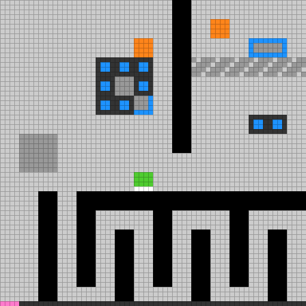[wa30](<https://arcprize.org/tasks/wa30>) | 100.00 | **713** / 1843**Cumulative progress** 0.39× human __Agent __Human Human: level 1 completed at 71 cumulative actionsHuman: level 2 completed at 190 cumulative actionsHuman: level 3 completed at 373 cumulative actionsHuman: level 4 completed at 471 cumulative actionsHuman: level 5 completed at 839 cumulative actionsHuman: level 6 completed at 907 cumulative actionsHuman: level 7 completed at 986 cumulative actionsHuman: level 8 completed at 1428 cumulative actionsHuman: level 9 completed at 1843 cumulative actionsAgent: level 1 completed at 39 cumulative actionsAgent: level 2 completed at 99 cumulative actionsAgent: level 3 completed at 179 cumulative actionsAgent: level 4 completed at 328 cumulative actionsAgent: level 5 completed at 449 cumulative actionsAgent: level 6 completed at 504 cumulative actionsAgent: level 7 completed at 542 cumulative actionsAgent: level 8 completed at 651 cumulative actionsAgent: level 9 completed at 713 cumulative actions05909221843Levels# ActionsAgent **713** Human **1,843** |  9 / 9 | WIN | [View replay](<https://vista-research.github.io/replays/claude-opus-5/games/wa30/index.html>) |

|  Level| Agent actions| Human actions| Agent / Human| Level score  
---|---|---|---|---  
1| 39| 71| 0.55×| 115.00  
2| 60| 119| 0.50×| 115.00  
3| 80| 183| 0.44×| 115.00  
4| 149| 98| 1.52×| 43.26  
5| 121| 368| 0.33×| 115.00  
6| 55| 68| 0.81×| 115.00  
7| 38| 79| 0.48×| 115.00  
8| 109| 442| 0.25×| 115.00  
9| 62| 415| 0.15×| 115.00  
|  |
|  |

Codex CLI

### GPT-5.6 Sol

Effortmax

Mean score
    98.27

Games completed
    25 / 25

Perfect games
    22 / 25

Actions · agent / human
    **10,063** / 17,135

| Task                                                                                                             | Score  | Actions                                                                                                                                                                                                                                                                                                                                                                                                                                                                                                                                                                                                                                                                                                                                                                                                                                                                                                                                           | Progress | Status | Replay                                                                          |
|------------------------------------------------------------------------------------------------------------------|--------|---------------------------------------------------------------------------------------------------------------------------------------------------------------------------------------------------------------------------------------------------------------------------------------------------------------------------------------------------------------------------------------------------------------------------------------------------------------------------------------------------------------------------------------------------------------------------------------------------------------------------------------------------------------------------------------------------------------------------------------------------------------------------------------------------------------------------------------------------------------------------------------------------------------------------------------------------|----------|--------|---------------------------------------------------------------------------------|
| [ar25](<https://arcprize.org/tasks/ar25>) | 100.00 | **327** / 748**Cumulative progress** 0.44× human __Agent __Human Human: level 1 completed at 32 cumulative actionsHuman: level 2 completed at 82 cumulative actionsHuman: level 3 completed at 157 cumulative actionsHuman: level 4 completed at 194 cumulative actionsHuman: level 5 completed at 283 cumulative actionsHuman: level 6 completed at 442 cumulative actionsHuman: level 7 completed at 675 cumulative actionsHuman: level 8 completed at 748 cumulative actionsAgent: level 1 completed at 84 cumulative actionsAgent: level 2 completed at 99 cumulative actionsAgent: level 3 completed at 139 cumulative actionsAgent: level 4 completed at 161 cumulative actionsAgent: level 5 completed at 190 cumulative actionsAgent: level 6 completed at 243 cumulative actionsAgent: level 7 completed at 280 cumulative actionsAgent: level 8 completed at 327 cumulative actions0480374748Levels# ActionsAgent **327** Human **748** |  8 / 8   | WIN    | [View replay](<https://vista-research.github.io/replays/games/ar25/index.html>) |

|  Level| Agent actions| Human actions| Agent / Human| Level score  
---|---|---|---|---  
1| 84| 32| 2.63×| 14.51  
2| 15| 50| 0.30×| 115.00  
3| 40| 75| 0.53×| 115.00  
4| 22| 37| 0.59×| 115.00  
5| 29| 89| 0.33×| 115.00  
6| 53| 159| 0.33×| 115.00  
7| 37| 233| 0.16×| 115.00  
8| 47| 73| 0.64×| 115.00  
|                                                                                                                  |
|                                                                                                                  |
| [bp35](<https://arcprize.org/tasks/bp35>) | 85.25 | **638** / 651**Cumulative progress** 0.98× human __Agent __Human Human: level 1 completed at 21 cumulative actionsHuman: level 2 completed at 69 cumulative actionsHuman: level 3 completed at 113 cumulative actionsHuman: level 4 completed at 151 cumulative actionsHuman: level 5 completed at 184 cumulative actionsHuman: level 6 completed at 271 cumulative actionsHuman: level 7 completed at 357 cumulative actionsHuman: level 8 completed at 488 cumulative actionsHuman: level 9 completed at 651 cumulative actionsAgent: level 1 completed at 35 cumulative actionsAgent: level 2 completed at 103 cumulative actionsAgent: level 3 completed at 139 cumulative actionsAgent: level 4 completed at 179 cumulative actionsAgent: level 5 completed at 274 cumulative actionsAgent: level 6 completed at 398 cumulative actionsAgent: level 7 completed at 485 cumulative actionsAgent: level 8 completed at 557 cumulative actionsAgent: level 9 completed at 638 cumulative actions0590326651Levels# ActionsAgent **638** Human **651** |  9 / 9 | WIN | [View replay](<https://vista-research.github.io/replays/games/bp35/index.html>) |

|  Level| Agent actions| Human actions| Agent / Human| Level score  
---|---|---|---|---  
1| 35| 21| 1.67×| 36.00  
2| 68| 48| 1.42×| 49.83  
3| 36| 44| 0.82×| 115.00  
4| 40| 38| 1.05×| 90.25  
5| 95| 33| 2.88×| 12.07  
6| 124| 87| 1.43×| 49.23  
7| 87| 86| 1.01×| 97.71  
8| 72| 131| 0.55×| 115.00  
9| 81| 163| 0.50×| 115.00  
|                                                                                                                  |
|                                                                                                                  |
| [cd82](<https://arcprize.org/tasks/cd82>) | 100.00 | **84** / 171**Cumulative progress** 0.49× human __Agent __Human Human: level 1 completed at 55 cumulative actionsHuman: level 2 completed at 63 cumulative actionsHuman: level 3 completed at 104 cumulative actionsHuman: level 4 completed at 125 cumulative actionsHuman: level 5 completed at 148 cumulative actionsHuman: level 6 completed at 171 cumulative actionsAgent: level 1 completed at 13 cumulative actionsAgent: level 2 completed at 19 cumulative actionsAgent: level 3 completed at 38 cumulative actionsAgent: level 4 completed at 52 cumulative actionsAgent: level 5 completed at 68 cumulative actionsAgent: level 6 completed at 84 cumulative actions036086171Levels# ActionsAgent **84** Human **171** |  6 / 6 | WIN | [View replay](<https://vista-research.github.io/replays/games/cd82/index.html>) |

|  Level| Agent actions| Human actions| Agent / Human| Level score  
---|---|---|---|---  
1| 13| 55| 0.24×| 115.00  
2| 6| 8| 0.75×| 115.00  
3| 19| 41| 0.46×| 115.00  
4| 14| 21| 0.67×| 115.00  
5| 16| 23| 0.70×| 115.00  
6| 16| 23| 0.70×| 115.00  
|                                                                                                                  |
|                                                                                                                  |
| [cn04](<https://arcprize.org/tasks/cn04>) | 100.00 | **264** / 789**Cumulative progress** 0.33× human __Agent __Human Human: level 1 completed at 29 cumulative actionsHuman: level 2 completed at 83 cumulative actionsHuman: level 3 completed at 168 cumulative actionsHuman: level 4 completed at 468 cumulative actionsHuman: level 5 completed at 676 cumulative actionsHuman: level 6 completed at 789 cumulative actionsAgent: level 1 completed at 14 cumulative actionsAgent: level 2 completed at 67 cumulative actionsAgent: level 3 completed at 98 cumulative actionsAgent: level 4 completed at 130 cumulative actionsAgent: level 5 completed at 221 cumulative actionsAgent: level 6 completed at 264 cumulative actions0360395789Levels# ActionsAgent **264** Human **789** |  6 / 6 | WIN | [View replay](<https://vista-research.github.io/replays/games/cn04/index.html>) |

|  Level| Agent actions| Human actions| Agent / Human| Level score  
---|---|---|---|---  
1| 14| 29| 0.48×| 115.00  
2| 53| 54| 0.98×| 103.81  
3| 31| 85| 0.36×| 115.00  
4| 32| 300| 0.11×| 115.00  
5| 91| 208| 0.44×| 115.00  
6| 43| 113| 0.38×| 115.00  
|                                                                                                                  |
|                                                                                                                  |
| [dc22](<https://arcprize.org/tasks/dc22>) | 100.00 | **805** / 1228**Cumulative progress** 0.66× human __Agent __Human Human: level 1 completed at 59 cumulative actionsHuman: level 2 completed at 161 cumulative actionsHuman: level 3 completed at 228 cumulative actionsHuman: level 4 completed at 326 cumulative actionsHuman: level 5 completed at 650 cumulative actionsHuman: level 6 completed at 1228 cumulative actionsAgent: level 1 completed at 22 cumulative actionsAgent: level 2 completed at 64 cumulative actionsAgent: level 3 completed at 121 cumulative actionsAgent: level 4 completed at 190 cumulative actionsAgent: level 5 completed at 390 cumulative actionsAgent: level 6 completed at 805 cumulative actions03606141228Levels# ActionsAgent **805** Human **1,228** |  6 / 6 | WIN | [View replay](<https://vista-research.github.io/replays/games/dc22/index.html>) |

|  Level| Agent actions| Human actions| Agent / Human| Level score  
---|---|---|---|---  
1| 22| 59| 0.37×| 115.00  
2| 42| 102| 0.41×| 115.00  
3| 57| 67| 0.85×| 115.00  
4| 69| 98| 0.70×| 115.00  
5| 200| 324| 0.62×| 115.00  
6| 415| 578| 0.72×| 115.00  
|                                                                                                                  |
|                                                                                                                  |
| [ft09](<https://arcprize.org/tasks/ft09>) | 100.00 | **75** / 208**Cumulative progress** 0.36× human __Agent __Human Human: level 1 completed at 43 cumulative actionsHuman: level 2 completed at 55 cumulative actionsHuman: level 3 completed at 78 cumulative actionsHuman: level 4 completed at 106 cumulative actionsHuman: level 5 completed at 171 cumulative actionsHuman: level 6 completed at 208 cumulative actionsAgent: level 1 completed at 4 cumulative actionsAgent: level 2 completed at 11 cumulative actionsAgent: level 3 completed at 25 cumulative actionsAgent: level 4 completed at 41 cumulative actionsAgent: level 5 completed at 62 cumulative actionsAgent: level 6 completed at 75 cumulative actions0360104208Levels# ActionsAgent **75** Human **208** |  6 / 6 | WIN | [View replay](<https://vista-research.github.io/replays/games/ft09/index.html>) |

|  Level| Agent actions| Human actions| Agent / Human| Level score  
---|---|---|---|---  
1| 4| 43| 0.09×| 115.00  
2| 7| 12| 0.58×| 115.00  
3| 14| 23| 0.61×| 115.00  
4| 16| 28| 0.57×| 115.00  
5| 21| 65| 0.32×| 115.00  
6| 13| 37| 0.35×| 115.00  
|                                                                                                                  |
|                                                                                                                  |
| [g50t](<https://arcprize.org/tasks/g50t>) | 100.00 | **376** / 879**Cumulative progress** 0.43× human __Agent __Human Human: level 1 completed at 78 cumulative actionsHuman: level 2 completed at 253 cumulative actionsHuman: level 3 completed at 432 cumulative actionsHuman: level 4 completed at 662 cumulative actionsHuman: level 5 completed at 758 cumulative actionsHuman: level 6 completed at 812 cumulative actionsHuman: level 7 completed at 879 cumulative actionsAgent: level 1 completed at 25 cumulative actionsAgent: level 2 completed at 56 cumulative actionsAgent: level 3 completed at 120 cumulative actionsAgent: level 4 completed at 197 cumulative actionsAgent: level 5 completed at 256 cumulative actionsAgent: level 6 completed at 333 cumulative actionsAgent: level 7 completed at 376 cumulative actions0470440879Levels# ActionsAgent **376** Human **879** |  7 / 7 | WIN | [View replay](<https://vista-research.github.io/replays/games/g50t/index.html>) |

|  Level| Agent actions| Human actions| Agent / Human| Level score  
---|---|---|---|---  
1| 25| 78| 0.32×| 115.00  
2| 31| 175| 0.18×| 115.00  
3| 64| 179| 0.36×| 115.00  
4| 77| 230| 0.33×| 115.00  
5| 59| 96| 0.61×| 115.00  
6| 77| 54| 1.43×| 49.18  
7| 43| 67| 0.64×| 115.00  
|                                                                                                                  |
|                                                                                                                  |
| [ka59](<https://arcprize.org/tasks/ka59>) | 100.00 | **395** / 730**Cumulative progress** 0.54× human __Agent __Human Human: level 1 completed at 28 cumulative actionsHuman: level 2 completed at 137 cumulative actionsHuman: level 3 completed at 188 cumulative actionsHuman: level 4 completed at 239 cumulative actionsHuman: level 5 completed at 272 cumulative actionsHuman: level 6 completed at 404 cumulative actionsHuman: level 7 completed at 730 cumulative actionsAgent: level 1 completed at 28 cumulative actionsAgent: level 2 completed at 72 cumulative actionsAgent: level 3 completed at 154 cumulative actionsAgent: level 4 completed at 196 cumulative actionsAgent: level 5 completed at 216 cumulative actionsAgent: level 6 completed at 286 cumulative actionsAgent: level 7 completed at 395 cumulative actions0470365730Levels# ActionsAgent **395** Human **730** |  7 / 7 | WIN | [View replay](<https://vista-research.github.io/replays/games/ka59/index.html>) |

|  Level| Agent actions| Human actions| Agent / Human| Level score  
---|---|---|---|---  
1| 28| 28| 1.00×| 100.00  
2| 44| 109| 0.40×| 115.00  
3| 82| 51| 1.61×| 38.68  
4| 42| 51| 0.82×| 115.00  
5| 20| 33| 0.61×| 115.00  
6| 70| 132| 0.53×| 115.00  
7| 109| 326| 0.33×| 115.00  
|                                                                                                                  |
|                                                                                                                  |
| [lf52](<https://arcprize.org/tasks/lf52>) | 100.00 | **982** / 1339**Cumulative progress** 0.73× human __Agent __Human Human: level 1 completed at 32 cumulative actionsHuman: level 2 completed at 113 cumulative actionsHuman: level 3 completed at 173 cumulative actionsHuman: level 4 completed at 244 cumulative actionsHuman: level 5 completed at 449 cumulative actionsHuman: level 6 completed at 597 cumulative actionsHuman: level 7 completed at 841 cumulative actionsHuman: level 8 completed at 950 cumulative actionsHuman: level 9 completed at 1114 cumulative actionsHuman: level 10 completed at 1339 cumulative actionsAgent: level 1 completed at 9 cumulative actionsAgent: level 2 completed at 76 cumulative actionsAgent: level 3 completed at 122 cumulative actionsAgent: level 4 completed at 174 cumulative actionsAgent: level 5 completed at 262 cumulative actionsAgent: level 6 completed at 384 cumulative actionsAgent: level 7 completed at 604 cumulative actionsAgent: level 8 completed at 675 cumulative actionsAgent: level 9 completed at 884 cumulative actionsAgent: level 10 completed at 982 cumulative actions051006701339Levels# ActionsAgent **982** Human **1,339** |  10 / 10 | WIN | [View replay](<https://vista-research.github.io/replays/games/lf52/index.html>) |

|  Level| Agent actions| Human actions| Agent / Human| Level score  
---|---|---|---|---  
1| 9| 32| 0.28×| 115.00  
2| 67| 81| 0.83×| 115.00  
3| 46| 60| 0.77×| 115.00  
4| 52| 71| 0.73×| 115.00  
5| 88| 205| 0.43×| 115.00  
6| 122| 148| 0.82×| 115.00  
7| 220| 244| 0.90×| 115.00  
8| 71| 109| 0.65×| 115.00  
9| 209| 164| 1.27×| 61.57  
10| 98| 225| 0.44×| 115.00  
|                                                                                                                  |
|                                                                                                                  |
| [lp85](<https://arcprize.org/tasks/lp85>) | 100.00 | **102** / 388**Cumulative progress** 0.26× human __Agent __Human Human: level 1 completed at 17 cumulative actionsHuman: level 2 completed at 55 cumulative actionsHuman: level 3 completed at 86 cumulative actionsHuman: level 4 completed at 102 cumulative actionsHuman: level 5 completed at 143 cumulative actionsHuman: level 6 completed at 203 cumulative actionsHuman: level 7 completed at 229 cumulative actionsHuman: level 8 completed at 388 cumulative actionsAgent: level 1 completed at 5 cumulative actionsAgent: level 2 completed at 15 cumulative actionsAgent: level 3 completed at 31 cumulative actionsAgent: level 4 completed at 44 cumulative actionsAgent: level 5 completed at 60 cumulative actionsAgent: level 6 completed at 79 cumulative actionsAgent: level 7 completed at 87 cumulative actionsAgent: level 8 completed at 102 cumulative actions0480194388Levels# ActionsAgent **102** Human **388** |  8 / 8 | WIN | [View replay](<https://vista-research.github.io/replays/games/lp85/index.html>) |

|  Level| Agent actions| Human actions| Agent / Human| Level score  
---|---|---|---|---  
1| 5| 17| 0.29×| 115.00  
2| 10| 38| 0.26×| 115.00  
3| 16| 31| 0.52×| 115.00  
4| 13| 16| 0.81×| 115.00  
5| 16| 41| 0.39×| 115.00  
6| 19| 60| 0.32×| 115.00  
7| 8| 26| 0.31×| 115.00  
8| 15| 159| 0.09×| 115.00  
|                                                                                                                  |
|                                                                                                                  |
| [ls20](<https://arcprize.org/tasks/ls20>) | 93.59 | **696** / 776**Cumulative progress** 0.90× human __Agent __Human Human: level 1 completed at 22 cumulative actionsHuman: level 2 completed at 145 cumulative actionsHuman: level 3 completed at 218 cumulative actionsHuman: level 4 completed at 302 cumulative actionsHuman: level 5 completed at 398 cumulative actionsHuman: level 6 completed at 590 cumulative actionsHuman: level 7 completed at 776 cumulative actionsAgent: level 1 completed at 16 cumulative actionsAgent: level 2 completed at 63 cumulative actionsAgent: level 3 completed at 103 cumulative actionsAgent: level 4 completed at 168 cumulative actionsAgent: level 5 completed at 309 cumulative actionsAgent: level 6 completed at 504 cumulative actionsAgent: level 7 completed at 696 cumulative actions0470388776Levels# ActionsAgent **696** Human **776** |  7 / 7 | WIN | [View replay](<https://vista-research.github.io/replays/games/ls20/index.html>) |

|  Level| Agent actions| Human actions| Agent / Human| Level score  
---|---|---|---|---  
1| 16| 22| 0.73×| 115.00  
2| 47| 123| 0.38×| 115.00  
3| 40| 73| 0.55×| 115.00  
4| 65| 84| 0.77×| 115.00  
5| 141| 96| 1.47×| 46.36  
6| 195| 192| 1.02×| 96.95  
7| 192| 186| 1.03×| 93.85  
|                                                                                                                  |
|                                                                                                                  |
| [m0r0](<https://arcprize.org/tasks/m0r0>) | 100.00 | **264** / 1107**Cumulative progress** 0.24× human __Agent __Human Human: level 1 completed at 30 cumulative actionsHuman: level 2 completed at 141 cumulative actionsHuman: level 3 completed at 344 cumulative actionsHuman: level 4 completed at 370 cumulative actionsHuman: level 5 completed at 870 cumulative actionsHuman: level 6 completed at 1107 cumulative actionsAgent: level 1 completed at 18 cumulative actionsAgent: level 2 completed at 53 cumulative actionsAgent: level 3 completed at 124 cumulative actionsAgent: level 4 completed at 135 cumulative actionsAgent: level 5 completed at 188 cumulative actionsAgent: level 6 completed at 264 cumulative actions03605541107Levels# ActionsAgent **264** Human **1,107** |  6 / 6 | WIN | [View replay](<https://vista-research.github.io/replays/games/m0r0/index.html>) |

|  Level| Agent actions| Human actions| Agent / Human| Level score  
---|---|---|---|---  
1| 18| 30| 0.60×| 115.00  
2| 35| 111| 0.32×| 115.00  
3| 71| 203| 0.35×| 115.00  
4| 11| 26| 0.42×| 115.00  
5| 53| 500| 0.11×| 115.00  
6| 76| 237| 0.32×| 115.00  
|                                                                                                                  |
|                                                                                                                  |
| [r11l](<https://arcprize.org/tasks/r11l>) | 100.00 | **128** / 233**Cumulative progress** 0.55× human __Agent __Human Human: level 1 completed at 22 cumulative actionsHuman: level 2 completed at 55 cumulative actionsHuman: level 3 completed at 106 cumulative actionsHuman: level 4 completed at 132 cumulative actionsHuman: level 5 completed at 184 cumulative actionsHuman: level 6 completed at 233 cumulative actionsAgent: level 1 completed at 27 cumulative actionsAgent: level 2 completed at 38 cumulative actionsAgent: level 3 completed at 69 cumulative actionsAgent: level 4 completed at 94 cumulative actionsAgent: level 5 completed at 112 cumulative actionsAgent: level 6 completed at 128 cumulative actions0360117233Levels# ActionsAgent **128** Human **233** |  6 / 6 | WIN | [View replay](<https://vista-research.github.io/replays/games/r11l/index.html>) |

|  Level| Agent actions| Human actions| Agent / Human| Level score  
---|---|---|---|---  
1| 27| 22| 1.23×| 66.39  
2| 11| 33| 0.33×| 115.00  
3| 31| 51| 0.61×| 115.00  
4| 25| 26| 0.96×| 108.16  
5| 18| 52| 0.35×| 115.00  
6| 16| 49| 0.33×| 115.00  
|                                                                                                                  |
|                                                                                                                  |
| [re86](<https://arcprize.org/tasks/re86>) | 100.00 | **684** / 1255**Cumulative progress** 0.55× human __Agent __Human Human: level 1 completed at 26 cumulative actionsHuman: level 2 completed at 68 cumulative actionsHuman: level 3 completed at 154 cumulative actionsHuman: level 4 completed at 262 cumulative actionsHuman: level 5 completed at 451 cumulative actionsHuman: level 6 completed at 590 cumulative actionsHuman: level 7 completed at 1014 cumulative actionsHuman: level 8 completed at 1255 cumulative actionsAgent: level 1 completed at 24 cumulative actionsAgent: level 2 completed at 60 cumulative actionsAgent: level 3 completed at 107 cumulative actionsAgent: level 4 completed at 151 cumulative actionsAgent: level 5 completed at 214 cumulative actionsAgent: level 6 completed at 276 cumulative actionsAgent: level 7 completed at 415 cumulative actionsAgent: level 8 completed at 684 cumulative actions04806281255Levels# ActionsAgent **684** Human **1,255** |  8 / 8 | WIN | [View replay](<https://vista-research.github.io/replays/games/re86/index.html>) |

|  Level| Agent actions| Human actions| Agent / Human| Level score  
---|---|---|---|---  
1| 24| 26| 0.92×| 115.00  
2| 36| 42| 0.86×| 115.00  
3| 47| 86| 0.55×| 115.00  
4| 44| 108| 0.41×| 115.00  
5| 63| 189| 0.33×| 115.00  
6| 62| 139| 0.45×| 115.00  
7| 139| 424| 0.33×| 115.00  
8| 269| 241| 1.12×| 80.27  
|                                                                                                                  |
|                                                                                                                  |
| [s5i5](<https://arcprize.org/tasks/s5i5>) | 100.00 | **304** / 638**Cumulative progress** 0.48× human __Agent __Human Human: level 1 completed at 20 cumulative actionsHuman: level 2 completed at 109 cumulative actionsHuman: level 3 completed at 215 cumulative actionsHuman: level 4 completed at 269 cumulative actionsHuman: level 5 completed at 431 cumulative actionsHuman: level 6 completed at 469 cumulative actionsHuman: level 7 completed at 555 cumulative actionsHuman: level 8 completed at 638 cumulative actionsAgent: level 1 completed at 13 cumulative actionsAgent: level 2 completed at 62 cumulative actionsAgent: level 3 completed at 115 cumulative actionsAgent: level 4 completed at 157 cumulative actionsAgent: level 5 completed at 186 cumulative actionsAgent: level 6 completed at 215 cumulative actionsAgent: level 7 completed at 262 cumulative actionsAgent: level 8 completed at 304 cumulative actions0480319638Levels# ActionsAgent **304** Human **638** |  8 / 8 | WIN | [View replay](<https://vista-research.github.io/replays/games/s5i5/index.html>) |

|  Level| Agent actions| Human actions| Agent / Human| Level score  
---|---|---|---|---  
1| 13| 20| 0.65×| 115.00  
2| 49| 89| 0.55×| 115.00  
3| 53| 106| 0.50×| 115.00  
4| 42| 54| 0.78×| 115.00  
5| 29| 162| 0.18×| 115.00  
6| 29| 38| 0.76×| 115.00  
7| 47| 86| 0.55×| 115.00  
8| 42| 83| 0.51×| 115.00  
|                                                                                                                  |
|                                                                                                                  |
| [sb26](<https://arcprize.org/tasks/sb26>) | 100.00 | **131** / 213**Cumulative progress** 0.62× human __Agent __Human Human: level 1 completed at 18 cumulative actionsHuman: level 2 completed at 46 cumulative actionsHuman: level 3 completed at 64 cumulative actionsHuman: level 4 completed at 83 cumulative actionsHuman: level 5 completed at 114 cumulative actionsHuman: level 6 completed at 137 cumulative actionsHuman: level 7 completed at 195 cumulative actionsHuman: level 8 completed at 213 cumulative actionsAgent: level 1 completed at 16 cumulative actionsAgent: level 2 completed at 31 cumulative actionsAgent: level 3 completed at 46 cumulative actionsAgent: level 4 completed at 61 cumulative actionsAgent: level 5 completed at 78 cumulative actionsAgent: level 6 completed at 97 cumulative actionsAgent: level 7 completed at 114 cumulative actionsAgent: level 8 completed at 131 cumulative actions0480107213Levels# ActionsAgent **131** Human **213** |  8 / 8 | WIN | [View replay](<https://vista-research.github.io/replays/games/sb26/index.html>) |

|  Level| Agent actions| Human actions| Agent / Human| Level score  
---|---|---|---|---  
1| 16| 18| 0.89×| 115.00  
2| 15| 28| 0.54×| 115.00  
3| 15| 18| 0.83×| 115.00  
4| 15| 19| 0.79×| 115.00  
5| 17| 31| 0.55×| 115.00  
6| 19| 23| 0.83×| 115.00  
7| 17| 58| 0.29×| 115.00  
8| 17| 18| 0.94×| 112.11  
|                                                                                                                  |
|                                                                                                                  |
| [sc25](<https://arcprize.org/tasks/sc25>) | 77.88 | **346** / 350**Cumulative progress** 0.99× human __Agent __Human Human: level 1 completed at 36 cumulative actionsHuman: level 2 completed at 42 cumulative actionsHuman: level 3 completed at 74 cumulative actionsHuman: level 4 completed at 157 cumulative actionsHuman: level 5 completed at 300 cumulative actionsHuman: level 6 completed at 350 cumulative actionsAgent: level 1 completed at 33 cumulative actionsAgent: level 2 completed at 41 cumulative actionsAgent: level 3 completed at 79 cumulative actionsAgent: level 4 completed at 117 cumulative actionsAgent: level 5 completed at 281 cumulative actionsAgent: level 6 completed at 346 cumulative actions0360175350Levels# ActionsAgent **346** Human **350** |  6 / 6 | WIN | [View replay](<https://vista-research.github.io/replays/games/sc25/index.html>) |

|  Level| Agent actions| Human actions| Agent / Human| Level score  
---|---|---|---|---  
1| 33| 36| 0.92×| 115.00  
2| 8| 6| 1.33×| 56.25  
3| 38| 32| 1.19×| 70.91  
4| 38| 83| 0.46×| 115.00  
5| 164| 143| 1.15×| 76.03  
6| 65| 50| 1.30×| 59.17  
|                                                                                                                  |
|                                                                                                                  |
| [sk48](<https://arcprize.org/tasks/sk48>) | 100.00 | **949** / 1070**Cumulative progress** 0.89× human __Agent __Human Human: level 1 completed at 61 cumulative actionsHuman: level 2 completed at 238 cumulative actionsHuman: level 3 completed at 339 cumulative actionsHuman: level 4 completed at 442 cumulative actionsHuman: level 5 completed at 672 cumulative actionsHuman: level 6 completed at 853 cumulative actionsHuman: level 7 completed at 978 cumulative actionsHuman: level 8 completed at 1070 cumulative actionsAgent: level 1 completed at 18 cumulative actionsAgent: level 2 completed at 131 cumulative actionsAgent: level 3 completed at 190 cumulative actionsAgent: level 4 completed at 288 cumulative actionsAgent: level 5 completed at 471 cumulative actionsAgent: level 6 completed at 800 cumulative actionsAgent: level 7 completed at 879 cumulative actionsAgent: level 8 completed at 949 cumulative actions04805351070Levels# ActionsAgent **949** Human **1,070** |  8 / 8 | WIN | [View replay](<https://vista-research.github.io/replays/games/sk48/index.html>) |

|  Level| Agent actions| Human actions| Agent / Human| Level score  
---|---|---|---|---  
1| 18| 61| 0.30×| 115.00  
2| 113| 177| 0.64×| 115.00  
3| 59| 101| 0.58×| 115.00  
4| 98| 103| 0.95×| 110.46  
5| 183| 230| 0.80×| 115.00  
6| 329| 181| 1.82×| 30.27  
7| 79| 125| 0.63×| 115.00  
8| 70| 92| 0.76×| 115.00  
|                                                                                                                  |
|                                                                                                                  |
| [sp80](<https://arcprize.org/tasks/sp80>) | 100.00 | **239** / 518**Cumulative progress** 0.46× human __Agent __Human Human: level 1 completed at 39 cumulative actionsHuman: level 2 completed at 97 cumulative actionsHuman: level 3 completed at 122 cumulative actionsHuman: level 4 completed at 270 cumulative actionsHuman: level 5 completed at 366 cumulative actionsHuman: level 6 completed at 518 cumulative actionsAgent: level 1 completed at 45 cumulative actionsAgent: level 2 completed at 52 cumulative actionsAgent: level 3 completed at 73 cumulative actionsAgent: level 4 completed at 99 cumulative actionsAgent: level 5 completed at 153 cumulative actionsAgent: level 6 completed at 239 cumulative actions0360259518Levels# ActionsAgent **239** Human **518** |  6 / 6 | WIN | [View replay](<https://vista-research.github.io/replays/games/sp80/index.html>) |

|  Level| Agent actions| Human actions| Agent / Human| Level score  
---|---|---|---|---  
1| 45| 39| 1.15×| 75.11  
2| 7| 58| 0.12×| 115.00  
3| 21| 25| 0.84×| 115.00  
4| 26| 148| 0.18×| 115.00  
5| 54| 96| 0.56×| 115.00  
6| 86| 152| 0.57×| 115.00  
|                                                                                                                  |
|                                                                                                                  |
| [su15](<https://arcprize.org/tasks/su15>) | 100.00 | **129** / 361**Cumulative progress** 0.36× human __Agent __Human Human: level 1 completed at 22 cumulative actionsHuman: level 2 completed at 64 cumulative actionsHuman: level 3 completed at 90 cumulative actionsHuman: level 4 completed at 205 cumulative actionsHuman: level 5 completed at 241 cumulative actionsHuman: level 6 completed at 272 cumulative actionsHuman: level 7 completed at 280 cumulative actionsHuman: level 8 completed at 320 cumulative actionsHuman: level 9 completed at 361 cumulative actionsAgent: level 1 completed at 11 cumulative actionsAgent: level 2 completed at 25 cumulative actionsAgent: level 3 completed at 43 cumulative actionsAgent: level 4 completed at 56 cumulative actionsAgent: level 5 completed at 76 cumulative actionsAgent: level 6 completed at 89 cumulative actionsAgent: level 7 completed at 99 cumulative actionsAgent: level 8 completed at 107 cumulative actionsAgent: level 9 completed at 129 cumulative actions0590181361Levels# ActionsAgent **129** Human **361** |  9 / 9 | WIN | [View replay](<https://vista-research.github.io/replays/games/su15/index.html>) |

|  Level| Agent actions| Human actions| Agent / Human| Level score  
---|---|---|---|---  
1| 11| 22| 0.50×| 115.00  
2| 14| 42| 0.33×| 115.00  
3| 18| 26| 0.69×| 115.00  
4| 13| 115| 0.11×| 115.00  
5| 20| 36| 0.56×| 115.00  
6| 13| 31| 0.42×| 115.00  
7| 10| 8| 1.25×| 64.00  
8| 8| 40| 0.20×| 115.00  
9| 22| 41| 0.54×| 115.00  
|                                                                                                                  |
|                                                                                                                  |
| [tn36](<https://arcprize.org/tasks/tn36>) | 100.00 | **191** / 317**Cumulative progress** 0.60× human __Agent __Human Human: level 1 completed at 32 cumulative actionsHuman: level 2 completed at 104 cumulative actionsHuman: level 3 completed at 130 cumulative actionsHuman: level 4 completed at 170 cumulative actionsHuman: level 5 completed at 200 cumulative actionsHuman: level 6 completed at 255 cumulative actionsHuman: level 7 completed at 317 cumulative actionsAgent: level 1 completed at 10 cumulative actionsAgent: level 2 completed at 22 cumulative actionsAgent: level 3 completed at 31 cumulative actionsAgent: level 4 completed at 54 cumulative actionsAgent: level 5 completed at 87 cumulative actionsAgent: level 6 completed at 140 cumulative actionsAgent: level 7 completed at 191 cumulative actions0470159317Levels# ActionsAgent **191** Human **317** |  7 / 7 | WIN | [View replay](<https://vista-research.github.io/replays/games/tn36/index.html>) |

|  Level| Agent actions| Human actions| Agent / Human| Level score  
---|---|---|---|---  
1| 10| 32| 0.31×| 115.00  
2| 12| 72| 0.17×| 115.00  
3| 9| 26| 0.35×| 115.00  
4| 23| 40| 0.57×| 115.00  
5| 33| 30| 1.10×| 82.64  
6| 53| 55| 0.96×| 107.69  
7| 51| 62| 0.82×| 115.00  
|                                                                                                                  |
|                                                                                                                  |
| [tr87](<https://arcprize.org/tasks/tr87>) | 100.00 | **180** / 414**Cumulative progress** 0.43× human __Agent __Human Human: level 1 completed at 54 cumulative actionsHuman: level 2 completed at 112 cumulative actionsHuman: level 3 completed at 152 cumulative actionsHuman: level 4 completed at 197 cumulative actionsHuman: level 5 completed at 268 cumulative actionsHuman: level 6 completed at 414 cumulative actionsAgent: level 1 completed at 50 cumulative actionsAgent: level 2 completed at 82 cumulative actionsAgent: level 3 completed at 114 cumulative actionsAgent: level 4 completed at 135 cumulative actionsAgent: level 5 completed at 156 cumulative actionsAgent: level 6 completed at 180 cumulative actions0360207414Levels# ActionsAgent **180** Human **414** |  6 / 6 | WIN | [View replay](<https://vista-research.github.io/replays/games/tr87/index.html>) |

|  Level| Agent actions| Human actions| Agent / Human| Level score  
---|---|---|---|---  
1| 50| 54| 0.93×| 115.00  
2| 32| 58| 0.55×| 115.00  
3| 32| 40| 0.80×| 115.00  
4| 21| 45| 0.47×| 115.00  
5| 21| 71| 0.30×| 115.00  
6| 24| 146| 0.16×| 115.00  
|                                                                                                                  |
|                                                                                                                  |
| [tu93](<https://arcprize.org/tasks/tu93>) | 100.00 | **238** / 462**Cumulative progress** 0.52× human __Agent __Human Human: level 1 completed at 19 cumulative actionsHuman: level 2 completed at 35 cumulative actionsHuman: level 3 completed at 69 cumulative actionsHuman: level 4 completed at 111 cumulative actionsHuman: level 5 completed at 234 cumulative actionsHuman: level 6 completed at 314 cumulative actionsHuman: level 7 completed at 328 cumulative actionsHuman: level 8 completed at 351 cumulative actionsHuman: level 9 completed at 462 cumulative actionsAgent: level 1 completed at 21 cumulative actionsAgent: level 2 completed at 31 cumulative actionsAgent: level 3 completed at 55 cumulative actionsAgent: level 4 completed at 73 cumulative actionsAgent: level 5 completed at 102 cumulative actionsAgent: level 6 completed at 130 cumulative actionsAgent: level 7 completed at 144 cumulative actionsAgent: level 8 completed at 167 cumulative actionsAgent: level 9 completed at 238 cumulative actions0590231462Levels# ActionsAgent **238** Human **462** |  9 / 9 | WIN | [View replay](<https://vista-research.github.io/replays/games/tu93/index.html>) |

|  Level| Agent actions| Human actions| Agent / Human| Level score  
---|---|---|---|---  
1| 21| 19| 1.11×| 81.86  
2| 10| 16| 0.63×| 115.00  
3| 24| 34| 0.71×| 115.00  
4| 18| 42| 0.43×| 115.00  
5| 29| 123| 0.24×| 115.00  
6| 28| 80| 0.35×| 115.00  
7| 14| 14| 1.00×| 100.00  
8| 23| 23| 1.00×| 100.00  
9| 71| 111| 0.64×| 115.00  
|                                                                                                                  |
|                                                                                                                  |
| [vc33](<https://arcprize.org/tasks/vc33>) | 100.00 | **300** / 447**Cumulative progress** 0.67× human __Agent __Human Human: level 1 completed at 7 cumulative actionsHuman: level 2 completed at 25 cumulative actionsHuman: level 3 completed at 69 cumulative actionsHuman: level 4 completed at 130 cumulative actionsHuman: level 5 completed at 261 cumulative actionsHuman: level 6 completed at 295 cumulative actionsHuman: level 7 completed at 447 cumulative actionsAgent: level 1 completed at 6 cumulative actionsAgent: level 2 completed at 16 cumulative actionsAgent: level 3 completed at 62 cumulative actionsAgent: level 4 completed at 148 cumulative actionsAgent: level 5 completed at 231 cumulative actionsAgent: level 6 completed at 251 cumulative actionsAgent: level 7 completed at 300 cumulative actions0470224447Levels# ActionsAgent **300** Human **447** |  7 / 7 | WIN | [View replay](<https://vista-research.github.io/replays/games/vc33/index.html>) |

|  Level| Agent actions| Human actions| Agent / Human| Level score  
---|---|---|---|---  
1| 6| 7| 0.86×| 115.00  
2| 10| 18| 0.56×| 115.00  
3| 46| 44| 1.05×| 91.49  
4| 86| 61| 1.41×| 50.31  
5| 83| 131| 0.63×| 115.00  
6| 20| 34| 0.59×| 115.00  
7| 49| 152| 0.32×| 115.00  
|                                                                                                                  |
|                                                                                                                  |
| [wa30](<https://arcprize.org/tasks/wa30>) | 100.00 | **1236** / 1843**Cumulative progress** 0.67× human __Agent __Human Human: level 1 completed at 71 cumulative actionsHuman: level 2 completed at 190 cumulative actionsHuman: level 3 completed at 373 cumulative actionsHuman: level 4 completed at 471 cumulative actionsHuman: level 5 completed at 839 cumulative actionsHuman: level 6 completed at 907 cumulative actionsHuman: level 7 completed at 986 cumulative actionsHuman: level 8 completed at 1428 cumulative actionsHuman: level 9 completed at 1843 cumulative actionsAgent: level 1 completed at 30 cumulative actionsAgent: level 2 completed at 78 cumulative actionsAgent: level 3 completed at 169 cumulative actionsAgent: level 4 completed at 254 cumulative actionsAgent: level 5 completed at 627 cumulative actionsAgent: level 6 completed at 697 cumulative actionsAgent: level 7 completed at 744 cumulative actionsAgent: level 8 completed at 1033 cumulative actionsAgent: level 9 completed at 1236 cumulative actions05909221843Levels# ActionsAgent **1,236** Human **1,843** |  9 / 9 | WIN | [View replay](<https://vista-research.github.io/replays/games/wa30/index.html>) |

|  Level| Agent actions| Human actions| Agent / Human| Level score  
---|---|---|---|---  
1| 30| 71| 0.42×| 115.00  
2| 48| 119| 0.40×| 115.00  
3| 91| 183| 0.50×| 115.00  
4| 85| 98| 0.87×| 115.00  
5| 373| 368| 1.01×| 97.34  
6| 70| 68| 1.03×| 94.37  
7| 47| 79| 0.59×| 115.00  
8| 289| 442| 0.65×| 115.00  
9| 203| 415| 0.49×| 115.00  
|  |
|  |

Actions are shown as agent / human reference.

### System-level comparison

In the table below, we compare VISTA with state-of-the-art methods on the [ARC-AGI Community Leaderboard](<https://arcprize.org/leaderboard/community>), most of which are concurrent work released within the past few days.

| System                                                                      | Program-based | Model              | Reasoning effort | RHAE       |
|-----------------------------------------------------------------------------|---------------|--------------------|------------------|------------|
| [Official minimal interface](<https://arcprize.org/results/openai-gpt-5-6>) | No            | GPT-5.6 Sol        | max              | 13.33      |
| [Official minimal interface](<https://arcprize.org/results/openai-gpt-5-6>) | No            | Opus 5.0           | high             | 30.16      |
| [Schema](<https://schema-harness.github.io/>)                               | Yes           | GPT-5.6 Sol        | xhigh → max      | 95.35      |
| [Schema](<https://schema-harness.github.io/>)                               | Yes           | Opus 4.8 → Fable 5 | max              | 98.98      |
| [ewma_sv_v1.6](<https://github.com/astroseger/arc-3-agents-baseline1>)      | Yes           | GPT-5.6 Sol        | xhigh            | 98.97      |
| [Retrodict](<https://github.com/ryanbbrown/Retrodict>)                      | Yes           | GPT-5.6 Sol        | max              | 99.86      |
| [Tycho](<https://github.com/NIMI-research/Tycho>)                           | Yes           | GPT-5.6 Sol        | max              | **100.00** |
| [Tycho](<https://github.com/NIMI-research/Tycho>)                           | Yes           | Opus 5.0           | xhigh            | **100.00** |
| **VISTA** (ours)                                                            | **No**        | GPT-5.6 Sol        | max              | 98.27      |
| **VISTA** (ours)                                                            | **No**        | Opus 5.0           | xhigh            | **100.00** |

_(Tableau reconstruit fidèlement depuis le HTML source : les cellules « System » et « Program-based » utilisaient des `rowspan=2` couvrant les deux lignes de modèle.)_

An arrow marks a fallback: Schema runs Opus 4.8 and Sol at xhigh first, reruns any game scoring below 80 with Fable 5 and Sol at max, and keeps the higher per-game score. Efforts for the other systems are taken from their published configurations and traces.

VISTA reaches a perfect **100.00** RHAE with Opus 5.0 and 98.27 with GPT-5.6 Sol. Notably, to our knowledge, it is the first system to reach a perfect or near-perfect score **without** program synthesis. As a reference, the official baselines from the ARC-AGI-3 organizers, which also do not use program synthesis, score 30.16 with Opus 5.0 and 13.33 with GPT-5.6 Sol.

### Varying the observation representation

The results above use the original 2D renderings. To examine how observation representation affects interaction, we compare three ways of presenting the same underlying worlds: a 1D text grid serialized row by row, the original 2D image, and a 3D rendering. We asked VISTA to play S5I5 and CD82 from each representation alone. It inferred how both games worked and completed Level 1 in all three settings. These are independent trajectories rather than identical action sequences.

The underlying rules are unchanged: in S5I5 the agent must extend two colored structures toward their targets, and in CD82 it must transform a canvas to match a reference.

**S5I5** Extend structures to reach both targets

[[Vidéo] figures/s5i5-text-grid-level1.mp4](<https://vista-research.github.io/figures/s5i5-text-grid-level1.mp4>)

Text grid

[[Vidéo] figures/s5i5-2d-level1-actions.mp4](<https://vista-research.github.io/figures/s5i5-2d-level1-actions.mp4>)

2D

[[Vidéo] figures/s5i5-3d-level1.mp4](<https://vista-research.github.io/figures/s5i5-3d-level1.mp4>)

3D

**CD82** Transform the canvas to match the reference

[[Vidéo] figures/cd82-text-grid-level1.mp4](<https://vista-research.github.io/figures/cd82-text-grid-level1.mp4>)

Text grid

[[Vidéo] figures/cd82-2d-level1-actions.mp4](<https://vista-research.github.io/figures/cd82-2d-level1-actions.mp4>)

2D

[[Vidéo] figures/cd82-3d-level1.mp4](<https://vista-research.github.io/figures/cd82-3d-level1.mp4>)

3D

**Complete Level 1 trajectories across three representations.** Each run is an independent trajectory. In the visual replays, a pointer marks each click; for keyboard actions, the active control is highlighted. The thin red bar shows trajectory progress.

Together, these runs show that VISTA is robust to different observation representations: it acts effectively from a serialized symbolic observation, the native 2D game view, or a visually richer 3D scene. Its transfer to 3D scenarios opens up the broader potential of VISTA acting in more complex physical worlds, from richer games to embodied environments.

5.

## What This Shows and What’s Next

VISTA gives a general-purpose multimodal model raw observations, free-form language to reason in, and a lossless visual memory of its past experience. This allows the model to explore and interact with the world in a natural way. We show that a minimal visual harness is enough for the agent to discover the rules of 25 unfamiliar visual games on ARC-AGI-3, play them to a perfect score, and do so more efficiently than first-time human players.

We acknowledge that the model’s existing capabilities are a key factor in this success, and that the visual harness is a simple but effective way of eliciting them. In addition, the models we use were released after the public ARC-AGI-3 games, so we cannot rule out that these games were seen during training; the private set remains the real test of generalization.

Nevertheless, ARC-AGI-3 is a testbed, not the target. The design is not restricted to 2D visual games, and extends straightforwardly to any interactive environment. We are excited about the potential of VISTA to support more complex and realistic tasks, even in embodied environments closer to the physical world.

## Cite this work

BibTeXCopy
    
    
    @misc{vista2026,
      title  = {{VISTA}: A Visual Harness for Reasoning in an Interactive World},
      author = {Han, Qiushi and Hu, Keya and Qiu, Linlu and Wu, Cathy and He, Kaiming},
      year   = {2026},
      month  = {aug},
      day    = {5},
      url    = {https://vista-research.github.io/}
    }
